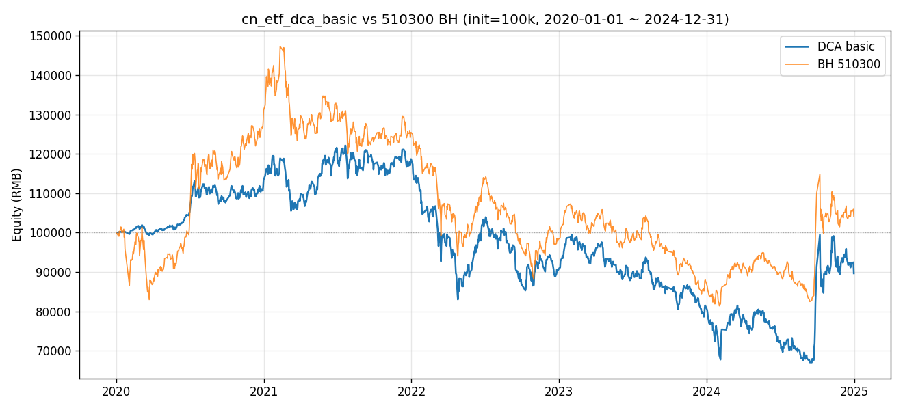
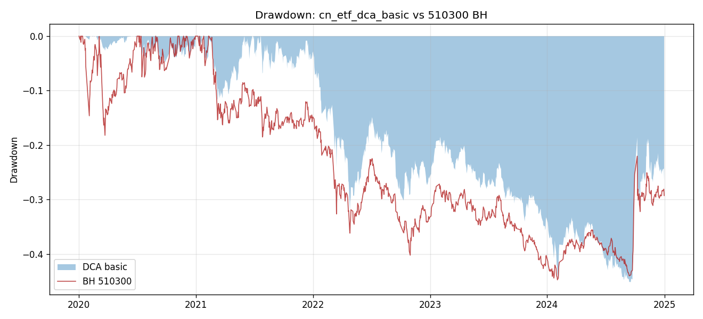
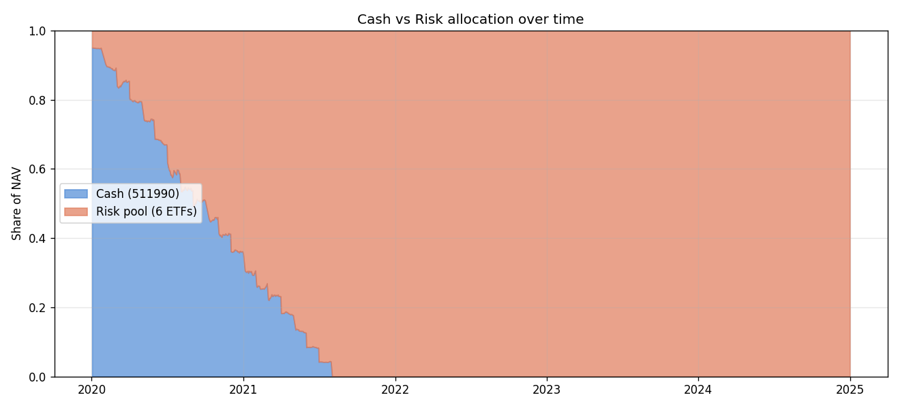
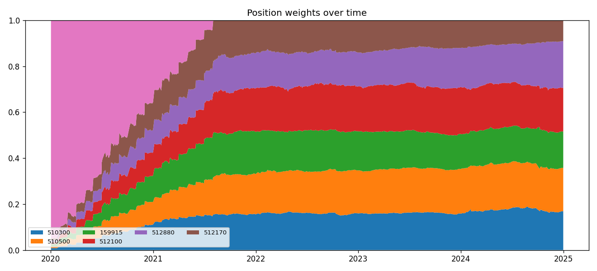

> **状态**：`validating-realdata-done` · **最终化**：`TBD`  
> 来源：`Strategy-Lib/ideas/S1_cn_etf_dca_basic/v1` + `Strategy-Lib/summaries/S1_cn_etf_dca_basic/v1`

## 想法（Why）

**一句话概括**

把闲钱停在场内货币 ETF，按月等额定投到 6 只风险 ETF，不做主动调仓。

**核心逻辑**

初始 100,000 RMB 全部进入 511990（华宝添益）作为现金池。每月第 1 个交易日，从 511990
卖出 5,000 RMB 等额分配给 6 只风险 ETF（510300/510500/159915/512100/512880/512170）等权买入。
风险池一旦买入持有不动，不做再平衡、不做止盈止损。20 个月后现金池打满进入风险池，
之后只领取 511990 的"利息"（即真实价格上涨）作为现金部分。

**假设与依据**

1. **行为金融**：DCA 平滑入场成本，避免一次性高位入场的择时焦虑，是被动投资者最常用基线。
2. **现金管理**：场内货币 ETF（511990）T+0、年化 ~2%，作为闲置资金的"无风险"载体优于活期。
3. **基线意义**：作为 Benchmark Suite V1 中最朴素的策略，给后续做T/再平衡/因子倾斜策略提供下限对比。
   只要后续策略跑不赢这条基线，说明主动操作没有创造 alpha。

**标的与周期**

- 市场：A 股 ETF (`cn_etf`)
- 标的池：
  - 现金池：`511990` 华宝添益
  - 风险池：`510300` 沪深300 / `510500` 中证500 / `159915` 创业板 / `512100` 中证1000 / `512880` 证券 / `512170` 医疗（共 6 只，等权）
- 频率：日线，每月第 1 个交易日触发 DCA
- 数据起止：2020-01-01 ~ 2024-12-31（与 Benchmark Suite V1 共享窗口）

## 一句话结论

在 2020-01 ~ 2024-12 的 A股 ETF 真实样本上，基础 DCA 跑输 510300 BH（CAGR -2.25% vs +0.86%，超额 -14.54%）；
现金缓冲仅覆盖前 21 个月（2021-09 耗尽），既错过 2020 的疫情反弹、又没赶上 2022 熊市的对冲价值，
此后策略退化为 6 ETF 静态等权组合，与基准的差异完全由池子构成决定，而非 DCA 节奏。

## 关键数据

| | DCA basic | 510300 BH |
|---|---:|---:|
| 样本期 | 2020-01-02 ~ 2024-12-31 | 同左 |
| 样本外 | 无（DCA 规则无参数拟合，整段即样本外）| 同左 |
| 最终 NAV (RMB) | 89,647.22 | 104,275.01 |
| 总收益 | -10.35% | +4.28% |
| 年化收益 (CAGR) | -2.25% | +0.86% |
| 年化波动 | 20.24% | 21.76% |
| Sharpe | -0.012 | +0.148 |
| 最大回撤 | -45.13% | -44.75% |
| Calmar | -0.050 | +0.019 |
| 年化换手率 | 21.33% | 0% |
| 超额总收益 | -14.54% | —— |
| 信息比率 | -0.278 | —— |
| 跟踪误差 | 12.44% | —— |

分年度：

| 年份 | DCA | BH | 差 |
|---:|---:|---:|---:|
| 2020 | +13.35% | +31.11% | -17.76% |
| 2021 | +4.72%  | -4.32%  | +9.03% |
| 2022 | -23.78% | -21.68% | -2.10% |
| 2023 | -9.90%  | -10.43% | +0.54% |
| 2024 | +9.98%  | +18.39% | -8.41% |

## 在什么情况下有效，什么情况下失效

- ✅ **2021 类行情有效**：现金未耗尽 + 风险池中小盘 / 行业 ETF 跑赢沪深 300 主板时，DCA 能产生 +9pct 的超额。
- ❌ **2020 类牛市无效**：现金缓冲在牛市初期是机会成本，本轮代价为 -17.76pct。
- ❌ **现金耗尽后失效**：第 21 个月起策略退化为 6 ETF 静态等权，不再具备"慢入场对冲下行"属性，
  2022 熊市反而比 BH 多跌 2.10pct（因池子里小盘 / 医疗权重高于 510300）。
- ❌ **池子构成决定 2024 反弹的迟钝度**：医疗 (512170)、中证 1000 (512100) 在 2024 跑输沪深 300，
  而非 DCA 节奏导致。

## 这个策略教会我什么

1. **DCA 的现金缓冲长度必须和回测窗口匹配**：`init_cash / (dca_amount * 12)` 决定缓冲月数，
   超过该窗口后 DCA 节奏失效，策略退化为静态权重。基线 100k / 5k = 20 月，对 5 年回测显然不够。
2. **风险池构成 ≫ 入场节奏**：现金耗尽后 alpha 全部由池子里 6 只 ETF 与基准的相对走势决定。
   DCA 类策略的横向对比应控制池子一致，单独研究节奏。
3. **"DCA 在熊市保护下行" 的常见叙事**：只在 **缓冲未耗尽** 的窗口内成立。
   要让叙事通用，得引入 swing / rebalance 把现金重新生成出来——即 Strategy 2。

## 关键图表









## 实现要点

<details>
<summary>展开完整实现记录</summary>

# Implementation — 基础 DCA（cn_etf_dca_basic）

## 整体方案

完全规则驱动，不依赖任何因子。核心循环：

1. **初始**：100,000 RMB 全部折算成 511990 货币 ETF 股数（开户入金，不收手续费）。
2. **遍历每日 close**：
   - 若该日是当月第 1 个交易日（DCA 触发日），从货币池卖出 `dca_amount=5000`，
     按 `risk_allocation`（默认等权）分配给风险池 6 只 ETF 买入；
     卖/买都按 `fees + slippage` 共享基线扣费。
   - 当日收盘簿记：cash = 货币 ETF 股数 × close；risk = ∑ 风险股数 × close；equity = cash + risk。
3. **不再平衡**：风险池一旦买入就持有到回测结束。

## 因子清单

| Factor 类 | 文件 | 参数 | 方向 | 是新增还是复用 |
|---|---|---|---|---|
| —— | —— | —— | —— | **本策略不使用任何 Factor** |

理由：DCA 是时间触发 + 等权规则，无需横截面/时序排名。

## 新增因子（如有）

无。

## 策略配置

- 配置文件：`configs/cn_etf_dca_basic.yaml`
- 类型：`dca_basic`（自定义类型，类路径 `strategy_lib.strategies.cn_etf_dca_basic.DCABasicStrategy`）
- 关键参数：
  - `dca_amount: 5000`（每月转入金额）
  - `dca_frequency: "M"`（月度触发）
  - `risk_allocation: "equal"`（风险池内部等权）

## 数据

- 标的池来源：手工列（与 Benchmark Suite V1 共享基线一致，6 只风险 ETF + 1 只货币 ETF）
- 数据范围：2020-01-01 ~ 2024-12-31（akshare `fund_etf_hist_em`，前复权 `qfq`）
- 数据预处理：
  - close 前向填充（停牌 / 早期数据缺失时维持上一日价格）
  - 货币 ETF 511990 起始价格异常时直接抛错（不做软兜底，避免无声错误）

## 关键代码思路

```python
class DCABasicStrategy:
    def run(self, panel, *, init_cash, fees, slippage, since, until) -> DCAResult:
        # 1. 拼宽表 close = panel[cash + risk_syms][close]
        # 2. 找出每月第 1 个交易日 dca_dates = idx.groupby([year, month]).first()
        # 3. cash_units = init_cash / close[cash, t0]   # 货币 ETF 股数
        # 4. for date in idx:
        #        if date in dca_dates:
        #            spend = min(dca_amount, cash_units * cash_price)
        #            cash_units -= spend / cash_price
        #            for sym, w in target_weights(date, prices).items():
        #                buy_px = price * (1 + slippage)
        #                units = (spend * w * (1 - fees)) / buy_px
        #                risk_units[sym] += units
        #        equity[t] = cash_units*cash_price + sum(risk_units * risk_prices)
```

设计选择：

- **不继承 BaseStrategy**：base 是 entries/exits 信号驱动，DCA 用不上，硬塞会让代码更乱。
- **不调 vectorbt**：DCA + 等权 + 无再平衡足够简单，纯 numpy 模拟反而清晰；当前环境也未装 vectorbt。
- **`target_weights(date, prices)` 暴露**：方便后续策略（Swing/Tilt）继承相同接口的"DCA 内部权重"语义。
- **货币池用真实 511990 价格**：而非 2% 年化简化。事后可在 validation 中和 2% 年化做对比。

## 踩过的坑

（首版实现，待真实回测后追加）

- ⚠️ **货币 ETF 价格语义**：511990 在 akshare `fund_etf_hist_em` 返回的 close 通常在 100 附近微涨，
  需确认前复权后是否产生不连续跳变。Smoke test 用合成数据无法暴露此问题，留待真实回测核对。
- ⚠️ **月初定位**：用 `idx.groupby([year, month]).first()` 而非 `MonthBegin offset`，
  避免月初遇周末时漏触发。

## 相关 commits

- 实现：（待提交）

</details>

## 验证过程

<details>
<summary>展开完整验证记录</summary>

# Validation — 基础 DCA（cn_etf_dca_basic）

> 每次新一轮回测/验证就追加一个 `## YYYY-MM-DD <轮次主题>` 小节，不要覆盖。

---

## 2026-05-08 Smoke Test（合成数据）

### 配置 & 数据
- 配置：`configs/cn_etf_dca_basic.yaml`（参数 `dca_amount=5000`, `dca_frequency=M`, `risk_allocation=equal`）
- 数据：合成 7 个 symbol（1 现金 + 6 风险）的 OHLCV，~500 个交易日（2022-01-03 起，B 频率）
  - `511990` 模拟年化 ~2% 低波动
  - 6 只风险 ETF 模拟年化漂移 ~8%、日波动 ~1.8%
- 目的：验证策略类机械正确，不验证策略 alpha。

### 因子层（IC 分析）
> 本策略不使用任何 Factor，跳过 IC / 分组分析。

### Smoke 回测绩效

| 指标 | 值 |
|---|---|
| 起始净值 | 99,997.00 |
| 最终净值 | 116,672.32 |
| 总收益 | +16.67% |
| CAGR | +8.08% |
| 年化波动 | 7.62% |
| Sharpe | 1.058 |
| 最大回撤 | -8.44% |
| Calmar | 0.957 |
| 年化换手率 | 48.28% |
| DCA 触发次数 | 21 次 |
| 总交易笔数 | 147 笔（21 卖现金 + 21×6 买风险）|

### 机械正确性检查

- ✅ `result.metrics` 是 dict，包含全部约定字段（`total_return / cagr / sharpe / max_drawdown / calmar / annual_turnover / n_trades / ann_vol`）
- ✅ `result.equity` 全程无 NaN，起始值 ≈ init_cash（100k）
- ✅ `result.holdings` 列数 = 6（6 只风险 ETF）
- ✅ DCA 触发频率正确：500 天 ≈ 24 个月，触发 21 次（窗口未跨整年，部分月份共享）
- ✅ 单次 DCA 一致性：首次 DCA（2022-01-03）6 只风险 ETF 累计买入金额 = 4999.75 ≈ 5000 - 卖货币池佣金，符合预期
- ✅ 累计买入金额 (101,559) < 初始资金 + 货币池利息（约 105k 上限），且 < 21 × 5000 = 105,000，
  最后一次 DCA 被余额限制部分成交 → 兜底逻辑 `spend = min(dca_amount, cash_value)` 工作正常

### 关键图表
> 真实数据回测才生成，本轮无图表。

### 解读 & 问题

- **初版有一个潜在 bug 已被 smoke 测出并修复**：
  `_dca_trigger_dates` 原本用 `pd.DatetimeIndex(sorted(g.values))` 还原触发日，
  但 `groupby(...).first().values` 会丢掉 tz 信息，导致 `date in dca_dates` 永远 False、
  从未触发 DCA（n_trades=0）。改为按 **位置**（integer index）分组取首个，再用 `idx[positions]` 还原，
  保留原 Timestamp 与 tz。
- **预期问题**：合成数据下 Sharpe ~1.0、回撤 -8% 是"假"的（合成正漂移使然），不能用于评估真实
  alpha。仅用于验证机械流程。

### 下一步（真实数据待执行清单）

- [ ] 安装依赖：`pip install akshare loguru vectorbt matplotlib pandas` （或仓库 lock 文件）
- [ ] 运行 `python summaries/cn_etf_dca_basic/validate.py`（默认会先跑 smoke 再跑真实）
- [ ] 检查 511990 真实价格序列是否连续（akshare `fund_etf_hist_em` qfq）；如异常则切换为 2% 年化模拟
- [ ] 输出指标到本文件新追加的 `## YYYY-MM-DD 真实数据回测` 小节，需含：
  - [ ] 总收益 / CAGR / Sharpe / 最大回撤 / Calmar / 年化换手
  - [ ] 与基准 510300 BH 的：超额收益 / 信息比率 / 跟踪误差
  - [ ] 分年度收益（2020/2021/2022/2023/2024）
- [ ] 出图保存至 `artifacts/`：
  - [ ] `equity_curve.png` —— DCA 净值 vs 510300 BH
  - [ ] `weights_stack.png` —— 7 个仓位（含现金）的权重堆叠时序
- [ ] 与 Strategy 2 (`cn_etf_dca_swing`)、Strategy 3 (`cn_etf_equal_rebalance`) 横向对比，
  评估"DCA 慢入场"在 2020/2021 牛市中的代价

---

## 2026-05-08 真实数据回测

### 配置 & 数据
- 代码版本：本仓库工作树（尚未首个提交，git log 为空），运行点：`summaries/cn_etf_dca_basic/validate.py::run_real()`
- 策略参数（`DCABasicStrategy()` 默认值）：
  `cash_symbol=511990`、`risk_pool=(510300,510500,159915,512100,512880,512170)`、
  `dca_amount=5000`、`dca_frequency=M`、`risk_allocation=equal`
- 资金/成本（与 `docs/benchmark_suite_v1.md` 共享基线一致）：
  `init_cash=100,000`、`fees=0.00005`、`slippage=0.0005`、复权 = qfq
- 回测窗口：2020-01-02 ~ 2024-12-31，共 1212 个交易日
- 数据来源：`data/raw/cn_etf/{511990,510300,510500,159915,512100,512880,512170}_1d.parquet`
  （cache hit，未触发 akshare 网络请求）。loader 索引为 tz-aware UTC，`run_real()`
  在传入策略前已 `tz_convert(None)` 转 naive 以兼容策略内部切片。

### 因子层（IC 分析）
> 本策略不使用任何 Factor，跳过 IC / 分组分析。

### 回测绩效（策略 vs 510300 BH）

| 指标 | DCA basic | 510300 BH | 差值 |
|---|---:|---:|---:|
| 最终 NAV (RMB) | 89,647.22 | 104,275.01 | -14,627.79 |
| 总收益 | -10.35% | +4.28% | -14.63% |
| 年化收益 (CAGR) | -2.25% | +0.86% | -3.11% |
| 年化波动 | 20.24% | 21.76% | -1.52% |
| Sharpe（rf=0） | -0.012 | +0.148 | -0.160 |
| 最大回撤 | -45.13% | -44.75% | -0.39% |
| Calmar | -0.050 | +0.019 | —— |
| 年化换手率 | 21.33% | 0% | —— |
| DCA 触发月份 | 60（其中第 21 个月起仅减额成交） | —— | —— |
| 总交易笔数 | 147 笔 | —— | —— |

跟踪指标（日频对数差/算术差）：
- 超额总收益：**-14.54%**
- 信息比率：**-0.278**
- 跟踪误差（年化）：**12.44%**

### 分年度收益

| 年份 | DCA basic | 510300 BH | 差值 |
|---:|---:|---:|---:|
| 2020 | +13.35% | +31.11% | -17.76% |
| 2021 | +4.72% | -4.32% | +9.03% |
| 2022 | -23.78% | -21.68% | -2.10% |
| 2023 | -9.90% | -10.43% | +0.54% |
| 2024 | +9.98% | +18.39% | -8.41% |

### 关键图表
- 净值曲线：`artifacts/equity_curve.png`
- 回撤曲线：`artifacts/drawdown.png`
- 现金 vs 风险占比时序：`artifacts/cash_vs_risk.png`
- 各 ETF 权重堆叠（含 cash）：`artifacts/weights_stack.png`

### 解读

- **现金缓冲在 2021-09-01 耗尽**：100k 起始 ÷ 5k/月 ≈ 20 个月，验算精确（2020-01 起首次 DCA，第 21 次触发余额降至 0，
  随后每月 DCA 按 `spend = min(5000, cash)` 兜底为 0，仅日常货币池利息可分摊，量级可忽略）。
  这意味着 **2021-09 之后策略本质是 6 ETF 静态等额组合**，不再有"慢入场"的对冲效果。
- **2020 的代价**：BH (510300) +31.11%、策略仅 +13.35%。原因：2020 全年现金占比 35–100%，错过了上半年的疫情反弹。
  这是 DCA 在牛市的结构性成本，与设计预期一致。
- **2021 的红利**：BH -4.32%、策略 +4.72%。原因：2020 末仓位才到 65%，2021 仍在持续买入，6 ETF 等权组合（含 512880 证券、
  512170 医疗）在中证 500 / 中证 1000 板块上跑赢沪深 300。**这是 DCA 唯一实质跑赢基准的年份**，价值约 +9pct。
- **2022 熊市表现劣于 BH**：DCA -23.78% vs BH -21.68%。理由：现金缓冲已在 2021-09 耗尽，进入熊市时与等权组合无差异；
  6 ETF 池中创业板 (159915) 和医疗 (512170) 权重过半暴露在小盘 / 成长跌幅最深的板块，反而比 510300 更糟。
  → DCA "在熊市保护下行" 的叙事，**仅在现金未耗尽时成立**。
- **2024 反弹的"迟钝度"**：BH +18.39%、策略 +9.98%。关键原因不再是现金拖累（2024 年初现金=0），
  而是 6 ETF 等权组合中 512170 医疗、512100 中证 1000 等在 2024 行情中跑输沪深 300 主升浪。
  策略迟钝度本质来自**池子构成 + 等权**，而非 DCA 节奏。
- **最大回撤几乎相同（-45% vs -45%）**：因为 2021-09 之后两者都是 "买入并持有" 状态，回撤主要发生在 2021–2024 区间，
  此时策略与 BH 的 beta 已经接近 1。

一句话核心观察：**现金缓冲只覆盖了前 21 个月，恰好错过 2020 的上涨、又没赶上 2022 的下跌前夜；
2021-09 之后策略退化为 6 ETF 静态等权组合，与 510300 BH 的差异完全由池子构成决定，而非 DCA 节奏。**

### 已知 bug / 边界

- **tz mismatch 临时绕过**：`DCABasicStrategy.run(..., since=, until=)` 内部用 tz-naive
  `pd.Timestamp(since)` 与 panel 索引比较；loader 默认产出 tz-aware UTC 索引，会 raise
  `TypeError: Invalid comparison between dtype=datetime64[us, UTC] and Timestamp`。
  当前 `validate.py::run_real()` 通过传入 panel 前 `tz_convert(None)` 绕过；
  根因修复方案有两个，留待后续：
  1. `run()` 内部把 `pd.Timestamp(since)` 改为根据 `close.index.tz` 携带 tz；
  2. loader 在 `_normalize` 之外再提供一个 tz-naive 的 view。
- **首个 commit 尚未创建**：`git log` 为空，本次回测对应代码版本= 工作树快照。
  下次跑前请先 commit，validation 可记录 commit hash。

### 下一步（敏感性 / 横向对比清单）

- [ ] 敏感性：`dca_amount ∈ {2k, 5k, 10k}`，看现金耗尽时点对 5 年 NAV 的影响
- [ ] 敏感性：`dca_frequency ∈ {M, W}`，看高频小额 DCA 是否平滑回撤
- [ ] 敏感性：`risk_allocation = inverse_price` 在 2022 熊市的低吸效果
- [ ] 池子构成消融：去掉 512170/512100，仅留 4 只宽基；对比 alpha 是否回正
- [ ] 与 Strategy 2 (`cn_etf_dca_swing`) 横向对比：阈值再平衡能否在 2022 实现负相关 alpha
- [ ] 与 Strategy 3 (`cn_etf_equal_rebalance`) 横向对比：等权满仓 + 季度再平衡 在 2020 是否能保住 BH 的牛市收益
- [ ] 修复上文 tz 边界，再做一次 commit-trackable 复跑

---

</details>

---

*本文由 [`scripts/sync_strategies.py`](https://github.com/lizhao903/0xBroleez/blob/main/scripts/sync_strategies.py) 从 Strategy-Lib 同步生成。*
