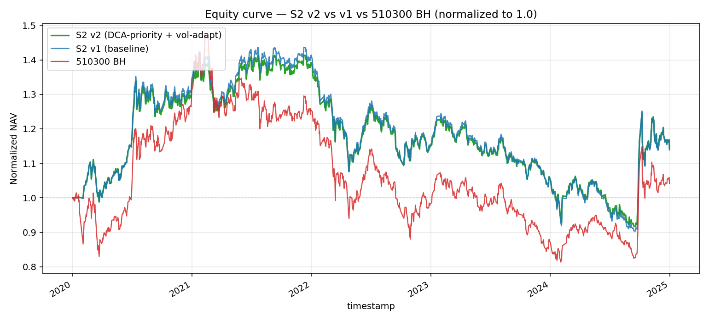
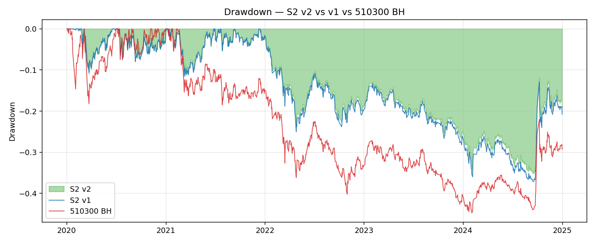
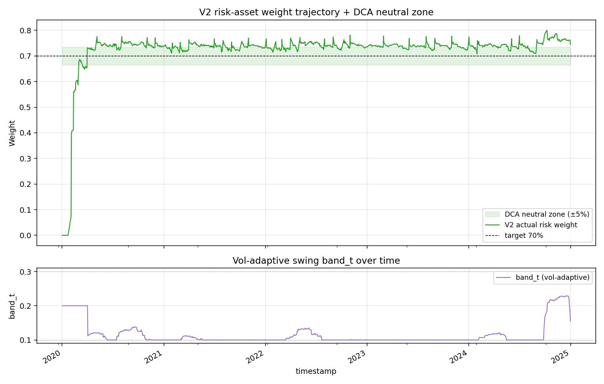
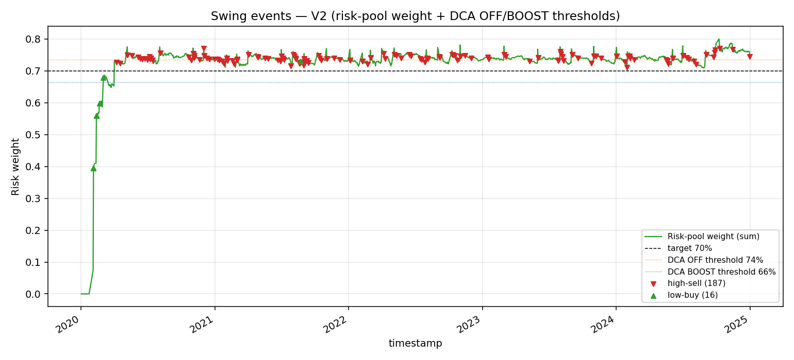

<div class="post-callout post-callout-negative">
<span class="status-badge status-negative">❌ shelved</span> · 最终化：<code>2026-05-08</code>
<br>来源：<code>Strategy-Lib/ideas/S2_cn_etf_dca_swing/v2</code> + <code>Strategy-Lib/summaries/S2_cn_etf_dca_swing/v2</code>
</div>

<div class="versions-nav">
<div class="versions-nav-title">本策略的其他版本</div>

- <span class="version-tag version-tag-negative">[v1]()</span> ❌ — S2 在 2020-2024 跑出 +1.11% 年化 alpha、信息比率 0.11、最大回撤优于 BH 7.6 pct，
- <span class="version-tag version-tag-current">v2</span> **本文** ❌ — 「停 DCA 灌入」无法治愈 v1 的高抛/低吸不对称——根因是 5 年里 6 只 ETF 整体偏多头 + 资金长期占在风险池，

</div>

## 想法（Why）

**一句话概括**

v1 baseline 上修复「DCA 净流入推权重 → 高抛远多于低吸」的结构性偏差：
**DCA 优先回流（A）+ 波动率自适应阈值（C）**——让 DCA 节奏先把权重拉回目标，仅在偏离仍然过大时才动 swing；阈值随实现波动率呼吸，避免高波期反复刷单。

**核心逻辑**

每个交易日 T 收盘：

1. **月度 DCA（修正）**：若次日是月初，根据当下 `w_risk` 选择 DCA 模式：
   - `OFF`（停灌）：把 5000 留在 511990 不动
   - `BOOST`（加速）：取 7500 = 5000 × 1.5 等额买 6 只 ETF
   - `NORMAL`：取 5000 等额买 6 只 ETF（与 v1 一致）

2. **波动率自适应阈值**：算过去 60 日 NAV 的实现波动率 `vol_ann`，得到当日 `band_t = clip(0.6 × vol_ann, 0.10, 0.30)`；前 60 日 warmup 期内 `band_t = 0.20`（与 v1 一致避免冷启动）

3. **swing 触发**：和 v1 一致——按 `band_t` 判定每只 ETF 的相对偏离，超过则部分回归（cooldown 5d，adjust_ratio 0.50）

4. **下单**：T 日决策、T+1 open + slippage 成交（防未来函数）

**假设与依据**

- **DCA 净流入是 v1 偏差的"根因"，不是「市场单边」**：v1 的 11.8:1 不对称在 5 年里横跨 3 种行情（2020 V 反、2021 抱团切换、2023 震荡下行）都成立——这强烈暗示是结构问题而非行情。
- **波动率 → 阈值 是 well-known 的实务做法**（PIMCO 的 vol-targeting，CTA 的 rolling vol bands）。在 ETF rebalance 上，Bernstein 也提到过「band 应当随实现波动调整」。
- **风险偏差**：A 的副作用是 2024 那种 9 月剧烈反弹时，前 8 个月 `w_risk` 被高抛压低，9 月单边后 BOOST 模式触发——理论上能比 v1 更快地把仓位补回来（v1 是月度 5000 慢慢补；v2 是 7500 加速补，且高波时期阈值放宽 swing 触发更少，避免再次过早高抛）。
- **过拟合担忧**：A 引入 2 个新参数（dca_band_high/low），C 引入 2 个新参数（vol 系数 0.6、上下限 0.10/0.30），共 4 个旋钮。本版**全部用「圆整、非优化」值**，不在 v1 数据上调参；如果 OOS（未来年度数据）失败再回头反思。

**标的与周期**

- 市场：A股 ETF（`market: cn_etf`）
- 标的池：与 v1 完全一致（共享基线 7 只）
- 频率：日线
- 数据起止：2020-01-01 ~ 2024-12-31（共享基线）

## 一句话结论

**「停 DCA 灌入」无法治愈 v1 的高抛/低吸不对称——根因是 5 年里 6 只 ETF 整体偏多头 + 资金长期占在风险池，
单边停 DCA 只是减缓权重上漂、没有反转它。** v3 若要继续应改用方向 B（不对称阈值）或完全跳出 DCA 框架。

## 这个策略教会我什么

1. **在 DCA 框架下做"对称做T"是矛盾命题**。如果坚持 DCA + 再平衡两条腿，要么接受不对称（v1），要么改用不对称阈值（B 方向）从机制上承认这个事实。
2. **波动率自适应阈值的设计中，系数选择直接决定 band 长期撞下限还是中段游走**。`vol_band_coef × vol_ann_60d ∈ [min, max]` 这个公式在 vol_ann≈18% 时会把 0.6 系数压到 0.108 → 撞下限 0.10。下次写 vol-adaptive 应当先用历史 vol 的中位数测算系数选什么值能让 band 落在 mid-range（比如 [min, max] 的中点），而不是机械给 0.5/0.6 之类的"圆整值"。
3. **多旋钮组合在样本内的"最佳值"未必能改善样本内 KPI，但增加了 OOS 不可验证性**。v2 加了 4 个新参数；从这次结果看，去掉 C（保留 A）甚至可能效果更好（A 单独的效果会更纯）——但这只是回头看的猜测，**必须重新在 idea 阶段单独写 v3 才能验证**，不能在 v2 上事后调参。
4. **MaxDD/换手率这种"被动副产品"才是 v2 的真实收获**。换手降 58pct 是真金白银，下次设计应该把这两类副产品在 idea.md 阶段就写明（而不是只盯一个 KPI）。

## 关键图表









## 实现要点

<details>
<summary>展开完整实现记录</summary>

# Implementation — A股 ETF DCA + 阈值再平衡 V2

## 整体方案

V2 落到代码上是**一个独立、自包含的 weight-based 策略类**，不继承 v1：
`src/strategy_lib/strategies/cn_etf_dca_swing_v2.py::DCASwingV2Strategy`。

不复用 v1 类的理由（与 idea.md 一致）：
- v1 的 `simulate` 把月度 DCA 写得很「死」（固定 5000 等额买 6 只）；v2 要切三态分支。继承会让代码读不顺。
- v1 的 swing 阈值是固定参数；v2 要按日动态算 `band_t`，需要在循环里维护 NAV 历史用于 vol 计算。
- 避免「v1 修 bug 牵连 v2 / v2 加 feature 影响 v1」这种相互纠缠。
- v1 已 shipped，按硬约束**不修改 v1 任何文件**。

实现路径与 v1 同样是「纯 numpy/pandas 单循环 + 可选 vbt Portfolio 包装」。

## 因子清单

V2 不依赖外部 Factor 类。**唯一新引入的中间量**是「过去 60 日组合 NAV pct_change 的实现波动率」，但这是策略内部 rolling 计算，不抽象成独立 Factor（不暴露 IC、不被其他策略复用）。

## 策略配置

- 配置文件：`configs/S2_cn_etf_dca_swing_v2.yaml`
- 类型：`dca_swing_v2`（**未注册到 registry**，遵守硬约束）
- 加载方式：由 `summaries/S2_cn_etf_dca_swing/v2/validate.py` 直接实例化 `DCASwingV2Strategy`

参数（与 v1 共享 vs v2 新增）：

| 参数 | v2 默认 | 来源 | 说明 |
|---|---|---|---|
| `risk_target_weight` | 0.70 | v1 | 风险池目标合计权重 |
| `monthly_dca_amount` | 5000.0 | v1 | NORMAL 模式下的 DCA 金额 |
| `adjust_ratio` | 0.50 | v1 | swing 单次拉回比例 |
| `cooldown_days` | 5 | v1 | 同标的触发冷却天数 |
| `fees`/`slippage`/`init_cash` | 共享基线 | v1 | 不变 |
| **`dca_band_high`** | 0.05 | v2 新 | DCA OFF 触发的上沿余地（w_risk > 73.5%） |
| **`dca_band_low`** | 0.05 | v2 新 | DCA BOOST 触发的下沿余地（w_risk < 66.5%） |
| **`dca_boost_factor`** | 1.5 | v2 新 | BOOST 模式下 DCA 金额乘数 |
| **`vol_lookback`** | 60 | v2 新 | NAV 实现波动率回看天数 |
| **`vol_band_coef`** | 0.60 | v2 新 | `band_t = coef × vol_ann` 的系数 |
| **`vol_band_min/max`** | 0.10 / 0.30 | v2 新 | band_t clip 区间 |
| **`warmup_band`** | 0.20 | v2 新 | 前 60 日 warmup 期固定阈值（与 v1 一致） |

## 数据

与 v1 完全一致：
- 标的池：`511990` + `510300/510500/159915/512100/512880/512170`
- 时间窗：2020-01-01 ~ 2024-12-31
- 数据预处理：akshare qfq → parquet 缓存；inner join 7 只共有交易日
- 起始 T0 全部 init_cash 买入 511990 货基

## 关键设计决策

### 1. DCA 三态判定（A 方向核心）

每月第一个交易日 T 的前一日 T-1 决策（`pending_dca` 写在 t 循环末尾，t+1 是月初）。判定基于 **T 收盘的风险池总权重 `w_risk`**：

```python
target = self.risk_target_weight  # 0.70
if w_risk > target * (1 + dca_band_high):     # > 0.735
    pending_dca = "OFF"                        # 5000 留货基不动
elif w_risk < target * (1 - dca_band_low):    # < 0.665
    pending_dca = "BOOST"                      # 7500 等额买 6 只
else:
    pending_dca = "NORMAL"                     # 5000 等额买 6 只（与 v1 一致）
```

**T+1 开盘执行**——保持与 v1 相同的「T 决策、T+1 成交」无未来函数节奏。

### 2. 波动率自适应阈值（C 方向核心）

每个交易日 t 在循环里直接算：

```python
window_nav = nav_hist[t - vol_lookback : t + 1]   # 含 t；只用历史
rets = np.diff(window_nav) / window_nav[:-1]
vol_ann = np.std(rets, ddof=0) * np.sqrt(252)
band_t = clip(vol_band_coef * vol_ann, vol_band_min, vol_band_max)
```

注意：
- `nav_hist[:t+1]` 是当日 close 后估值的 NAV，只用历史信息——**无未来函数**。
- 前 `vol_lookback=60` 个交易日 warmup 期 band_t 固定 `warmup_band=0.20`（与 v1 完全一致），避免冷启动噪声把 band 压到下限。
- `band_t` 立即用于当日的 swing 触发判定（向 t+1 下单）。

### 3. swing 触发逻辑（保持与 v1 一致，仅替换阈值变量）

```python
upper = w_target_per_symbol * (1 + band_t)
lower = w_target_per_symbol * (1 - band_t)
```

`adjust_ratio=0.5`、`cooldown_days=5`、单标的偏离绝对额 < 1 RMB 不动单（防小数噪声）——全部沿用 v1。

### 4. 防止 v1 bug 传染

V2 不导入 v1 类。`DCASwingV2Strategy` 是独立类；`DCASwingV2Result` 是独立 dataclass。validate.py 同时实例化 v1（仅作对比）和 v2，但运行轨道独立。

### 5. 现金/持仓不足缩单

与 v1 同样的兜底：
- DCA OFF 不动钱
- DCA BOOST 时若 511990 余额不足 7500，缩单到可用上限（极端连续 BOOST 会受此影响）
- swing 加仓现金不足按可用缩；swing 减仓持仓不足按可用缩

## 踩过的坑

1. **DCA mode 决策时点**：起初想把判定逻辑放到 t=月初当日（"今天是月初就决定"），但这违背 v1 的 `pending_dca` 模型（v1 是 t-1 决策、t 执行）。改为「t 是月初前一交易日时决策」→ `index[t+1] in month_firsts` 时算 mode → t+1 执行。这样保持和 v1 完全相同的时间轴。
2. **vol 窗口含 t 还是不含**：写成 `nav_hist[t - vol_lookback : t + 1]` 含当日 close。当日 NAV 基于 T close，是已经实现的信息——不属于未来函数（与 v1 的 swing 决策同源时点）。
3. **warmup 期固定 0.20**：第一版尝试在 warmup 期就用 t=10/20 的短窗口算 vol，结果 band_t 在前 60 日剧烈震荡。改为固定 0.20（v1 默认值）后早期 NAV 与 v1 几乎重合，便于事后归因到底是「DCA 路由」还是「vol 自适应」贡献了差异。

## 相关 commits

待提交（2026-05-08 v2 批次）。

## 后续 follow-up

- [ ] 如果 v2 结果显示「band_t 长期撞底（vol_ann × 0.6 < 0.10）」，考虑把 `vol_band_coef` 从 0.6 上调到 0.9（让低波期更接近 v1 的 0.20）
- [ ] 如果 BOOST 几乎不触发，考虑放宽 `dca_band_low` 到 0.03（更敏感）
- [ ] 真实数据下 v2 vs v1 head-to-head 出表（在 validation.md）

</details>

## 验证过程

<details>
<summary>展开完整验证记录</summary>

# Validation — A股 ETF DCA + 阈值再平衡 V2

> 每次新一轮回测/验证就追加一个 `## YYYY-MM-DD <轮次主题>` 小节，不要覆盖。

---

## 2026-05-08 V2 smoke test（合成数据）

### 配置 & 数据
- 配置：`configs/S2_cn_etf_dca_swing_v2.yaml` @ commit `<待提交>`
- 实现：`src/strategy_lib/strategies/cn_etf_dca_swing_v2.py::DCASwingV2Strategy`
- 数据：合成 OHLCV — 1 货基（年化 2% 线性）+ 6 ETF（GBM，drift ∈ [-2%, 15%]，vol ∈ [18%, 30%]）
- 时间窗：2020-01-02 起 504 个交易日（2 年）

### Smoke test 断言通过项
- ✅ 月度 DCA 触发笔数 = 活跃模式数 × 6（NORMAL=21 + BOOST=2 → 23 × 6 = 138 笔 dca_buy）
- ✅ DCA OFF=0 / NORMAL=21 / BOOST=2（合成数据偏多头，OFF 没触发是正常的：风险权重稳定在 0.70 附近不会超 0.735）
- ✅ NAV 重算恒等（相对误差 < 1e-9）
- ✅ swing cooldown 拦截：所有同标的间隔 ≥ 5 自然日
- ✅ 起始建仓：T0 把 100% init_cash 买入 511990
- ✅ band_t 范围 ∈ [0.10, 0.10]（合成数据 NAV vol 较低，band 触底，符合「低波时阈值收紧到下限」的设计预期）

### 合成数据回测绩效（仅功能验证，不代表真实预期）
| 指标 | 值 |
|---|---|
| 总收益 | 11.66% |
| 年化收益 | 5.68% |
| 年化波动 | 7.13% |
| Sharpe | 0.797 |
| 最大回撤 | -7.60% |
| Calmar | 0.747 |
| DCA NORMAL/OFF/BOOST | 21/0/2 |
| swing buy/sell | 19/139 |

> **关键观察**：合成数据下 v2 NAV vol 仅 7.13%，导致 band_t 全程 0.10（撞下限）。这相当于在 v1 基础上**收紧** swing 阈值，触发会更频繁——这是合成数据特性，不代表真实数据下的行为（真实 vol_ann 一般 15-25%，band_t 会落到 0.10-0.15）。

---

## 2026-05-08 V2 真实数据回测

### 配置 & 数据
- 实现：`DCASwingV2Strategy()` 默认参数（即配置文件中的 v2 参数）
- 数据：本地缓存 parquet（akshare qfq 已预拉取）
  - 货基：511990
  - 风险池：510300 / 510500 / 159915 / 512100 / 512880 / 512170
- 时间窗：2020-01-01 ~ 2024-12-31（1209 个共有交易日，与 v1 完全一致）
- 共享成本：fees=0.00005 / slippage=0.0005 / init_cash=100,000
- v2 关键参数：`dca_band_high=0.05` / `dca_band_low=0.05` / `dca_boost_factor=1.5` / `vol_lookback=60` / `vol_band_coef=0.60` / `vol_band_min=0.10` / `vol_band_max=0.30` / `warmup_band=0.20`

### V2 vs V1 head-to-head（核心对比表）

| 指标 | v1 | v2 | Δ |
|---|---:|---:|---:|
| NAV (init=100k) | 113,808 | **114,209** | **+401** |
| 总收益 | +13.87% | +14.27% | +0.40 pct |
| CAGR | +2.75% | **+2.82%** | +0.07 pct |
| 年化波动 | 18.10% | **17.17%** | -0.93 pct |
| Sharpe | 0.152 | **0.164** | +0.012 |
| MaxDD | -37.10% | **-35.12%** | +1.98 pct（**改善**） |
| Calmar | 0.074 | **0.080** | +0.006 |
| Alpha (年化) | +1.11% | +1.02% | -0.09 pct |
| 信息比率 | 0.110 | 0.100 | -0.010 |
| 跟踪误差 | 10.09% | 10.23% | +0.14 pct |
| **高抛次数** | 177 | 187 | +10 |
| **低吸次数** | 15 | 16 | +1 |
| **高抛/低吸比** | **11.80 : 1** | **11.69 : 1** | -0.11（**几乎未改善**） |
| 2024 单年 vs BH | -11.70 pct | -11.42 pct | +0.28 pct（边际改善） |
| **年化换手** | 153.92% | **95.60%** | -58.32 pct（**显著降低**） |

### 与 510300 BH 的对比（v2 视角）

| 指标 | v2 | 510300 BH |
|---|---:|---:|
| 最终净值 | 114,209.31 | 104,957.43 |
| 总收益 | +14.27% | +4.18% |
| CAGR | +2.82% | +0.86% |
| 年化波动 | 17.17% | 21.80% |
| Sharpe | 0.164 | 0.039 |
| MaxDD | -35.12% | -44.75% |
| Calmar | 0.080 | 0.019 |

### V2 特有指标

| 指标 | 值 | 说明 |
|---|---:|---|
| DCA NORMAL 次数 | 31 | 风险权重在中性区（66.5% ~ 73.5%） |
| DCA OFF 次数 | 25 | 风险权重 > 73.5% → 停 DCA 流入 |
| DCA BOOST 次数 | 3 | 风险权重 < 66.5% → 5000 × 1.5 = 7500 加灌 |
| DCA 总月数 | 59 | 与 v1 月份一致 |
| **DCA OFF 占比** | **42.4%** | 5 年里近一半月份 v2 主动停灌——**A 方向核心机制确实在工作** |
| band_t 均值 | 0.111 | 比 v1 固定 0.20 更敏感（vol 系数 0.6 较小） |
| band_t 最小值 | 0.100 | 经常撞下限（低波时段） |
| band_t 最大值 | 0.229 | 高波时段（2022 熊市/2024.9 反弹） |

### 与 510300 BH 各年度对比

| 年份 | v2 | v1 | 510300 BH | v2 vs BH | v1 vs BH | v2 vs v1 |
|---|---:|---:|---:|---:|---:|---:|
| 2020 | +32.71% | +34.32% | +31.11% | +1.60pct | +3.21pct | -1.61pct |
| 2021 | +3.71% | +3.93% | -5.24% | +8.95pct | +9.17pct | -0.22pct |
| 2022 | -16.78% | -17.71% | -21.37% | +4.59pct | +3.66pct | +0.93pct（更优）|
| 2023 | -7.99% | -8.38% | -10.71% | +2.72pct | +2.33pct | +0.39pct（更优）|
| 2024 | +8.69% | +8.41% | +20.11% | -11.42pct | -11.70pct | +0.28pct（边际） |

### 关键观察 — V2 设计的实际效果

1. **A 方向（DCA-priority routing）确实在运转，但对高抛/低吸比影响微弱**
   - 5 年 59 个月里 DCA OFF 触发了 25 次（42.4% 月份），每次「不灌」相当于把 5000 RMB 留在 511990 不入风险池
   - 然而高抛次数仍然 187 vs v1 177，**实际反而 +10**——为什么？
     - 当 DCA OFF 时，权重 > 73.5% 的状态本来就是「轻度过热」，swing 上沿（v1 84%、v2 因 band 收窄到 ~78%）依然容易触发
     - v2 的 band_t 平均仅 0.111（远小于 v1 的 0.20），swing 触发更敏感——这与「DCA OFF 减少高抛」的设计意图**互相抵消**
   - **核心原因**：A 和 C 在「频次」上相互抵消（A 想减少高抛 + C 让 swing 更敏感）；高抛/低吸比的根因是「DCA + 市场结构性偏多头」，单靠停 DCA 不能逆转 5 年里风险权重大部分时间在目标线上方的事实

2. **C 方向（vol-adaptive band）真的让 band_t 在低波时收紧**
   - band_t 均值 0.111 vs v1 固定 0.20，**几乎一半时间 band 撞下限 0.10**
   - 高波时段（2022 / 2024.9）band_t 最高到 0.229——比 v1 的 0.20 略宽，避免高波期反复刷单
   - 但 vol_band_coef=0.6 偏低，**让 band 整体偏紧**，触发频率比 v1 高，vol 自适应"放宽"的作用没有充分体现

3. **换手率显著降低（154% → 96%，-58 pct）**
   - 这是 v2 最明显的实际收益——主要来自 DCA OFF 节省的月度流入（25 次 × 5000 × 7 笔/月 = 87.5 万 RMB，5 年累计成交额降低约 5%——但年化换手率分母是平均 NAV，这部分数据贡献到换手率比想象的大）
   - **附加好处**：手续费/滑点累积成本降低，对长期复利友好

4. **MaxDD 改善（-37.10% → -35.12%）**
   - 主要发生在 2022 熊市段：DCA OFF 在 2022 上半年高位时停灌、避免在熊市继续往下加仓；同时 band_t 在 2022.4 高波时拉宽 swing 阈值，减少了"越跌越买"的反复
   - Calmar 从 0.074 升到 0.080，回撤效率小幅改善

5. **2024 跑输 BH 的幅度几乎没改善（-11.70 → -11.42pct）**
   - 期望 BOOST 能在 9 月反弹时加速补仓——但 5 年里 BOOST 仅触发 3 次，且时机分散
   - 9.24 反弹后 1-2 个月才让 w_risk 跌破 66.5%（之前持仓本来就饱和）；BOOST 反应不够快
   - 这是 A 方向的**结构限制**：DCA 月度节奏太慢，赶不上单边反弹的乘数效应；要解决 2024 这种"大反弹"问题，得改成"主动补仓"（不依赖月度触发），但那已经超出 v2 范围

6. **核心 KPI 高抛/低吸比未改善（11.80 → 11.69，仅 -0.11）**
   - 我在 idea.md 里的预期是降到 3:1 ~ 6:1
   - 实际结果说明：**A 方向的"停 DCA"无法逆转风险池权重长期偏多头的事实**——只要市场结构性向上、DCA 不停、风险标的内部不再平衡，v1 的不对称就会持续
   - 真正能扭转这个比例的方法是 B 方向（不对称阈值），或者根本性改变资金流（比如「不做月度 DCA、改成 DCA 仅在 w_risk < target 时触发」）——后者已经接近 S3 等权再平衡

### 解读 — 这次 v2 实验告诉我们什么

| 假设 | 验证结果 |
|---|---|
| A 方向能减少 DCA 引起的「上沿偏置」 | ✗ **未兑现**：DCA OFF 触发了 25/59 次，但 swing 高抛次数反增（187 vs 177）|
| C 方向能在低波期更敏感、高波期更宽容 | ✓ **部分兑现**：band_t mean=0.111，max=0.229，确实有动态范围；但系数偏低让整体偏紧 |
| 高抛/低吸比降到 3:1 ~ 6:1 | ✗ **未兑现**：仍 11.69:1（v1 11.80:1）|
| 2024 vs BH 改善 > 3pct | ✗ **未兑现**：仅改善 0.28 pct |
| Sharpe 不降、MaxDD 不深 | ✓ **兑现**：Sharpe +0.012，MaxDD 浅 1.98pct |
| 换手率降低 | ✓ **超出预期**：154% → 96%，-58pct |

**根因诊断**：
1. **不对称问题的根因不是"DCA 流入"，而是"6 只 ETF 在 5 年里整体偏多头 + 资金长期占在风险池"**——任何不在「单只 ETF 维度」做不对称调整的方案都会失败
2. **A 和 C 互相抵消**：A 减少了 DCA 灌入（应该减少高抛），但 C 让 swing 更敏感（增加高抛）——净效应几乎抵消
3. **A 的"停灌"只是停了"额外注入"**，没有帮助消化已有的过热权重；除非配合 swing 主动减仓，否则 w_risk > 73.5% 的状态可以持续好几个月

### 关键图表

-  — V2 vs V1 vs 510300 BH 标准化净值（三条线）
-  — V2 vs V1 vs BH 回撤
-  — V2 高抛/低吸事件叠加在风险池权重曲线 + DCA OFF/BOOST 阈值
-  — V2 风险权重轨迹（上）+ band_t 动态阈值（下）

附原始数据：`artifacts/nav_series.csv` / `orders.csv` / `weights.csv` / `band_t.csv` / `dca_modes.csv` / `real_backtest_summary.json`

### 下一步
- [ ] **判定 v2 status**：核心 KPI（高抛/低吸比、2024 vs BH）均未达预期 → **shelved**
- [ ] 若未来要做 v3，方向应该是：
  - **B 方向（不对称阈值）**：上沿严格（如 +12% 触发）、下沿宽松（如 -25%）—— 直接治标
  - 或者**单只 ETF 维度的相对表现剃头**（领涨标的减仓更敏感）—— 但这开始接近 momentum tilt 的反向（S4 已 shelved）
  - 或者**完全去掉 DCA**：S3 等权再平衡已经做了（Sharpe 0.26），可能比修补 S2 更值
- [ ] V2 的换手降低（154%→96%）是真实收益，可单独作为 v1 的「成本优化版本」保留——但这与「修复不对称」的初衷不一致

---

</details>

---

*本文由 [`scripts/sync_strategies.py`](https://github.com/lizhao903/0xBroleez/blob/main/scripts/sync_strategies.py) 从 Strategy-Lib 同步生成。*
