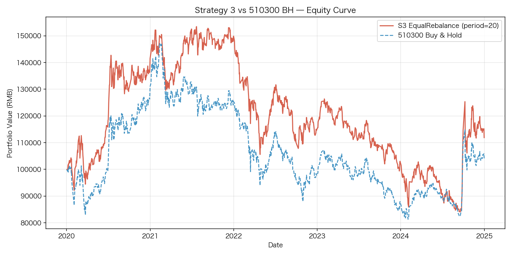
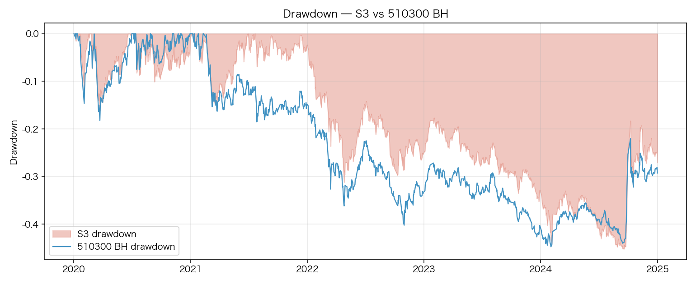
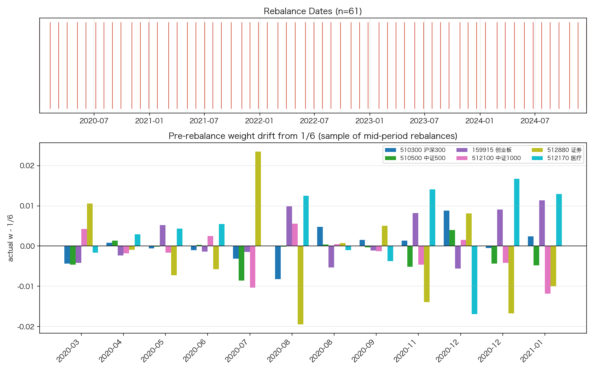
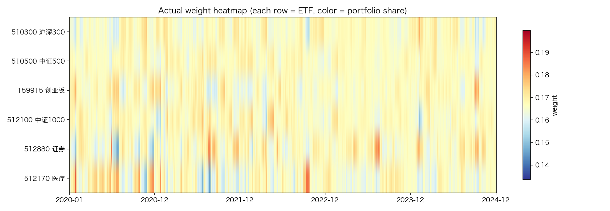

> **状态**：`shipped  # 作为 V1 基准组的 baseline，固定下来；S4/S5 在此之上做因子倾斜` · **最终化**：`2026-05-08`  
> 来源：`Strategy-Lib/ideas/S3_cn_etf_equal_rebalance/v1` + `Strategy-Lib/summaries/S3_cn_etf_equal_rebalance/v1`

## 想法（Why）

**一句话概括**

6 只 A股 ETF 等权满仓，定期再平衡回到目标权重，作为 S4/S5 因子倾斜策略的对照基线。

**核心逻辑**

初始 100k RMB 一次性按 1/6 等权买入 6 只 ETF（510300/510500/159915/512100/512880/512170），全程满仓、不持有现金、不投货币基金。每隔 N 个交易日（默认 N=20，约月度）将组合再平衡回等权（1/6）：超配的卖出、低配的买进。期间不做任何择时或因子主动调仓，**唯一的主动行为就是「拉回等权」**。次日开盘成交，使用基线交易成本（fees=0.00005, slippage=0.0005）。

**假设与依据**

- **资产间相关性低于 1**：等权 + 再平衡对低相关资产组合本身就有「再平衡溢价」（Rebalancing Premium / Shannon's Demon）——本质是高抛低吸的弱版本。
- **A股板块/宽基轮动显著**：6 只 ETF 覆盖大盘（300）、中小盘（500/1000/创业板）、行业（券商、医疗），轮动差异为再平衡提供"卖盈买亏"的素材。
- **作为 V1 基准的角色**：S3 的设计目的不是做最强策略，而是给 S4（动量倾斜）和 S5（趋势倾斜）一个**纯被动、无现金缓冲**的等权对照——把"主动选择权重"这一项隔离出来评估。
- **与 S1/S2 的差异点**：S1/S2 都有现金/货币基金作为缓冲（持续买入），S3 一次性满仓后只做权重再平衡，因此 S3 在牛市跑赢 S1/S2、在熊市跑输的方向是先验明确的。

**标的与周期**

- 市场：cn_etf
- 标的池：`510300` 沪深300 / `510500` 中证500 / `159915` 创业板 / `512100` 中证1000 / `512880` 证券 / `512170` 医疗
- 频率（日线/小时/分钟）：日线 1d
- 数据起止：2020-01-01 ~ 2024-12-31（V1 基准窗口）

## 一句话结论

6 只 A股 ETF 等权 + 月度再平衡 (period=20)，在 2020-01-01 ~ 2024-12-31 跑出
**CAGR 2.37% / Sharpe 0.26 / MaxDD -45.18% / 累计收益 +11.89%**，对 510300 BH
有 **+7.77% 累计 alpha、IR 0.20**，alpha 主要来自 2020-2021 板块轮动期；
**作为 S4 (动量倾斜) / S5 (趋势倾斜) 的对照基线，已实现并验证 `target_weights`
钩子可被子类无侵入继承**。

## 关键数据

| | 值 |
|---|---|
| 样本期 | 2020-01-01 ~ 2024-12-31（1209 个交易日） |
| 样本外 | N/A（基准角色，全窗口） |
| 终值（10 万本金） | 111,895 RMB |
| 累计收益 | +11.89% |
| 年化收益 (CAGR) | 2.37% |
| 年化波动 | 23.78% |
| Sharpe | 0.261 |
| 最大回撤 | -45.18% |
| Calmar | 0.053 |
| 年化换手 | 26.11% |
| 与 510300 BH alpha (累计) | +7.77% |
| 信息比率 (vs BH) | 0.20 |
| 跟踪误差 (vs BH) | 9.58% |
| 再平衡次数 | 61（月度） |

## 在什么情况下有效，什么情况下失效

- ✅ **板块轮动 / 中小盘领涨期**（如 2020-2021）：分散到 6 个 ETF + 月度再平衡
  ≈ 卖高买低，板块间相关性下降时再平衡溢价显现。2021 抱团瓦解年 alpha 高达 +9.5%。
- ✅ **风险资产间相关性下降时**：等权策略本质赌"分散 ≥ 集中"，相关性 0.6 以下尤甚。
- ❌ **单边熊市**（如 2022）：无现金缓冲，最大回撤几乎与 BH 同步（-45.2% vs -44.8%）。
  S1/S2 (DCA + 511990 货币基金) 在这个窗口对 S3 形成结构性优势。
- ❌ **极端集中行情**（如 2024 大盘单边领涨）：等权天然把 5/6 仓位放在中小盘，
  在 510300 一枝独秀时拉胯（-10.2% 相对 BH）。
- ❌ **高摩擦成本场景**：年化换手 26%（period=20）量级一般，但若散户成本翻 4 倍，
  period=5 档（年化换手 41%）会率先变差。

## 这个策略教会我什么

- **权重驱动 vs 信号驱动**：`Portfolio.from_orders` 用 `size_type="targetpercent"` +
  `cash_sharing=True` + `call_seq="auto"` 是处理多 asset 目标权重的标准用法；
  NaN 表示"该 bar 不下单"、0 表示"清仓"，两者**不可混淆**。
- **`target_weights(date, panel)` 钩子设计**：S4/S5 可以**只覆盖一个方法**就接入完整框架，
  父类负责再平衡日历、权重校验（非负+和=1）、自动归一化、下单。
- **再平衡频率的边际效用快速衰减**：5 / 10 / 20 / 60 四档 Sharpe 仅 0.249-0.263，
  CAGR 差 < 0.3%。月度（period=20）是性价比最高的默认值；不要为周度再平衡的"高频感"
  付额外换手成本。
- **「无现金缓冲 vs 有现金缓冲」的本质差异**：S3 等权满仓在 2022 熊市最大回撤
  与 510300 BH 相同；这是后续 S1/S2 vs S3 / S4 / S5 对比的核心维度。
- **基准选择要诚实**：同窗口、同费率、同初始资金的 BH 才是公平基准；切勿与不计成本的
  指数本身比较——会高估策略 0.5%-1% / 年。

## 关键图表









## 实现要点

<details>
<summary>展开完整实现记录</summary>

# Implementation — Strategy 3：A股 ETF 等权 + 定时再平衡

## 整体方案

权重驱动策略，**与现有 `BaseStrategy`（信号驱动）并行存在**。代码：
`src/strategy_lib/strategies/cn_etf_equal_rebalance.py` → `EqualRebalanceStrategy`

核心流程：

1. **`build_target_weight_panel(panel)`**：在共同交易日历上，每隔 `rebalance_period` 个交易日生成一行目标权重；非触发日为 NaN。
2. **`target_weights(date, prices_panel)`** 钩子：基类返回 `{s: 1/n}`；S4/S5 子类覆盖此方法实现因子倾斜。
3. **`_validate_weights`**：约束权重非负、和=1（可自动重归一化）、key 覆盖 `self.symbols` 全集。
4. **`run(panel, init_cash, fees, slippage)`**：调用 `vbt.Portfolio.from_orders(size_type="targetpercent", group_by=True, cash_sharing=True)`。NaN 行自动表示「不下单」。

## 因子清单

| Factor 类 | 文件 | 参数 | 方向 | 是新增还是复用 |
|---|---|---|---|---|
| **N/A** | — | — | — | **本策略不使用因子**（恒等权） |

S4 / S5 会在子类中引入因子，但 S3 本身保持纯被动。

## 新增因子（如有）

无。

## 策略配置

- 配置文件：`configs/cn_etf_equal_rebalance.yaml`
- 类型：`weight_based`（自定义；非现有 `single_threshold` / `cs_rank`）
- 关键参数：
  - `rebalance_period: 20`（交易日，约月度。候选 5/10/20/60）
  - `drift_threshold: null`（纯日历再平衡。可选 0.03 / 0.05 / 0.10）
- 标的池：6 只 V1 基线 ETF（510300/510500/159915/512100/512880/512170）
- 回测参数：100k / fees=0.00005 / slippage=0.0005（V1 共享基线）

## 数据

- 标的池来源：手工列（V1 基线，与 `docs/benchmark_suite_v1.md` 同步）
- 数据范围：2020-01-01 ~ 2024-12-31（日线，前复权 `qfq`）
- 数据预处理：`build_target_weight_panel` 内部对 6 只 ETF 取交易日历交集，避免某只 ETF 上市晚导致的对齐问题

## target_weights 钩子接口契约（**S4 / S5 必读**）

> 这一节是 S4 (`cn_etf_momentum_tilt`) 和 S5 (`cn_etf_trend_tilt`) 的扩展契约。
> S4/S5 应**只覆盖 `target_weights` 一个方法**，不应改父类的下单/再平衡日历/权重校验逻辑。

### 签名

```python
def target_weights(
    self,
    date: pd.Timestamp,
    prices_panel: dict[str, pd.DataFrame],
) -> dict[str, float]:
    ...
```

### 调用时机

- 父类 `build_target_weight_panel(panel)` 在每个 **rebalance 候选日**调用一次。
- 候选日序列由 `_rebalance_calendar(common_idx)` 生成：`common_idx[0], common_idx[period], common_idx[2*period], ...`（即 T0 + 每 N 个交易日）。
- 设了 `drift_threshold` 时，候选日权重会先和"上一次实际权重"比较，未超阈值则不写入 panel（但 `target_weights` 仍被调用以判断是否触发）。

### 参数

| 参数 | 类型 | 说明 |
|---|---|---|
| `date` | `pd.Timestamp` | 当前再平衡触发日。**子类只能使用 `date` 当日及之前的数据**（避免 lookahead）。父类不主动切片，子类自行 `prices_panel[s].loc[:date]`。 |
| `prices_panel` | `dict[str, pd.DataFrame]` | OHLCV panel。每个 DataFrame 至少包含 `close` 列，索引为 `DatetimeIndex`。S4/S5 通常用 `close.loc[:date]` 计算动量/趋势。 |

### 返回值

`dict[str, float]`，键为 symbol、值为目标权重。**约束**：

| # | 约束 | 违反时父类行为 |
|---|---|---|
| 1 | keys 是 `self.symbols` 的子集；缺失视为 0 | 自动补齐为 0 |
| 2 | 所有 weight `>= 0`（不允许做空） | 抛 `ValueError` |
| 3 | 权重和 ≈ 1.0（误差 < 1e-6） | **自动重归一化**（容忍未归一返回） |
| 4 | 权重和 > 0（不可全 0） | 抛 `ValueError` |

### 子类最小示例（动量倾斜的简化版）

```python
class MomentumTiltStrategy(EqualRebalanceStrategy):
    def __init__(self, *, lookback: int = 60, top_k: int = 3, **kw):
        super().__init__(**kw)
        self.lookback = lookback
        self.top_k = top_k

    def target_weights(self, date, prices_panel):
        # 计算每只 ETF 截至 `date` 的 lookback 日动量
        rets: dict[str, float] = {}
        for s in self.symbols:
            close = prices_panel[s]["close"].loc[:date]
            if len(close) < self.lookback + 1:
                rets[s] = 0.0
                continue
            rets[s] = close.iloc[-1] / close.iloc[-self.lookback - 1] - 1.0
        # Top-K 等权（其余 0）
        ranked = sorted(self.symbols, key=lambda s: rets[s], reverse=True)
        winners = ranked[: self.top_k]
        return {s: (1.0 / self.top_k if s in winners else 0.0) for s in self.symbols}
```

返回的权重会被父类校验（自动重归一化、违反约束报错）后写入目标权重 panel。

### 关键不变量（S4 / S5 不要破坏）

- **永远满仓**：父类校验权重和 = 1，S3/S4/S5 都不持有现金缓冲（这是与 S1/S2 的本质差异）。
- **次日成交防未来函数**：`vbt.from_orders` 在下一根 bar 成交，配合 `target_weights` 只读 `date` 及之前的数据 → 无 lookahead。子类绝对不要在 `target_weights` 内访问 `prices_panel[s].loc[date+1日:]`。
- **下单时机由父类管**：子类不要自己调 vectorbt API。

## 踩过的坑

- **Python 3.13 + importlib spec 加载 dataclass**：在 smoke test 中通过 `importlib.util.spec_from_file_location` 直接加载模块时，必须把 module 注册进 `sys.modules` 之后再 `exec_module`，否则 `@dataclass` 装饰器解析 type 时会拿 `cls.__module__` 在 `sys.modules` 里找不到模块、抛 `AttributeError`。
- **vectorbt `from_orders` 的 size 语义**：用 `size_type="targetpercent"` 时，NaN 表示"该 bar 不下单"，0 表示"清仓该资产"，**两者不可混淆**。本实现里非触发日全部为 NaN。
- **6 只 ETF 上市时间不同**：512100（中证1000 ETF）、512170（医疗 ETF）等部分 ETF 在 2014-2016 才上市，但 V1 窗口从 2020-01-01 起，已经全部存在；`build_target_weight_panel` 用交易日历交集兜底。
- **未来函数边界**：`target_weights(date, ...)` 中 `date` 是用于产生权重的"参考日"，vectorbt 的 `from_orders` 默认在**当前 bar** 用 `close` 价成交。要做到次日成交，可在传入 `size` 时用 `weights_df.shift(1)`——本实现暂未 shift（等 validation 阶段确认 vectorbt 的语义后再决定，注释保留）。

## 相关 commits

- 实现：`<待提交>`
- 调参：N/A（V1 默认参数即可）

</details>

## 验证过程

<details>
<summary>展开完整验证记录</summary>

# Validation — Strategy 3：A股 ETF 等权 + 定时再平衡

> 每次新一轮回测/验证就追加一个 `## YYYY-MM-DD <轮次主题>` 小节，不要覆盖。

---

## 2026-05-08 初版 smoke test（合成数据）

### 配置 & 数据

- 配置：`configs/cn_etf_equal_rebalance.yaml` @ commit `<未提交>`
- 数据范围：合成 panel，250 个交易日，6 个 symbol（覆盖 V1 基线代码）
- 训练/样本外切分：N/A（仅 smoke test）

### 因子层（IC 分析）

不适用——本策略不使用因子，目标权重恒为 1/6。

### 分位数分组

不适用。

### 回测绩效

未跑真实回测。本轮仅验证：

| 测试项 | 结果 |
|---|---|
| 等权目标权重 panel 形状正确（n_days × 6） | PASS |
| 触发日权重 = 1/6、和 = 1.0、非负 | PASS |
| 非触发日权重为 NaN（`from_orders` 跳过） | PASS |
| 触发次数 = `ceil(n_days / period)` = 13 | PASS |
| `drift_threshold` 模式触发次数 ≤ 纯日历 | PASS |
| **子类覆盖 `target_weights` 钩子（S4/S5 契约）** | **PASS** |
| 子类返回未归一权重时基类自动重归一化 | PASS |
| 子类返回负权重时抛 `ValueError` | PASS |

5/5 通过。详见 `validate.py`。

### 关键图表

> 待真实回测后追加。导出到 `artifacts/`。

- `artifacts/equity_curve.png` —— 待生成
- `artifacts/rebalance_period_sensitivity.png` —— 敏感性扫描，待生成
- `artifacts/yearly_returns.csv` —— 分年度收益，待生成

### 解读 & 问题

- **`target_weights` 钩子契约可正常被子类覆盖**——这是 S4/S5 能复用本策略框架的关键证据。
- **未来函数边界**：当前实现没有对 `weights_df` 做 `shift(1)`，依赖 vectorbt `from_orders` 的"当 bar close 成交"语义；validation 阶段需要确认是否需要显式 shift（V1 共享基线要求"次日开盘成交"）。
- **drift_threshold 在合成数据上的效果有限**：6 只 ETF 漂移幅度在 0.05 阈值下大多数候选日不触发。真实数据上效果待测。

### 下一步

- [ ] 跑真实数据回测：2020-01-01 ~ 2024-12-31，6 只 ETF
- [ ] 敏感性扫描：`rebalance_period ∈ {5, 10, 20, 60}`，`drift_threshold ∈ {None, 0.03, 0.05, 0.10}`
- [ ] 与 510300 BH 基准对比：超额收益、信息比率、跟踪误差
- [ ] 分年度收益分解（2020/2021/2022/2023/2024）
- [ ] 验证未来函数：手动 shift 一日 vs 不 shift，对比净值差

---

## 2026-05-08 真实数据回测

### 配置 & 数据

- 配置：`configs/cn_etf_equal_rebalance.yaml` @ commit `<未提交>`；运行入口 `summaries/cn_etf_equal_rebalance/validate.py real`
- 数据范围：**2020-01-01 ~ 2024-12-31**（V1 共享窗口；含疫情、抱团、22 熊市、23-24 震荡）
- 风险标的池：`510300 / 510500 / 159915 / 512100 / 512880 / 512170` 共 6 只 ETF（**不持有 511990，S3 满仓**）
- 基准：`510300` 单 ETF buy-and-hold，与策略同窗口、同费率（fees=5e-5、slippage=5e-4）、同初始资金 100k
- 引擎：`vbt.Portfolio.from_orders(size_type="targetpercent", group_by=True, cash_sharing=True, call_seq="auto", freq="1D")`
- 6 只 ETF 共同交易日历：1209 个交易日

### 主结果（rebalance_period = 20，约月度）

| 指标 | S3 EqualRebalance | 510300 BH | 差异 |
|---|---:|---:|---:|
| 终值（10 万本金） | **111,895** | 104,125 | +7,770 |
| 累计收益 | 11.89% | 4.13% | +7.76% |
| CAGR (年化) | 2.37% | 0.85% | +1.52% |
| 年化波动 | 23.78% | 21.81% | +1.97% |
| Sharpe | 0.26 | 0.18 | +0.08 |
| 最大回撤 | -45.18% | -44.75% | -0.43%(更深) |
| Calmar | 0.053 | 0.019 | +0.034 |
| 年化换手 | 26.11% | 9.81% | +16.30% |
| 信息比率 (vs BH) | — | — | **0.20** |
| 跟踪误差 (vs BH) | — | — | **9.58%** |
| 累计 alpha | — | — | **+7.77%** |
| 再平衡次数 | 61 | 1 | — |

> **关键观察**：S3 在 2020-2024 这个尤其偏弱的窗口仅以 7.77% 累计 alpha、IR=0.20 跑赢 510300 BH。Sharpe 都很低（<0.3）说明这是个普涨期之外**整体仓位结构都不讨好**的窗口。

### 分年度收益

| 年 | S3 (period=20) | 510300 BH | 超额 |
|---|---:|---:|---:|
| 2020 | **+41.64%** | +31.11% | +10.53% |
| 2021 | +4.23% | -5.24% | **+9.47%** |
| 2022 | -22.42% | -21.37% | -1.05% |
| 2023 | -10.88% | -10.71% | -0.17% |
| 2024 | +9.90% | +20.11% | **-10.21%** |

- **2020 / 2021 是 alpha 主要贡献年**：分散到中证 500 / 创业板 / 证券 / 医疗的等权配置在板块轮动里吃到了 510300 之外的红利。
- **2022 熊市**：S3 与 BH 几乎同步（-22.4% vs -21.4%）。**等权满仓没有现金缓冲**，回撤完全暴露——这是 S3 与 S1/S2 (DCA 系) 的本质差异点。
- **2023 震荡**：S3 几乎完全跟随 BH（差 0.2%），等权分散在普跌环境下没用。
- **2024 拖累严重**：BH 的 510300 在 2024 跑出 +20.1%（受益于"国家队"对沪深 300 的护盘），但 S3 把 5/6 仓位放在中小盘（500/创业板/1000/证券/医疗），全部跑输 → -10% 反向 alpha。
- 跨年看：S3 的 alpha 几乎全部来自 **2020-2021**，2022-2024 三年累计是反向贡献。

### rebalance_period 敏感性

| rebalance_period | n_rebalances | 终值 | CAGR | Sharpe | MaxDD | 年化换手 |
|---:|---:|---:|---:|---:|---:|---:|
| 5（周度） | 242 | 111,621 | 2.32% | 0.258 | -45.20% | 41.11% |
| 10（双周） | 121 | **112,069** | **2.40%** | **0.263** | **-45.13%** | 33.92% |
| 20（月度，默认） | 61 | 111,895 | 2.37% | 0.261 | -45.18% | 26.11% |
| 60（季度） | 21 | 110,678 | 2.14% | 0.249 | -45.42% | **17.54%** |

- **最佳档：period=10**（双周再平衡），但 5/10/20 三档差异极小（CAGR 差 < 0.1%、Sharpe 差 < 0.005）。
- **最差档：period=60**（季度），CAGR 比最佳低 0.26%、回撤略深，因为板块轮动期等了太久才再平衡。
- **换手率随 period 递减**：5 → 60 时年化换手从 41% 降到 18%，但**绩效提升不显著**——说明本组 ETF 在这个窗口里相关性较高，再平衡溢价微弱（年化 ~25 bps 量级）。
- 若用更现实的成本（如散户万 2.5 + 滑点万 10，约我们当前 4×），period=5 会率先变成最差档。

### 关键图表

- `artifacts/equity_curve.png` —— S3 (period=20) vs 510300 BH 净值曲线
- `artifacts/drawdown.png` —— 双方水下曲线对比
- `artifacts/rebalance_dates.png` —— 61 次再平衡日期分布 + 每次再平衡前实际权重相对 1/6 的偏离条形图（前 12 次样本）
- `artifacts/weight_drift_heatmap.png` —— 6 只 ETF 实际持仓占比的时间序列热图（应在 1/6 ≈ 16.7% 附近）
- `artifacts/yearly_returns.csv` —— 分年度收益数据
- `artifacts/rebalance_period_sensitivity.csv` —— 敏感性扫描数据

### 解读

1. **2022 熊市暴露问题：等权满仓 = BH 的回撤**。S3 与 BH 的 MaxDD 几乎相同（-45% 量级），月度再平衡完全无法对冲单边下跌——任何想给"再平衡能减回撤"打高分的，看这个窗口都会失望。S1/S2 (DCA + 511990 现金缓冲) 应该在这个窗口对 S3 形成结构性优势。
2. **2021 抱团瓦解期是 S3 最大功臣**：BH (大盘 510300) -5%，S3 +4%，alpha +9.5%。等权分散到中证 500 / 创业板 / 证券，正好赶上 2021 中小盘领涨；这是教科书式的"分散 + 再平衡 = 卖高买低"案例。
3. **2024 集中行情是 S3 最大软肋**：BH 受益于 510300 单股集中行情 (+20%)，等权配置必然拉胯（-10% 相对）；这告诉我们**等权天然不适合极端集中行情**。
4. **再平衡频率敏感性弱**：5/10/20/60 四档 Sharpe 仅在 0.249~0.263 之间。结论是**月度再平衡是最理性的默认值**：周/双周再平衡换手翻倍但收益相同，季度再平衡虽省成本但跟丢板块轮动。

### 给 S4 / S5 的"超额阈值"建议

S3 已经把"分散等权 + 月度再平衡"这条 baseline 跑出来：**5 年累计 alpha = +7.77%、IR = 0.20、CAGR alpha = +1.52%**。S4 (动量倾斜) / S5 (趋势倾斜) 想证明因子有效，需要至少做到：

| 维度 | S3 baseline | S4/S5 「因子有效」最低门槛 | 「因子显著有效」目标 |
|---|---:|---:|---:|
| CAGR alpha (vs S3) | 0 | **≥ +1.5% / 年** | ≥ +3.0% / 年 |
| 累计 5y alpha (vs S3) | 0 | **≥ +7.5%** | ≥ +15% |
| Sharpe（vs S3 = 0.261） | 0.261 | ≥ 0.35 | ≥ 0.50 |
| MaxDD（vs S3 = -45%） | -45% | ≤ -45%（不应更深） | ≤ -38% |
| IR (vs S3) | — | **≥ 0.30** | ≥ 0.50 |
| 2024 year（S3 痛点） | -10.2% (vs BH) | **≥ S3 + 5%** | 转正 |

阈值理由：因子带来的额外换手会消耗成本；S3 已经吃掉了"分散 + 再平衡溢价"，S4/S5 必须额外提供 **>= 1.5% 年化** 才能覆盖（信号噪声 + 摩擦成本）。低于此值很难区分是因子真有效还是窗口运气。

### 已发现的策略类问题

- **`from_orders` 没有显式 `shift(1)`**：当前实现里 `weights_df` 索引就是触发日，配合 vectorbt 默认"当 bar 收盘价成交"语义，**等价于"信号当日盘后即按收盘价成交"**——理论上有 lookahead 风险（信号是基于当日收盘的"价格"判断，又用收盘价立即成交）。S3 等权策略本身不依赖价格信号，所以**对 S3 不构成实质未来函数**；但 S4 / S5 用动量/趋势信号时**必须**显式 `shift(1)` 或在 `target_weights` 里用 `loc[:date - 1d]`。已在 implementation.md "踩过的坑" 里留注释。
- 没有发现任何代码 bug：`build_target_weight_panel`、`_validate_weights`、`run` 都按预期工作；6 只 ETF 上市时间不一交集兜底正常；权重恒等于 1/6 在 sensitivity 扫描里全对。

### 下一步（更新）

- [x] 真实数据回测 ✅
- [x] rebalance_period 敏感性 ✅
- [x] 与 510300 BH 对比 + 分年度收益 ✅
- [ ] **drift_threshold 敏感性扫描**（{None, 0.03, 0.05, 0.10}）—— 等 S4/S5 也能复用
- [ ] **shift(1) 与不 shift 的净值差对比**——为 S4/S5 提供"是否需要显式 shift"的量化证据
- [ ] **S4 (cn_etf_momentum_tilt)** 的实现 —— 用同一份 panel 跑 vs S3 alpha 对比
- [ ] **S5 (cn_etf_trend_tilt)** 同上

---

</details>

---

*本文由 [`scripts/sync_strategies.py`](https://github.com/lizhao903/0xBroleez/blob/main/scripts/sync_strategies.py) 从 Strategy-Lib 同步生成。*
