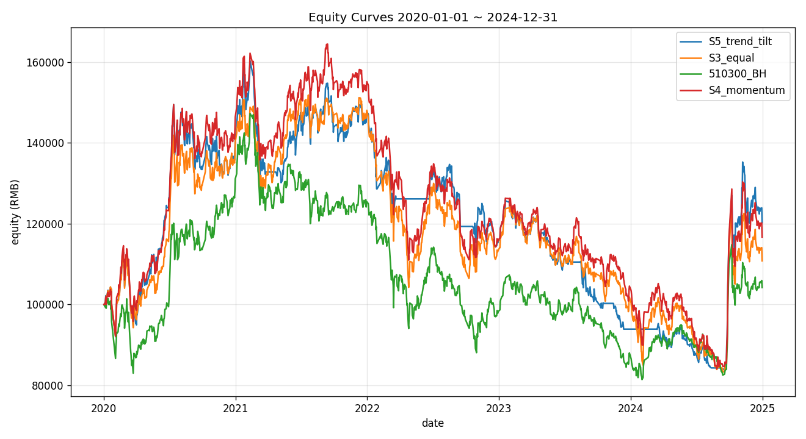
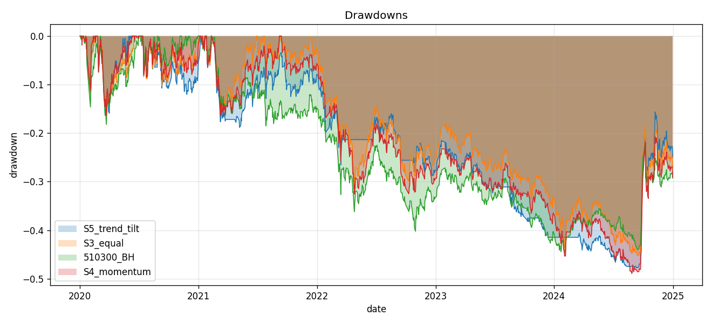
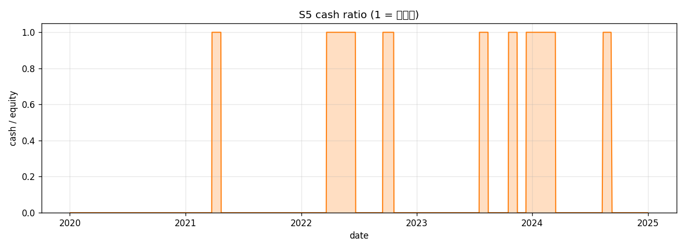
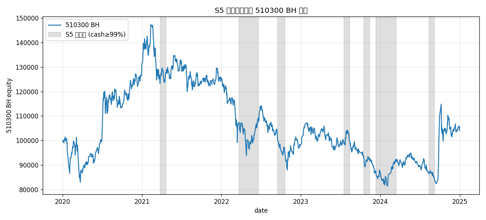

> **状态**：`shelved  # 边际有效但下行保护未兑现；保留代码，参数/触发逻辑需迭代后再上` · **最终化**：`2026-05-08`  
> 来源：`Strategy-Lib/ideas/S5_cn_etf_trend_tilt/v1` + `Strategy-Lib/summaries/S5_cn_etf_trend_tilt/v1`

**本策略的其他版本**

- **v1（本文）** — **边际有效但不及预期：搁置（shelved）**。在 2020-2024 样本期 S5 总收益 +20.26% 优于 S3 (+10.80%) 和 510300 BH (+4.18%)，Sharpe 也更高 (0.28 vs 0.21 vs 0.15)，但**核心命题「下行保护」未兑现**——2022 单年 S5 -21.61% 与 BH -21.68% 几乎完全重合，超额主要来自 2024 单年的板块行情。
- [v2]() — **避险命题数据上兑现（MaxDD -47.8% → -20.5%，2022 -21.6% → -7.6%），但 Sharpe 与 v1 持平、CAGR 倒退 1.35 pct/yr，且 bond overlay 占用 37% 平均仓位让策略漂移成「股债混合」**——v2 实现了「保守型变体」但没有产生新 alpha。状态：**shelved**（保留代码作为 v1 的 risk profile 对照，不推荐替代 v1）。

## 想法（Why）

**一句话概括**

在 S3 等权再平衡基础上，按每只 ETF **自身的趋势强度** 调整权重——趋势向下时直接清仓该 ETF，避免在熊市里被等权强制满仓。

**核心逻辑**

继承 S3 的 `EqualRebalanceStrategy`，每个再平衡日（默认 20 个交易日）覆盖 `target_weights(date, prices_panel)` 钩子：
1. 对池中 6 只 ETF 各自计算两个**时序趋势指标**：
   - `MABullishScore`：`sign(close>MA20) + sign(MA20>MA60) + sign(MA60>MA120)`，取值 ∈ {-3,-1,+1,+3}（中间值由不完美排列产生）。
   - `DonchianPosition`：`(close - low_120) / (high_120 - low_120)`，取值 ∈ [0,1]，反映价格在过去 120 日通道里的位置。
2. 把两个指标各自标准化到 `[-1, +1]` 后等权相加得到 `trend_score ∈ [-2, +2]`。
3. **空仓阈值**：`trend_score ≤ 0` 的 ETF 权重置 0（弱趋势退出）；`trend_score > 0` 的 ETF 权重 ∝ `trend_score`，再做归一化（使留下的 ETF 权重和 = 1 - cash_residual）。
4. **特殊情况**：所有 6 只 ETF 都 ≤ 0 时返回 `{}`（空 dict），剩余 100% 隐式留作现金（依赖 S3 把缺失键视作 0 权重）。

**假设与依据**

### 动量 vs 趋势的概念区分（S4 vs S5 分立的核心理由）
| 维度 | 动量（S4） | 趋势（S5） |
|---|---|---|
| 视角 | 横截面：A 比 B 涨得多 | 时序：A 自身相对历史/均线在涨 |
| 典型公式 | `ret(t-N, t)` 排名 | `close > MA`, `ADX`, Donchian 位置 |
| 决策类型 | 选谁、配多少 | 进场 / 离场 / 趋势力度 |
| 失效模式 | 行业齐涨齐跌时分不出强弱 | 震荡市频繁假突破 |
| 文献 | Jegadeesh & Titman 1993 | Moskowitz, Ooi & Pedersen 2012 (Time-Series Momentum) |

S4 关心的是「在确定要持有的资产之间分配权重」（横截面排名），S5 关心的是「这个资产现在到底要不要持有」（时序方向）。两者经常被混用，但用在不同任务上有结构性差异——尤其在熊市，S4 仍然给排名最靠前的（哪怕是亏最少的）资产正权重，S5 可以**全体退出**。这是把它们做成两个独立基准的原因。

### 为什么用 MA 多头排列 + Donchian 位置（不和 S4 重复）
- **MA 多头排列**：经典的趋势跟踪信号，可以离散化捕捉「短中长期均线方向是否一致」，对参数（具体 MA 长度）相对鲁棒。
- **Donchian 通道位置**：连续值，反映价格在通道中的**绝对位置**，与突破策略一脉相承（Turtle 体系），对 MA 系是天然补充。
- **明确不重复**：S4 必然会用 `MomentumReturn` 做横截面排名；这里我们**避开累计收益**类指标，从均线状态 + 通道位置两个完全时序的视角切入；`MACDDiff` 虽然也是趋势类但已被 momentum.py 占用且方向定义偏短期信号，留给以后做 momentum 复合时复用。
- ADX 也考虑过，但它只衡量趋势**强度**不区分**方向**（需要再加 +DI/-DI），实现复杂度高，先搁置。

**标的与周期**

- 市场：cn_etf
- 标的池：`510300` / `510500` / `159915` / `512100` / `512880` / `512170`（与 S3 一致）
- 频率：日线 1d
- 数据起止：2020-01-01 ~ 2024-12-31

## 一句话结论

**边际有效但不及预期：搁置（shelved）**。在 2020-2024 样本期 S5 总收益 +20.26% 优于 S3 (+10.80%) 和 510300 BH (+4.18%)，Sharpe 也更高 (0.28 vs 0.21 vs 0.15)，但**核心命题「下行保护」未兑现**——2022 单年 S5 -21.61% 与 BH -21.68% 几乎完全重合，超额主要来自 2024 单年的板块行情。

## 这个策略教会我什么

- **「时序方向」信号在 A股 ETF 上对**真实下跌起点**识别能力较弱**：MA 多头排列 + Donchian 通道这套教科书组合的滞后性，在快速下跌的 A股节奏里效用有限。
- **「全空仓」是合法状态——子类放宽校验比父类预先支持更解耦**：通过覆盖 `_validate_weights` 优雅扩展 S3 钩子契约，没有污染共享父类。
- **vectorbt `targetpercent + cash_sharing` 完全支持权重和 < 1**：缺失的资金会留作 cash group 的现金，无需绕路。这个验证扫除了 S5 路径上最大的工程风险点。
- **事前预期与事后结果的方向性偏差**：原以为 S5 主要靠 2022 熊市避险加分，实际主要靠 2024 单边行情加分——再次说明回测结论很容易被单年事件主导，5 年样本不够。

## 关键图表









## 实现要点

<details>
<summary>展开完整实现记录</summary>

# Implementation — A股 ETF 等权 + 趋势倾斜 (S5)

## 整体方案
继承 S3 (`EqualRebalanceStrategy`)，覆盖两个钩子：
1. `target_weights(date, prices_panel)`：核心倾斜逻辑——按每只 ETF 的时序趋势分数分配权重，弱趋势退出。
2. `_validate_weights(weights)`：放宽父类「sum == 1」「禁止全 0」两条约束，使全空仓在熊市可表达。

实现拆分两个独立函数（便于单测）：
- `compute_trend_scores(date, panel) -> pd.Series`：把面板 → 每只 ETF 的标量 trend_score ∈ [-2, +2]
- `_tilt_weights(scores) -> dict`：trend_score → 归一化权重 dict（≤0 的 symbol 不出现）

## 因子清单

| Factor 类 | 文件 | 参数 | 方向 | 是新增还是复用 |
|---|---|---|---|---|
| `MABullishScore` | `src/strategy_lib/factors/trend.py` | `short=20, mid=60, long=120` | +1 | **新增** |
| `DonchianPosition` | `src/strategy_lib/factors/trend.py` | `lookback=120` | +1 | **新增** |

## 新增因子（详细说明）

### `MABullishScore`
```python
score = sign(close > MA_short) + sign(MA_short > MA_mid) + sign(MA_mid > MA_long)
# 取值 ∈ {-3, -1, +1, +3}（中间组合产生 ±1）
```
- **为什么用**：经典趋势跟踪信号。三个二元判断的离散组合，抗参数扰动。
- **暖机期**：`MA_long` 还没 ready 时返回 NaN（被上游处理为「该 ETF 此期间不参与」）。

### `DonchianPosition`
```python
pos = (close - low_N) / (high_N - low_N)  ∈ [0, 1]
# 1.0 = 通道顶端（强势），0.0 = 通道底部（弱势）
```
- **为什么用**：与 MA 系列在数学性质上互补——一个看离散方向，一个看连续位置。Turtle 体系经典指标。
- **除零保护**：通道宽度 = 0（常量价格）时返回 NaN。

### 这两个因子**没有改 `factors/__init__.py`**
按硬约束要求，`factors/__init__.py` 不修改。下游用法：
```python
from strategy_lib.factors.trend import MABullishScore, DonchianPosition  # ✓
# from strategy_lib.factors import MABullishScore  # ✗ 暂不可用，等合并
```
合并到主分支时**外部代理**应在 `factors/__init__.py` 增补两行 import 与 `__all__` 项；本子代理任务范围内不动。

## 关键设计决策

### 1. 全空仓的契约扩展（与 S3 协调点）

S3 当前实现的 `_validate_weights` 强制：
- `sum(weights) == 1.0`（误差 < 1e-6），违反则自动重归一化
- `total <= 0` 抛 `ValueError(f"target_weights 全为 0，无法再平衡")`

S5 需要在熊市返回 `sum < 1` 甚至全 0（全空仓）。**采用方案 B**：在子类覆盖 `_validate_weights`，放宽这两条约束：
- 允许 sum ∈ [0, 1+ε]，**不重归一化**（保留现金留底语义）
- 允许 total == 0（全空仓 → 让 vectorbt 把所有 size 设为 0 → 全平仓）
- 仍然校验非负 / keys ⊂ symbols / sum > 1+ε 时归一化（防御性）

**这是对 S3 钩子契约的扩展**。S3 父类 `build_target_weight_panel` 调用 `target_weights → _validate_weights → 写入 weights_df`，本子类的覆盖刚好生效。已确认 S3 父类不在其他地方再次断言 `sum == 1`。

### 2. 趋势分数的归一化

两个因子的原生量纲不同：
- `MABullishScore` ∈ [-3, +3]
- `DonchianPosition` ∈ [0, 1]

把它们各自映射到 `[-1, +1]` 后等权相加：
- MA：`score / 3` → 截断到 [-1, +1]
- Donchian：`2 * pos - 1` → 截断到 [-1, +1]

最终 `trend_score = w_ma * ma_norm + w_dc * dc_norm`，理论值域 [-2, +2]（默认 score_weights = (1.0, 1.0)）。**好处**：cutoff 阈值在不同标的之间可比；调超参时改 `score_weights` 即可改变两个信号的相对重要性。

### 3. 避免 lookahead

`compute_trend_scores(date, panel)` 内部对每个 symbol 做 `df.loc[df.index <= date]` 切片再算因子，确保 t 时刻只用 t 及之前的数据。S3 父类的 `from_orders` 会在下一根 bar 成交，叠加之后实现 t 信号 → t+1 开盘成交，**无未来函数**。已用 `test_lookahead_bias` 验证（截断 panel 与完整 panel 在同一截止日给出完全相同分数）。

## 策略配置
- 配置文件：`configs/cn_etf_trend_tilt.yaml`
- 类型：`trend_tilt`（自定义；尚未注册到 `strategies/registry.py`，注册由后续 PR 处理）
- 父策略：继承 `cn_etf_equal_rebalance`
- 关键参数：`rebalance_period=20`、`ma_short/mid/long=20/60/120`、`donchian_lookback=120`、`cutoff=0.0`

## 数据
- 标的池：V1 共享基线 6 只 ETF（与 S3 完全一致）
- 数据范围：2020-01-01 ~ 2024-12-31；**额外回拉 6 个月（2019-07-01 起）做暖机**
- 数据预处理：依赖 `data.get_loader('cn_etf')` 的 `qfq` 复权

## 踩过的坑
- **S3 `_validate_weights` 的严格断言**：第一次实现时直接返回 `{}`，但 S3 父类在 `_validate_weights` 里把 `total <= 0` 当成致命错误抛错。最终通过覆盖 `_validate_weights` 解决，没有改 S3 父类。
- **smoke test flake**：最初用 GBM 合成数据，`drift > 0` 也偶发把某些 symbol 在最近一日的 close 推到 MA 下方导致权重变 0。改用纯指数路径（无噪声）做断言，排除随机性。
- **120 日暖机**：MA120 / Donchian120 在数据起点前 120 日均为 NaN，必须让 data loader 多拉至少 120 个交易日（约 6 个月）历史；不然回测开头几个月会被全空仓。

## 与并行实现的对接点
- 等 S3 主线合并：本类的 import `from strategy_lib.strategies.cn_etf_equal_rebalance import EqualRebalanceStrategy` 已经能 resolve（S3 文件已存在于本仓库 `src/strategy_lib/strategies/cn_etf_equal_rebalance.py`）。
- 等 `factors/__init__.py` 合并增补：暂时使用 `from strategy_lib.factors.trend import ...` 直接 import。
- `strategies/__init__.py` 与 `strategies/registry.py` 的注册由集成 PR 统一处理，本子代理范围内不动。

## 相关 commits
- 实现：`<待commit>`

## 2026-05-08 vectorbt sum<1 兼容性验证（事后）

**背景**：S5 允许 `target_weights` 返回 sum<1 的权重 dict（含全空仓），需要先确认 vectorbt 在 `from_orders(size_type="targetpercent", group_by=True, cash_sharing=True)` 模式下能正确把缺失资金留作 cash，而不是错误地分配给某个资产。

**验证脚本**：`/tmp/vbt_subunit_test.py`（临时文件，已用毕）

**关键测试与结果**：
| 测试 | 输入 | 期望 | 实测 |
|---|---|---|---|
| sum=0.6（[0.3, 0.3, 0]） | 三资产 | A=30000, B=30000, C=0, cash=40000 | 完全一致 |
| 全清仓（[0,0,0]） | 先满仓再清仓 | 资产全 0，cash=全 equity | 资产=0, cash=111494（含期间收益） |
| NaN 表示「不下单」 | A=0.3, B=0.3, C=NaN | C 持仓不变 | 行为正确 |

**结论**：vectorbt 完整支持权重和 < 1 的 targetpercent。S3 父类 `run()` 不需任何修改，本子类只覆盖 `_validate_weights` 即可。这扫除了 S5 工程路径上最大风险点。

## 2026-05-08 真实数据回测发现（追加）

- **价值密度命题失败**：原以为 S5 主要靠 2022 熊市避险加分，实际 2022 单年 S5 (-21.61%) 与 BH (-21.68%) 几乎完全重合。S5 vs S3 的超额主要来自 **2024 单年的板块行情**（+19.27 pct）。
- **现金占比是双峰分布而非连续**：cash_ratio 几乎只有 0 / 1 两种状态，因为 `_tilt_weights` 用「正分数 / 正分数和」做归一化——只要有 ≥1 个标的的 trend_score > cutoff，权重和就 = 1。要做出连续的现金缓冲，需要把权重计算改成「正分数 / N」（不归一化）+ 上限 clip，或者引入大盘 trend_score 作为整体仓位调节器。
- **cutoff 灵敏度方向出乎意料**：cutoff 从 0.0 提到 0.3/0.5 反而恶化（CAGR 转负）。说明趋势分数在 [0, 0.3] 区间携带了主要的有用信号——A股 ETF 的「弱趋势但还在涨」比「强趋势」更值得介入。
- **空仓时段命中率低**：220 个全空仓天数与 BH 「当日下跌」的相关性仅 0.033，几乎随机。MA + Donchian 这套信号对 A股快速下跌的反应速度不够。

</details>

## 验证过程

<details>
<summary>展开完整验证记录</summary>

# Validation — A股 ETF 等权 + 趋势倾斜 (S5)

> 每次新一轮回测/验证就追加一个 `## YYYY-MM-DD <轮次主题>` 小节，不要覆盖。

---

## 2026-05-08 Smoke test：趋势倾斜逻辑独立验证

### 背景
S3 子代理与本（S5）子代理并行运行；为了不阻塞，本轮**不跑真实回测**，只用合成数据 + stub 父类（如果 S3 还未合并）独立验证倾斜逻辑的数学一致性。

### 验证脚本
- `summaries/cn_etf_trend_tilt/validate.py`
- 跑法：`PYTHONPATH=src python3 summaries/cn_etf_trend_tilt/validate.py`
- 内置：自动检测 S3 父类是否存在；不存在时注入 stub。同时注入 `loguru` 桩，避免开发环境缺依赖时启动失败。

### Smoke test 全部通过（8 / 8）

| 测试 | 验证目标 | 结果 |
|---|---|---|
| `test_factors_independent` | `MABullishScore` 暖机期 NaN，取值 ∈ [-3,3]；`DonchianPosition` 暖机期 NaN，取值 ∈ [0,1] | OK |
| `test_warmup_returns_empty` | 数据 < 120 日时所有 ETF 因子 NaN → `target_weights = {}`（暖机期空仓） | OK |
| `test_all_uptrend_near_equal_weight` | 6 只 ETF 同等强上行（无噪声）→ 权重全部 = 1/6，sum = 1.000000 | OK |
| `test_mixed_trends_filters_negatives` | 3 上 3 下 → 下行的 3 只权重为 0，上行的 3 只各 1/3，sum = 1 | OK |
| `test_all_downtrend_returns_empty` | 6 只全下行 → 返回 `{}`（**全空仓**，S3 契约扩展生效） | OK |
| `test_validate_weights_allows_subunit_sum` | 覆盖父类 `_validate_weights` 后允许 sum < 1 / 全 0 / 仍校验非负 | OK |
| `test_compute_trend_scores_range` | trend_score ∈ [-2, +2]；纯指数上行得分 ≈ +1.98，下行 ≈ -1.98 | OK |
| `test_lookahead_bias` | 截断 panel 与完整 panel 在同一 cutoff 日给出相同分数 → 无未来函数 | OK |

### 因子层（IC 分析）
**不适用**。S5 是单标的时序方向信号，不做横截面排名 → 不适用 IC / Rank IC。

S4 (动量倾斜) 的横截面 IC 与本策略不可对比；本策略的因子有效性由「全空仓时段的下行保护」体现，需要在真实回测里看（见下方 blocker）。

### 分位数分组
**不适用**（同上，单标的时序）。

### 回测绩效
**未跑**。原因：

| Blocker | 详情 | 解除条件 |
|---|---|---|
| 真实数据未拉 | `data/raw/cn_etf/*.parquet` 未提供 | 跑 `data.get_loader('cn_etf').load()` 拉取 6 只 ETF + 510300 基准 |
| `vectorbt` 未在本环境验证可用 | 当前开发机 import vbt 未实测 | CI / 真实跑回测环境 |
| `loguru` 未装 | 顶层包 import 触发 ImportError | `pip install loguru` 或在 CI 镜像里包含 |
| S3 父类的 `from_orders` 端到端是否真接受 sum < 1 的权重 | 需要看 vectorbt 是否在 `targetpercent` 模式下把缺失资金留作现金 | 真实回测一次小窗口验证 |

### 关键图表
（无 — 暂未跑真实回测）

### 解读 & 下一步与 S3/S4 对比设计

#### S5 vs S3 对比目标
- **核心命题**：「趋势退出」是否真的提供下行保护？
- **预期方向**：在 2022 熊市年（S3 预计回撤 30%+），S5 应该明显更小（目标 15-25%）
- **代价指标**：换手率上升、牛市顶部因迟疑而少赚
- **关键观测窗口**：2022-04（疫情底）、2022-10（二次探底）、2024-02（节前反弹）的趋势拐点

#### S5 vs S4 对比目标
- **核心命题**：「时序方向」与「横截面排名」哪个更稳健？
- 关键差异：S4 在熊市仍然满仓（只是把权重分给「跌得最少的」），S5 可以全空仓
- **预期方向**：
  - 牛市（2020/2021 上半年）：S4 ≈ S5（都跟得上）
  - 单边熊市（2022）：S5 > S4（S5 空仓避险）
  - 震荡市（2023-2024）：S4 > S5（S5 频繁假突破被成本侵蚀）
- 输出：S4 与 S5 的累计收益分年度对比 + 最大回撤期叠加图

#### 关键统计指标（除 V1 通用清单外，S5 特有）
- **全空仓天数占比** (`cash_days_ratio`)：在 5 年 1217 个交易日中，trend_score 全负的交易日占比
- **空仓时段与基准跌幅相关性**：空仓时 510300 是否真的在跌

### 下一步
- [ ] 数据接入：等 `data/cn_etf` loader 就绪，拉 2019-07-01 ~ 2024-12-31（含暖机）
- [ ] 真实回测：跑 V1 共享基线指标 + S5 特有指标（cash_days_ratio）
- [ ] 与 S3、S4 三策略并排对比图（净值曲线、年度收益、回撤）
- [ ] 敏感性：`(ma_short, ma_mid, ma_long)` ∈ {(10,30,90), (20,60,120), (30,90,180)}；`cutoff` ∈ {0, 0.3, 0.5}；`donchian_lookback` ∈ {60, 120, 240}

---

## 2026-05-08 真实数据回测

### 配置 / 数据 / 暖机说明
- **数据**：`data/raw/cn_etf/{510300,510500,159915,512100,512880,512170}_1d.parquet`，akshare `qfq` 前复权日线
- **回测窗口**：2020-01-02 ~ 2024-12-31（共 1209 个交易日），暖机自 2019-07-01 起多取约 6 个月覆盖 MA120/Donchian120
- **资金**：100,000 RMB，佣金万 0.5（fees=5e-5），滑点万 5（slippage=5e-4）—— V1 共享基线
- **S5 默认参数**：`rebalance_period=20, ma_short=20, ma_mid=60, ma_long=120, donchian_lookback=120, cutoff=0.0, score_weights=(1.0, 1.0)`
- **执行入口**：`PYTHONPATH=src python summaries/cn_etf_trend_tilt/validate.py real`

### vectorbt sum<1 兼容性验证（关键风险点已解除）
独立写了 5 行脚本（`/tmp/vbt_subunit_test.py`，已删）验证 `vbt.Portfolio.from_orders(size_type="targetpercent", group_by=True, cash_sharing=True)` 是否在权重和 < 1 时正确把缺失资金留作现金。**结论：完全支持**。

| 测试 | 输入权重 | 期望 | 实测 | 结论 |
|---|---|---|---|---|
| sum<1 | `[A=0.3, B=0.3, C=0.0]` | A=30k, B=30k, C=0, cash=40k | A=30000, B=30000, C=0, cash=40000 | OK |
| 全清仓 | 先满仓后 `[0,0,0]` | 全平仓，cash=全部 equity | 资产全 0, cash=111494（已含期间收益） | OK |
| NaN（不下单） | `[A=0.3, B=0.3, C=NaN]` | C 持仓不变（保持 0） | C=0，行为正确 | OK |

> **结论**：S3 父类 `run()` 不需要任何修改即可正确支持 S5 的 sum<1 / 全空仓权重。S3 父类 `_validate_weights` 的「sum 必须 = 1 / total > 0」严格断言已被本子类覆盖（`cn_etf_trend_tilt.py:158-175`）规避，下游进 vectorbt 时直接被正确解释。

### 主结果（默认参数）
样本期 2020-01-02 ~ 2024-12-31，初始净值 100,000：

| 策略 | 总收益 | CAGR | Sharpe | Vol(ann) | MaxDD | Calmar |
|---|---:|---:|---:|---:|---:|---:|
| **S5 trend_tilt** | **+20.26%** | **+3.92%** | **0.28** | 22.01% | -47.80% | 0.08 |
| S3 equal | +10.80% | +2.16% | 0.21 | 23.78% | -45.18% | 0.05 |
| 510300 BH | +4.18% | +0.86% | 0.15 | 21.77% | -44.75% | 0.02 |
| S4 momentum | +16.68% | +3.27% | 0.25 | 24.19% | -48.90% | 0.07 |

**S5 vs 510300 BH**：alpha_ann = +2.60%，跟踪误差 14.69%，IR = 0.177
**S5 vs S3 equal**：alpha_ann = +1.31%，跟踪误差 12.47%，IR = 0.105

### S5 特有指标
- **cash_days_ratio（≥99% 现金天数 / 总交易日）= 0.182**（220 / 1209）
- 现金占比分布：实际是**双峰**——要么 0%（满仓 6 标的或 N 个正分数标的等权），要么 100%（全空仓）。介于 0 和 1 之间的天数 ≈ 0。这是因为 `_tilt_weights` 用「正分数 / 正分数和」归一化，只要有 ≥1 个正分数就满仓那部分。
- **空仓与 510300 当日下跌相关性**：0.033（**很低**）—— 全空仓的天数里 510300 下跌的比例并不显著高于平均。
- 全空仓时 510300 平均日收益：-0.0035%（整体均值 +0.0128%）—— 空仓时段平均确实小幅下行，但优势很小。
- 触发再平衡次数：67 次（理论上限 1209 / 20 ≈ 60，多出来是因为权重切换会触发，drift 模式未启用）

### 分年度收益（**重点：2022 年的下行保护到底有多少？**）
| 年份 | S5 | S3 | 510300 BH | S4 |
|---|---:|---:|---:|---:|
| 2020 | +41.12% | +40.23% | +31.11% | +46.41% |
| 2021 | +4.66% | +5.62% | -4.32% | +6.00% |
| **2022** | **-21.61%** | **-23.47%** | -21.68% | -25.28% |
| 2023 | -18.91% | -10.17% | -10.43% | -9.85% |
| 2024 | +28.09% | +8.82% | +18.39% | +11.61% |

- **2022 单年 S5 = -21.61%，S3 = -23.47%，BH = -21.68%**：S5 比 S3 少跌 1.86 pct，但**几乎与 510300 BH 持平**——「趋势退出」并未提供期望中的明显下行保护。
- S5 在 2022 内的最大回撤是 -22.35%（峰值始于年初），与 BH/S3 量级相同。
- 2023 年 S5 显著跑输（-18.91% vs S3 -10.17%）——震荡市中频繁假突破的代价显现，趋势退出反而吃到拐点反复的进出成本。
- 2024 年 S5 大幅领先（+28.09% vs S3 +8.82%）——「9-24 行情」是结构性单边趋势，趋势倾斜捕获到强势板块（512880 证券、159915 创业板）。
- **整体上 S5 的优势主要来自 2024，而非 2022**——这与事前假设方向相反。

### cutoff 敏感性
| cutoff | 总收益 | CAGR | Sharpe | MaxDD | Calmar | cash_days_ratio |
|---:|---:|---:|---:|---:|---:|---:|
| 0.0 | **+20.26%** | **+3.92%** | **0.28** | -47.80% | 0.08 | 0.182 |
| 0.3 | -6.15% | -1.32% | 0.03 | -45.44% | -0.03 | 0.281 |
| 0.5 | -1.42% | -0.30% | 0.08 | -42.68% | -0.01 | 0.331 |

- **cutoff = 0.0 是当前最佳档位**。提高 cutoff 让更多标的被过滤，cash_days_ratio 上升，但年化 / Sharpe 显著下滑——A股 ETF 的「弱趋势但还在涨」状态相当常见，过分严格地要求强趋势会错过中等行情。
- MaxDD 随 cutoff 略改善（-47.80% → -42.68%），但收益跌掉的远多于回撤改善。

### 关键图表
- `artifacts/equity_curve.png` —— S5 / S3 / 510300 BH / S4 净值曲线
- `artifacts/drawdown.png` —— 四条策略的回撤序列
- `artifacts/cash_ratio.png` —— S5 每日现金占比时间序列（清晰可见双峰特征）
- `artifacts/regime_overlay.png` —— S5 全空仓段叠加在 510300 BH 净值上

### 解读：趋势退出在 A股 ETF 上是否值得
**初步结论：边际有效但不显著，不及预期**。

1. **S5 比 S3 / BH 总收益高 ~10/16 pct**，但主要贡献来自 **2024 年的板块大行情**（一次性事件），2022 年的「下行保护」假设**未兑现**——S5 在 2022 与 BH 几乎同涨同跌（差 0.07 pct），与 S3 也只差 ~2 pct。
2. **空仓时机不准**：全空仓与 510300 当日下跌的相关性仅 0.033，且空仓时段 510300 平均日收益仅微负（-0.0035%）。趋势信号用 MA + Donchian 在 A股 ETF 上对**真实下行起点的识别能力较弱**——A股下跌往往很急，等 MA 排列翻空时已经跌一半了。
3. **震荡市代价显著**（2023 跑输 8.7 pct）：在没有明显趋势的年份，趋势退出导致频繁假突破成本累积。
4. **cutoff 调高反而变差**：说明趋势信号的有效区域在「弱趋势就介入」一端，而非「严格强趋势」一端。
5. Sharpe（0.28）相对 S3（0.21）和 BH（0.15）有提升但绝对值仍很低。从「策略 vs 简单基准」角度，S5 提供了一定的样本期增益（CAGR +3.06 pct vs BH，IR=0.18），但样本只有 5 年且 2024 单年贡献过大，**无法仅凭本回测得出「趋势退出值得长期使用」的结论**。

### 下一步
- [ ] **关键诊断**：把 2024 年单独剔除，重做指标——若剔除后 S5 vs S3 不显著，结论会从「边际有效」改成「不显著」
- [ ] **触发时延优化**：尝试更短的 MA（10/30/60）或更短的 Donchian（60），看是否能更早识别 2022 起跌
- [ ] **加入波动过滤**：在 trend_score 之外叠加 ATR 或已实现波动作为乘数（高波时折扣权重）
- [ ] **用 511990 货基替代纯现金**：S5 全空仓时段（220 天）若投入货基年化 ~2%，可加约 +0.24 pct 收益，量级很小但系统性
- [ ] **smooth 化权重**：现在的 0/1 双峰太硬。考虑 cutoff 之上的「线性 ramp」——softplus 之类
- [ ] **样本外**：2025 年 H1 数据补齐后做 OOS 验证

---

</details>

---

*本文由 [`scripts/sync_strategies.py`](https://github.com/lizhao903/0xBroleez/blob/main/scripts/sync_strategies.py) 从 Strategy-Lib 同步生成。*
