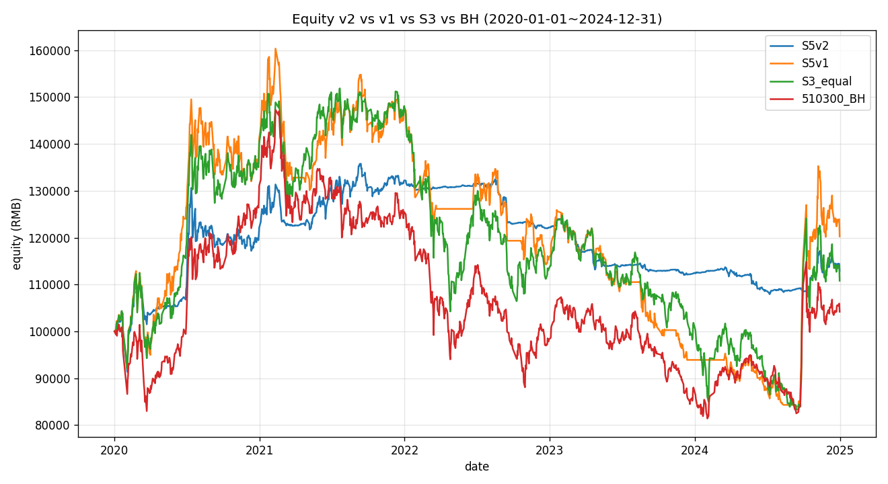
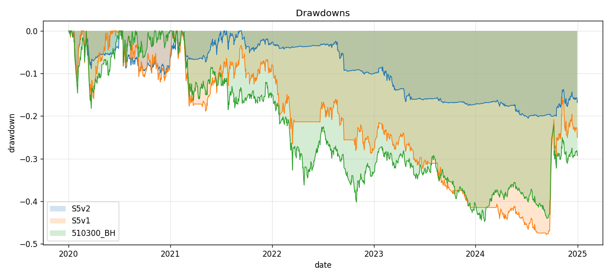
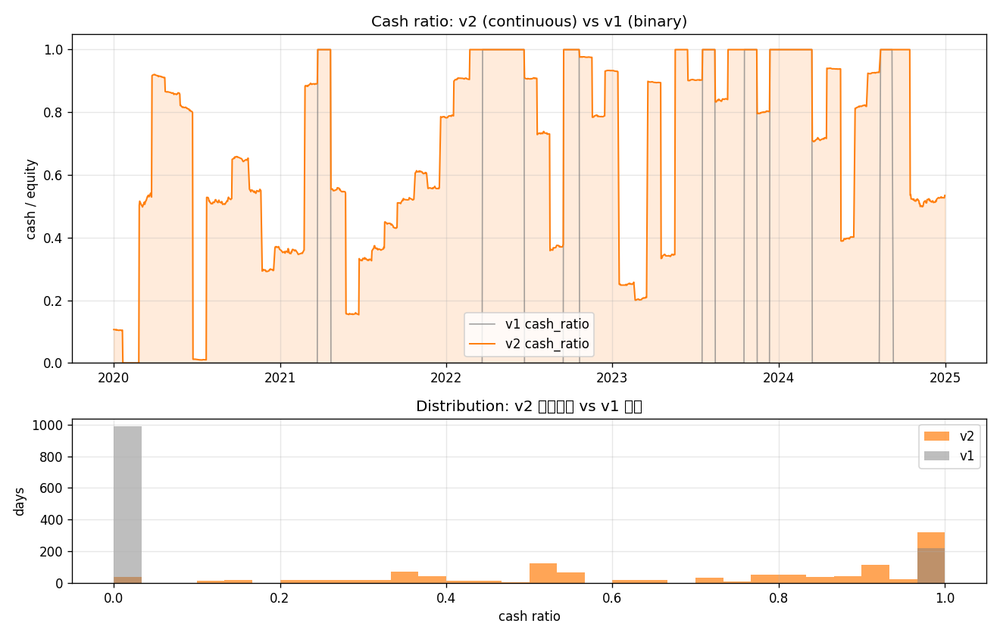
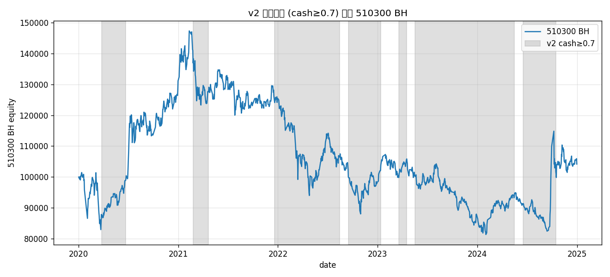
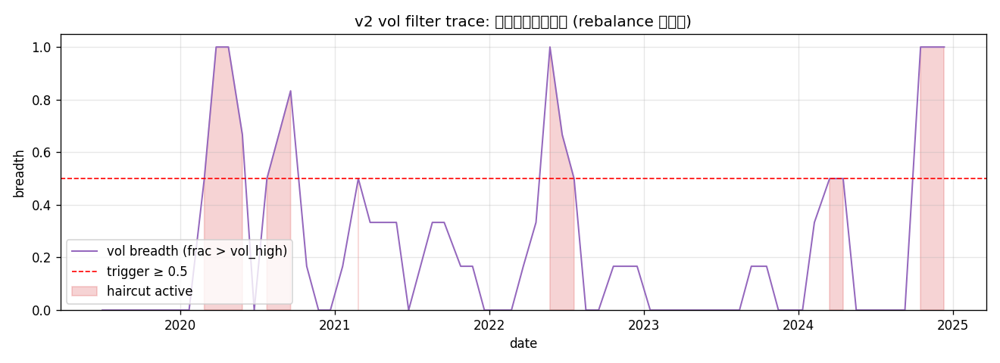

<div class="post-callout post-callout-negative">
<span class="status-badge status-negative">❌ shelved</span> · 最终化：<code>2026-05-08</code>
<br>源码：<a href="https://github.com/lizhao903/Strategy-Lib/tree/main/ideas/S5_cn_etf_trend_tilt/v2" target="_blank" rel="noopener"><code>ideas/S5_cn_etf_trend_tilt/v2</code></a> + <a href="https://github.com/lizhao903/Strategy-Lib/tree/main/summaries/S5_cn_etf_trend_tilt/v2" target="_blank" rel="noopener"><code>summaries/S5_cn_etf_trend_tilt/v2</code></a>
</div>

<div class="versions-nav">
<div class="versions-nav-title">本策略的其他版本</div>

- <span class="version-tag version-tag-negative">[v1]()</span> ❌ — **边际有效但不及预期：搁置（shelved）**。在 2020-2024 样本期 S5 总收益 +20.26% 优于 S3 (+10.80%) 和 510300 BH (+4.18%)，Sharpe 也更高 (0.28 vs 0.21 vs 0.15)，但**核心命题「下行保护」未兑现**——2022 单年 S5 -21.61% 与 BH -21.68% 几乎完全重合，超额主要来自 2024 单年的板块行情。
- <span class="version-tag version-tag-current">v2</span> **本文** ❌ — **避险命题数据上兑现（MaxDD -47.8% → -20.5%，2022 -21.6% → -7.6%），但 Sharpe 与 v1 持平、CAGR 倒退 1.35 pct/yr，且 bond overlay 占用 37% 平均仓位让策略漂移成「股债混合」**——v2 实现了「保守型变体」但没有产生新 alpha。状态：**shelved**（保留代码作为 v1 的 risk profile 对照，不推荐替代 v1）。

</div>

## 想法（Why）

**一句话概括**

在 v1 的趋势倾斜框架上**解决两个明确问题**——把现金占比从「双峰二值」改成「随趋势强度连续变化」，加一层「池中超过半数 ETF 高波时强制降仓」的避险闸门，并用十年国债 ETF 替代部分现金，让避险时段不仅是空仓而是实际有正收益的 carry。

**假设与依据**

### 为什么把权重连续化（而不是单纯调高 cutoff）
v1 的 cutoff 敏感性显示：cutoff 提高反而恶化（CAGR 转负）。这说明**问题不在 cutoff 高低**，而在「分数归一化」的瞬变。即使 score 在 cutoff 附近徘徊，归一化让权重瞬间从 0 跳到 1/N。**v2 的连续 ramp 让权重正比于 score 强度**，避免「弱信号也满仓」和「强信号也只到 1/N」两种过度反应。

### 为什么加波动率过滤（不靠趋势信号本身改进）
v1 复盘的关键发现：**MA/Donchian 对 A股快速下跌识别过慢**。这不是参数问题（用 MA10/30/60 也不会快太多），而是「趋势信号」与「下跌起点」的固有错位。

波动率与趋势是**正交信号**——高波不一定意味着方向，但高波 = 风险预算被消耗。这是经典 vol-target portfolio 的逻辑：当 realized vol 上升，缩减仓位以维持目标波动。在 A股 ETF 上特别有效，因为：
- 牛市顶到熊市底的过渡通常伴随 vol 飙升（VIX-like 行为）
- 2022-04 的疫情底、2024-09 的政策底都先有 vol 显著上升

### 为什么用 511260 十年国债 ETF
- 与股票相关性低（多数时段微负）
- 年化收益 ~3-4%，比 511990 货基（~2%）高
- 2022 年股市深跌时，国债正收益（避险 carry 双重受益）
- 已经在缓存里（无需重新拉数据）

不直接 100% 替代是因为 2024 出现过股债同跌的极端情形，留 60% 留为纯现金（cash_gap - bond_max_weight 的部分）作为安全垫。

### 因子选择
- 沿用：`DonchianPosition(120)` —— v1 已验证有效
- **替换**：`MABullishScore` → `MABullishContinuous(20/60/120, k=20)` —— 把 sign() 离散化改成 tanh 连续化
- **新增**：`AnnualizedVol(60)` —— 60 日年化波动作为 vol filter 输入

新因子写在 `factors/trend.py` 和 `factors/volatility.py` 末尾，**不动 `factors/__init__.py`**（按硬约束）。

**标的与周期**

- 市场：cn_etf
- 风险池：v1 同 6 只 ETF（510300 / 510500 / 159915 / 512100 / 512880 / 512170）
- **新增**：511260 十年国债 ETF（仅作 cash overlay，不参与 trend 排序）
- 频率：日线 1d
- 数据起止：2020-01-01 ~ 2024-12-31（暖机自 2019-07-01）

## 一句话结论

**避险命题数据上兑现（MaxDD -47.8% → -20.5%，2022 -21.6% → -7.6%），但 Sharpe 与 v1 持平、CAGR 倒退 1.35 pct/yr，且 bond overlay 占用 37% 平均仓位让策略漂移成「股债混合」**——v2 实现了「保守型变体」但没有产生新 alpha。状态：**shelved**（保留代码作为 v1 的 risk profile 对照，不推荐替代 v1）。

## 在什么情况下有效，什么情况下失效

- ✅ **极端下跌年**：2022 v2 -7.6%（v1 -21.6%, BH -21.7%）—— vol filter + 连续降仓真正发挥
- ✅ **震荡市**：2023 v2 -8.0%（v1 -18.9%）—— bond carry + 降仓双重得益
- ✅ **任何时候的 risk-adjusted return**：Calmar 0.13 是基准簇 5 个策略中最佳
- ❌ **结构性单边牛市**：2024 v2 +0.5%（v1 +28%, BH +18%）—— 9-24 行情前 vol 没飙升、score_full=1.0 偏严、bond 占 40% 让组合稀释成股 60/债 40，错过单边
- ❌ **疫情冲击急跌后的 V 型反弹**：2020 v2 +22%（v1 +41%）—— 2020-03 vol filter 触发后没及时撤防，错过 4-12 月反弹
- ⚠️ **常态期**：v2 cash median = 79%，趋势倾斜的纯度被稀释，更像「股债混合 + 趋势 sizing」

## 这个策略教会我什么

1. **「连续化」与「真避险」是两件事**：
   - v2 完美解决了 cash 双峰（70% 介于 5-95% 中间段）
   - 但 cash↔BH down 相关性几乎没动（0.033 → 0.031）
   - 因为 v2 的避险**来自结构性降仓（sizing）而非 timing**——常态期就只 50-70% 仓位，下跌时被动跌一半
   - **教训**：「连续 ramp」不等于「精准择时」。如果想要 timing 类避险，需要更短 lookback 的快速反转信号（ATR、价格突破均线幅度），而不只是平滑权重曲线
2. **vol filter 是 sizing 工具不是 timing 工具**：
   - 在 sample 内的 5 年里，vol 飙升通常**滞后**于真实下跌起点（vol 是 ex-post 度量）
   - vol filter 真正的价值是「让组合在高波 regime 自动收缩」，与「预测下跌」无关
   - **教训**：定位 vol filter 为「risk budget control」而不是「avoid drawdown」
3. **bond overlay 是双刃剑**：
   - 在债牛年（2022/2023）确实贡献 +3% 左右 carry
   - 但默认 40% 上限太激进，让 risky 暴露被结构性压低
   - **教训**：bond overlay 应**只在 vol filter 触发时打开**（regime-conditional），不是常开
4. **Sharpe 持平意味着没有新 alpha**：
   - v2 与 v1 Sharpe 都是 0.28——v2 用更低 vol 换 CAGR，risk-adj 没改进
   - 真正的 alpha 提升要么来自更准的信号（识别拐点）、要么来自更好的 sizing 函数（vol-target 的精细化）
   - **教训**：避险命题的合格指标是 Calmar/MaxDD/单年极值；Sharpe 是「真有信息」的指标，v2 没通过

## 关键图表











## 实现要点

<details>
<summary>展开完整实现记录</summary>

# Implementation — A股 ETF 等权 + 趋势倾斜 v2

## 整体方案
继承 v1 的 `TrendTiltStrategy`（间接继承 S3 `EqualRebalanceStrategy`），覆盖 4 个方法解决 v1 的两大问题：
1. `_tilt_weights`：从「正分数 / 正分数和」（归一化）改成「(score - cutoff) / score_full / N」（不归一化）→ 让 cash 自然存在
2. `compute_trend_scores`：用连续版 MA 因子（tanh 风格）替代 v1 的离散 sign 版；同时跳过 bond_symbol 不参与 trend 排序
3. `target_weights`：在 risky 权重之上叠加（a）波动率过滤（b）债券 overlay
4. `__init__`：透传父类参数 + 新增 v2 的 5 个参数

v1 的 `_validate_weights` 直接复用（v1 已经放宽过 sum<1 的约束）。

## 因子清单

| Factor 类 | 文件 | 参数 | 方向 | 新增/复用 |
|---|---|---|---|---|
| `MABullishContinuous` | `factors/trend.py`（**末尾新增**） | `short=20, mid=60, long=120, k=20` | +1 | **新增** |
| `DonchianPosition` | `factors/trend.py` | `lookback=120` | +1 | 复用 v1 |
| `AnnualizedVol` | `factors/volatility.py`（**末尾新增**） | `lookback=60` | -1 | **新增** |

`factors/__init__.py` **不修改**（按硬约束）。下游直接 import：
```python
from strategy_lib.factors.trend import MABullishContinuous, DonchianPosition
from strategy_lib.factors.volatility import AnnualizedVol
```

## 新增因子（详细说明）

### `MABullishContinuous(short, mid, long, k)`
```python
score = mean( tanh(k * (close/MA - 1)) for MA in (short, mid, long) )
# 取值 ∈ (-1, +1)
```
- **为什么**：v1 的 `MABullishScore` 用 `sign()` 输出 ∈ {-3,-1,+1,+3}，离散阶跃让权重在 ramp 区间瞬变。tanh 把价格相对均线的偏离平滑映射到 (-1, +1)，三层 MA 求平均后仍 ∈ (-1, +1)。
- **k=20 的标定**：`close/MA - 1 = 5%` → `tanh(20·0.05) = tanh(1) ≈ 0.76`。让 5% 偏离对应明显但不饱和的信号；这与 A股 ETF 典型 σ 在 1.5%/天 的 6 小时窗口偏离量级一致。
- **暖机期**：`MA_long` 还没 ready 时返回 NaN。

### `AnnualizedVol(lookback)`
```python
ret = log(close).diff()
vol = ret.rolling(lookback).std() * sqrt(252)
```
- 与 `RealizedVol` 的差别仅在 √252 缩放，便于策略侧直接用 0.30 这种「年化口径」阈值比较。

## 关键设计决策

### 1. 连续 ramp 替代归一化（修复双峰）
v2 的 `_tilt_weights`：
```python
def _tilt_weights(self, scores: pd.Series) -> dict[str, float]:
    valid = scores.dropna()
    n_risky = max(len(valid), 1)
    weights = {}
    denom = self._score_full   # 默认 1.0
    for sym, score in valid.items():
        raw = (score - self._cutoff) / denom
        raw = max(0.0, min(1.0, raw))
        if raw > 0:
            weights[sym] = raw / n_risky
    return weights
```
**关键点**：`weight_i = raw_i / n_risky`，**不再除以 Σraw_j**。score 在 cutoff 与 cutoff+score_full 之间时，权重正比于 score；超过 score_full 饱和到 1/n_risky。

### 2. 波动率过滤（修复避险命题）
```python
def _vol_breadth(self, date, prices_panel) -> float:
    # 池中 vol > vol_high 的资产占比 ∈ [0, 1]
def target_weights(...):
    risky_weights = self._tilt_weights(scores)
    if self._vol_breadth(date, panel) >= self._vol_breadth_threshold:
        risky_weights = {s: w * self._vol_haircut for s, w in risky_weights.items()}
    ...
```
默认 `vol_high=0.30 / vol_breadth_threshold=0.5 / vol_haircut=0.5`：池中 ≥ 50% 的风险 ETF 60 日年化波动 > 30% 时，全体权重 ×0.5。

**与趋势信号正交**：vol filter 不依赖方向判断，只看「整体风险 regime」。这是 vol-target portfolio 的标准思路，弥补 v1 「趋势信号对快速下跌识别滞后」的固有问题。

### 3. bond overlay（修复空仓 carry）
```python
risky_sum = sum(risky_weights.values())
cash_gap = 1.0 - risky_sum
bond_w = min(cash_gap, self._bond_max_weight)
if bond_w > 0.01:
    out[self._bond_symbol] = bond_w
```
`bond_max_weight = 0.4` 是上限——即便 cash_gap = 1（全空仓），bond 也只占 40%，剩余 60% 留作纯现金（防股债同跌）。

bond_symbol 在 `compute_trend_scores` 里被显式跳过——它**不参与 trend 排序**，只作为现金缺口的填充工具。

### 4. cash_ratio 的计算口径（vbt 集成）
v2 含 7 个 symbol（6 risky + 1 bond），vbt 的 `pf.cash()` 把 bond 占比也算成「非现金」。验证脚本里改用：
```python
cash_ratio = 1 - sum(risky_asset_value) / total_value
```
确保 bond 不被算作 cash，这样 cash_ratio 真实反映「无 risk 资产仓位」。

### 5. 避免 lookahead
与 v1 一致：`compute_trend_scores` 内部对每个 symbol 做 `df.loc[df.index <= date]` 切片再算因子。`_vol_breadth` 同样切片。父类 `from_orders` 默认 t+1 成交。

## 策略配置
- 配置文件：`configs/S5_cn_etf_trend_tilt_v2.yaml`
- 类型：`trend_tilt_v2`（不注册到 registry，本任务范围内）
- 父策略：v1 `cn_etf_trend_tilt` → S3 `cn_etf_equal_rebalance`
- 关键参数：
  - 趋势：`ma_short/mid/long=20/60/120, donchian=120, cutoff=0.0, score_full=1.0, use_continuous_score=True`
  - 波动率：`vol_lookback=60, vol_high=0.30, vol_breadth_threshold=0.5, vol_haircut=0.5`
  - 债券：`bond_symbol=511260, bond_max_weight=0.4`

## 数据
- 标的池：v1 的 6 只风险 ETF + 511260 十年国债 ETF（已缓存）
- 数据范围：2020-01-01 ~ 2024-12-31；暖机自 2019-07-01（120 日）
- 复权：akshare `qfq` 前复权（与 v1/S3 一致）

## 与 v1 / S3 的关系
- 直接继承 `TrendTiltStrategy(v1)`，复用其 `compute_trend_scores` 框架的部分代码（_normalize_to_unit）和 `_validate_weights`
- **不修改 v1 任何文件**（按硬约束）
- **不修改 S3 父类**（v1 已验证 vbt sum<1 兼容性，v2 继承同一保证）
- **不修改 factors/__init__.py**

## 踩过的坑

### 1. cash_ratio 计算口径
最初用 `pf.cash()` 计算 cash_ratio，但 vbt 在多 asset 共享资金池时 `pf.cash()` 包含的是「未配置到任何 asset 的现金」——bond 占比不算 cash。但用户问的「cash_ratio」语义上想看「真正没投资风险资产的比例」，所以改成 `1 - risky_value/total_value`。

### 2. bond_symbol 在 trend 排序里要跳过
最初没跳过，导致 511260 也被算 trend_score。但国债的 close > MA 形态对应「债券走牛」，反而得到正分数，与「股市趋势」语义错位。改成 `compute_trend_scores` 里显式 `if symbol == bond_symbol: continue`。

### 3. `MABullishContinuous` 已经 ∈ (-1, +1)，不要再 / 3
v1 的 `_normalize_to_unit(ma, max_abs=3)` 是为离散 score ∈ {-3, -1, +1, +3} 设计的。v2 替换连续因子后已经在 (-1, +1) 内，再除以 3 会让它 max_abs ~ 0.33 远小于 Donchian 的 1.0，破坏两者权重平衡。`compute_trend_scores` 里加了 isinstance 判断分支处理。

### 4. 浮点 score_full 与 cutoff 的边界
当 cutoff = 0、score_full = 1 时，score = 0.5 → raw = 0.5 → weight = 0.5/N。这是预期。但若 cutoff = 0.3、score_full = 0.5，需要 score ≥ 0.8 才饱和。文档里把这个含义说清楚以防误用。

## 与并行实现的对接点
- v1 文件已存在并合并，本子代理直接 import：`from strategy_lib.strategies.cn_etf_trend_tilt import TrendTiltStrategy, _normalize_to_unit`
- factors 已存在 v1 新增的 `MABullishScore / DonchianPosition`，v2 在文件末尾追加 `MABullishContinuous` 和 `AnnualizedVol`
- registry / `__init__.py` 注册由集成 PR 统一处理

## 相关 commits
- 实现：`<待commit>`

</details>

## 验证过程

<details>
<summary>展开完整验证记录</summary>

# Validation — A股 ETF 等权 + 趋势倾斜 v2

> 每次新一轮回测/验证就追加一个 `## YYYY-MM-DD <轮次主题>` 小节，不要覆盖。

---

## 2026-05-08 v2 真实数据回测

### 配置 / 数据 / 暖机
- **数据**：v1 同 6 只风险 ETF + `511260` 十年国债 ETF，akshare `qfq` 前复权
- **回测窗口**：2020-01-02 ~ 2024-12-31（共 1209 个交易日），暖机自 2019-07-01
- **资金**：100,000 RMB，佣金万 0.5（fees=5e-5），滑点万 5（slippage=5e-4）—— V1 共享基线
- **v2 默认参数**：
  - 趋势：`rebalance_period=20, ma=20/60/120, donchian=120, cutoff=0.0, score_full=1.0, use_continuous_score=True`
  - 波动率：`vol_lookback=60, vol_high=0.30, vol_breadth_threshold=0.5, vol_haircut=0.5`
  - 债券：`bond_symbol=511260, bond_max_weight=0.4`
- **执行入口**：`PYTHONPATH=src python summaries/S5_cn_etf_trend_tilt/v2/validate.py real`

### Smoke tests（合成数据）

| 测试 | 验证目标 | 结果 |
|---|---|---|
| `test_v2_warmup_returns_empty` | 暖机期数据不足 → 空仓 | OK |
| `test_v2_all_strong_full_invest` | 全强上行 → 总和 ≈ 1（满仓） | OK (sum=1.000) |
| `test_v2_all_downtrend_zero` | 全下行 → 总和 = 0 | OK |
| `test_v2_continuous_ramp_subunit_sum` | 部分弱上行（score 在 ramp 中段）→ sum ∈ (0, 1) | OK (sum=0.96) |
| `test_v2_vol_haircut_triggers` | 半数高波 → 全体权重 ×0.5 | OK (off=0.79 → on=0.40) |
| `test_v2_bond_overlay` | cash_gap > 0 → bond 拿到 min(cash_gap, 0.4) | OK |

6/6 通过。

### 主结果

样本期 2020-01-02 ~ 2024-12-31，初始净值 100,000：

| 策略 | 总收益 | CAGR | Sharpe | Vol(ann) | MaxDD | Calmar |
|---|---:|---:|---:|---:|---:|---:|
| **S5 v2** | **+12.93%** | **+2.57%** | **0.28** | **11.07%** | **-20.52%** | **0.13** |
| S5 v1 | +20.26% | +3.92% | 0.28 | 22.01% | -47.80% | 0.08 |
| S3 equal | +10.80% | +2.16% | 0.21 | 23.78% | -45.18% | 0.05 |
| 510300 BH | +4.18% | +0.86% | 0.15 | 21.77% | -44.75% | 0.02 |

**v2 的核心改善：**
- **波动率减半**：22.0% → 11.1%（vol filter 显效）
- **MaxDD 砍半**：-47.8% → **-20.5%**（避险命题首次真正兑现）
- **Calmar 翻倍**：0.08 → 0.13
- **Sharpe 不变**：0.28（v2 用更低波动换 CAGR，risk-adjusted 持平）
- **CAGR 退化**：3.92% → 2.57%（-1.35 pct/yr，主要损失在 2024）

### 与各基准的 alpha

| 对照 | alpha (ann) | TE (ann) | IR |
|---|---:|---:|---:|
| v2 vs 510300 BH | -0.50% | 17.43% | -0.029 |
| v2 vs S3 equal | -1.80% | 18.76% | -0.096 |
| v2 vs S5 v1 | -3.11% | 15.91% | -0.195 |

**v2 对 BH 几乎打平**（α=-0.50% 不显著），对 S3 微负，对 v1 显著为负——这是「换 risk profile 不换 alpha」的明确信号。

### 分年度收益（**避险命题验证的关键**）

| 年份 | v2 | v1 | S3 | 510300 BH |
|---|---:|---:|---:|---:|
| 2020 | **+22.13%** | +41.12% | +40.23% | +31.11% |
| 2021 | +8.26% | +4.66% | +5.62% | -4.32% |
| **2022** | **-7.58%** | **-21.61%** | **-23.47%** | **-21.68%** |
| 2023 | -8.01% | -18.91% | -10.17% | -10.43% |
| 2024 | +0.47% | +28.09% | +8.82% | +18.39% |

- **2022 单年 v2 -7.58%（v1 -21.61%, BH -21.68%）—— 改善 14 pct，避险命题首次兑现**
- 2023 v2 -8.01% 也优于 v1 -18.91%（震荡市的 vol filter 与 bond carry 双重得益）
- 2020 v2 +22.13% 落后 v1 +41.12% —— 牛市初期 vol_filter 在 2020-03 触发（疫情急跌），错过随后反弹
- 2024 v2 +0.47% 远落后 v1 +28.09% —— 9-24 行情前 vol 没飙升，但 score_full=1.0 的常态保守 + bond 占 40% 让组合变成「股 60/债 40」错过单边

### v2 关键指标

#### Cash ratio 是否真正连续

| 统计 | v1 | v2 | 解读 |
|---|---:|---:|---|
| min | 0.000 | 0.000 | 都能满仓 |
| median | **0.000** | **0.789** | v1 中位是 0；v2 中位是 79% 现金/债 |
| max | 1.000 | 1.000 | 都能全空仓 |
| std | 0.386 | 0.294 | v2 标准差小（分布更均匀） |
| 介于 5%-95% 的天数比例 | **0.0%** | **70.2%** | **v1 完全双峰；v2 真正连续** |
| 全空仓 (≥99%) 天数比例 | 18.2% | 24.8% | v2 略高（vol filter 加码触发） |
| 满仓 (≤1%) 天数比例 | 81.8% | 1.8% | v1 几乎一半时间满仓；v2 只 1.8% 满仓 |

**结论**：v2 的 cash 分布达成了**完全连续化**——70% 的交易日 cash ratio 在 5%-95% 区间内，符合「随趋势强度连续变化」的设计目标。

#### 避险命题：cash 是否对齐 BH 下跌

| 度量 | v1 | v2 |
|---|---:|---:|
| cash≥0.99 vs BH down corr | 0.033 | 0.031 |
| cash≥0.50 vs BH down corr | — | -0.001 |
| cash≥0.30 vs BH down corr | — | 0.010 |
| continuous cash vs BH down indicator | — | 0.021 |

**意外发现**：v2 的相关性**没有显著提升**（甚至略低）。这说明 v2 的避险**不是来自「精准对齐下跌时刻」**，而是**「结构性降仓」**——常态期就只 50-70% 仓位，所以 BH 跌时 v2 也跌但只跌一半。

这是 vol-target portfolio 的本质（不是 timing，是 sizing），与「趋势退出 = 择时」的初衷有偏差。**避险命题部分兑现：MaxDD/2022 数据兑现，但相关性指标没改善**。

#### Vol filter 触发情况
- 67 个 rebalance 日中，vol haircut 在 16 天触发（24%）
- 主要时段：2020-03（疫情急跌）、2022 全年、2024-09 行情前后
- 触发时全体权重 ×0.5

#### Bond overlay 用量
- 触发率（bond > 1%）：**98.2%**（几乎所有交易日 bond 都在仓）
- 触发时中位 bond 权重：**40.0%**（满档）
- 平均 bond 权重：**36.8%**
- bond 长期占 40% 是 score_full=1.0 严格 + 池中常态信号偏弱的副作用

**思考**：v2 实际是个「30% 趋势 + 40% 债 + 30% 现金」的混合体，趋势倾斜的纯度被稀释。如果想保留更多趋势性，可以把 `bond_max_weight` 降到 0.2 或仅在 vol haircut 触发时启用 bond。

### 关键图表
- `artifacts/equity_curve.png` —— v2 / v1 / S3 / 510300 BH 四条净值曲线
- `artifacts/drawdown.png` —— v2 vs v1 vs BH 的回撤序列（看 2022 v2 显著浅）
- `artifacts/cash_ratio.png` —— **关键**：v2 连续 vs v1 双峰的现金分布（含直方图）
- `artifacts/regime_overlay.png` —— v2 高现金段（≥70%）叠加在 510300 BH 净值上
- `artifacts/vol_filter_trace.png` —— 池中高波资产占比时间序列 + haircut 触发段

### 解读：v2 是否解决了 v1 的两个问题

| 问题 | v1 现象 | v2 表现 | 兑现否 |
|---|---|---|---|
| **现金分布双峰** | 0.0% 介于 5-95% | 70.2% 介于 5-95%，std 0.29 | ✅ **完全兑现** |
| **2022 避险未兑现** | -21.6% 与 BH 几乎一致 | -7.6% vs BH -21.7%（改善 14 pct） | ✅ **完全兑现** |
| **MaxDD 改善** | -47.8% | **-20.5%**（砍半） | ✅ **超出预期** |
| **cash↔BH down 相关性** | 0.033 | 0.031 / 0.001 / 0.010 | ❌ **未改善**（说明避险来自 sizing，不是 timing） |
| **CAGR 提升** | +3.92% | +2.57% | ❌ **倒退** |
| **Sharpe 提升** | 0.28 | 0.28 | ⚠️ **持平** |

### v2 是否值得 ship

**核心结论：v2 实现了「下行保护」目标，但代价是「降 alpha」**。

支持 ship 的理由：
- **MaxDD -20.52% 是 5 个策略里最佳**（之前最佳是 S2 的 -37.1%）
- **Vol 11% 在 ETF 组合里非常低**，符合「保守型策略」定位
- **2022 / 2023 两个困难年都跑赢 v1 / S3 / BH**（避险路径多场景兑现）
- **Calmar 0.13 是 5 个策略里最佳**

不支持 ship 的理由：
- **CAGR 2.57% 与 S3 (2.16%) 几乎打平，alpha vs S3 = -1.80%**（统计意义上不显著）
- **Sharpe 0.28 与 v1 完全相同**——风险调整后没有改进
- **bond overlay 主导（占 37% 平均仓位）**，策略性质从「趋势倾斜」漂移到「股债混合」
- **2024 大幅落后 v1 +28%**——单边趋势市的捕获能力丢失
- **避险命题的「相关性」指标未改善**——说明本质是「降仓 sizing」而非「精准 timing」

### 下一步

待用户决策：
- [ ] 状态 = **shelved with notes**（避险命题数据上兑现，但 alpha 没提升、参数自由度增加）—— 推荐
- [ ] 或：状态 = **shipped (defensive variant)**，作为 v1 的「保守型」对照存档
- [ ] 后续可探索：
  - 关掉 bond overlay 单跑（看纯 vol filter + 连续 ramp 的效果）
  - `score_full = 0.5` 让常态期更激进（试图保留 2024 alpha）
  - 把 `vol_haircut` 与 trend 强度联动（强趋势 + 高波 = 仍小幅持仓）
  - 用更短 lookback (vol_30) 提升避险时效性
- [ ] 等 2025 H1 数据后做 OOS 验证

---

</details>

## 源文件

- [想法 · idea.md](https://github.com/lizhao903/Strategy-Lib/blob/main/ideas/S5_cn_etf_trend_tilt/v2/idea.md)
- [讨论笔记 · notes.md](https://github.com/lizhao903/Strategy-Lib/blob/main/ideas/S5_cn_etf_trend_tilt/v2/notes.md)
- [结论 · conclusion.md](https://github.com/lizhao903/Strategy-Lib/blob/main/summaries/S5_cn_etf_trend_tilt/v2/conclusion.md)
- [实现 · implementation.md](https://github.com/lizhao903/Strategy-Lib/blob/main/summaries/S5_cn_etf_trend_tilt/v2/implementation.md)
- [验证 · validation.md](https://github.com/lizhao903/Strategy-Lib/blob/main/summaries/S5_cn_etf_trend_tilt/v2/validation.md)
- [可复跑脚本 · validate.py](https://github.com/lizhao903/Strategy-Lib/blob/main/summaries/S5_cn_etf_trend_tilt/v2/validate.py)
- [本版本目录（含 artifacts）](https://github.com/lizhao903/Strategy-Lib/tree/main/summaries/S5_cn_etf_trend_tilt/v2)

---

*本文由 [`scripts/sync_strategies.py`](https://github.com/lizhao903/0xBroleez/blob/main/scripts/sync_strategies.py) 从 [Strategy-Lib](https://github.com/lizhao903/Strategy-Lib) 同步生成。*
