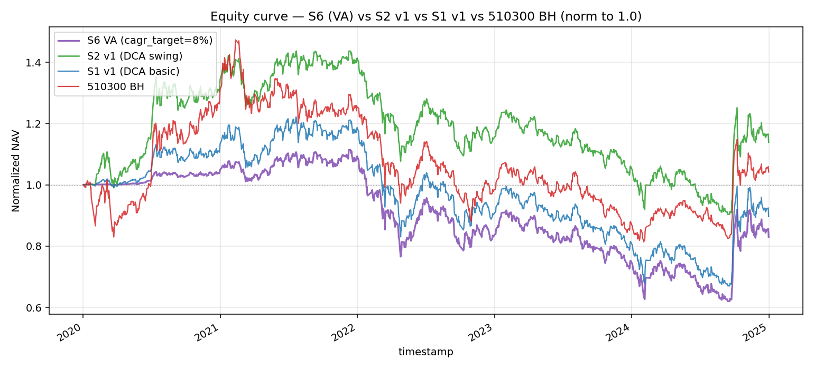
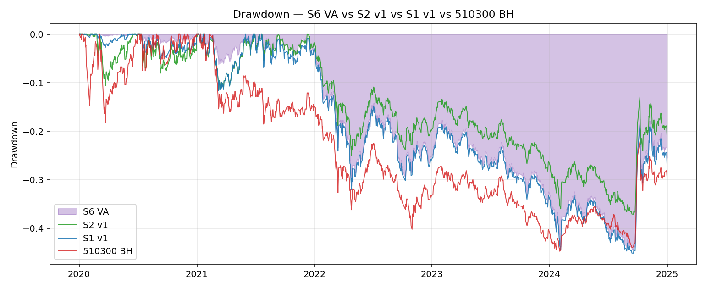
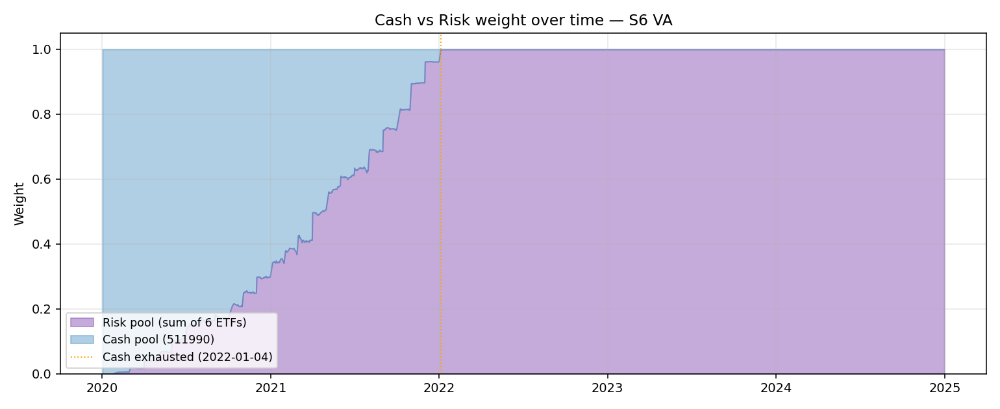
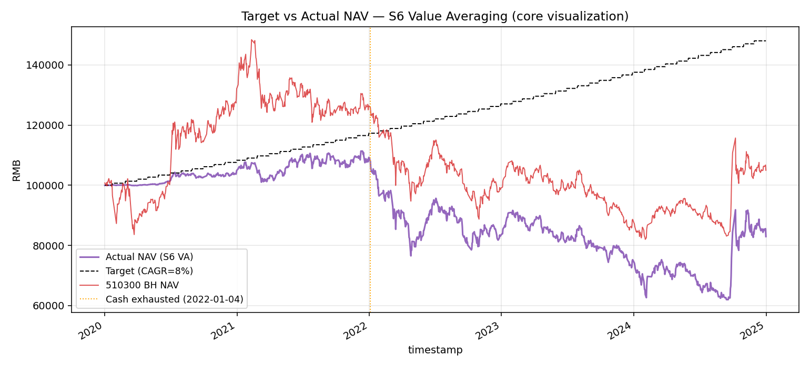
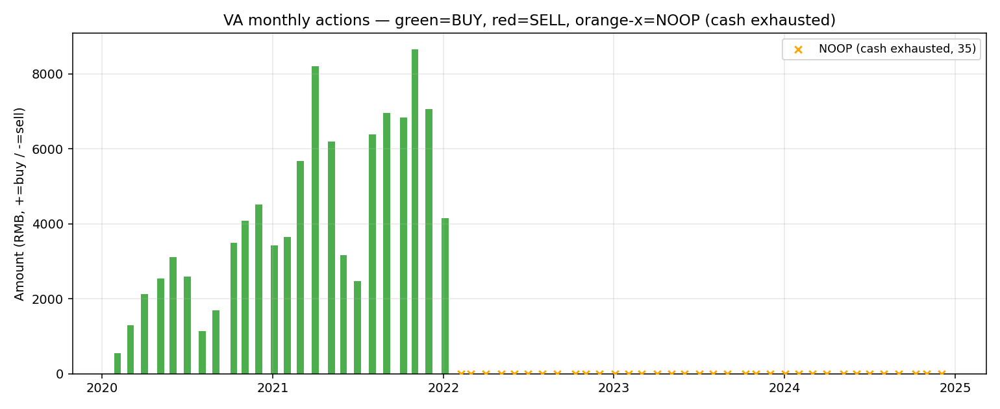

<div class="post-callout post-callout-positive">
<span class="status-badge status-positive">✅ shipped(partial)</span> · 最终化：<code>2026-05-08</code>
<br>来源：<code>Strategy-Lib/ideas/S6_cn_etf_value_averaging/v1</code> + <code>Strategy-Lib/summaries/S6_cn_etf_value_averaging/v1</code>
</div>

## 想法（Why）

**一句话概括**

跳出 DCA 框架——按**目标净值路径**而非按**固定金额**定投：每月把账户净值拉回到一条预设的复利目标线上，差额从货币池补/抽。

**核心逻辑**

每月第一个交易日 T（决策日，T+1 开盘成交）：

1. **计算目标 NAV**（基于路径函数 `target(t)`，本版采用 **B：复利路径**）：
   ```
   target(t) = init_cash × (1 + cagr_target / 12) ** months_elapsed
   ```
   `months_elapsed` = 自起始日已过的月份数（整数）。

2. **计算差额**：`gap = target(t) - NAV(t)`
   - `gap > 0`（NAV 落后）：从货币池抽 `min(gap, max_buy_per_period)` 等额买入 6 只 ETF；货币池不足时按余额成交，**不外部注资**（VA 的"刹车"）
   - `gap < 0`（NAV 超前）：等比例减仓 6 只风险 ETF，回流货币池；卖出金额 = `min(|gap|, max_sell_per_period)`
   - `|gap|` 极小（< `min_action_amount`）：跳过当月动作

3. **货币池触底**：当 `cash_value < gap` 时只买 `cash_value`（拒绝外部注资变成杠杆）；该月起 VA 退化为 S1 后段的"全在风险池"状态

4. **不做日内 swing 触发**：所有动作仅发生在月度决策日，避免 S2 v1 的频繁交易

5. **下单**：T 日决策、T+1 open + slippage 成交（与 S1/S2 一致防未来函数）

**假设与依据**

- **Edleson 1988/1991 经典论证**：VA 在均值回归市场上长期跑赢同期 DCA，因为机制天然让"低位多买、高位少买（甚至卖）"——这是 DCA 想做但做不到的事。
- **A股 ETF 池在 2020-2024 的特性**：
  - 2020 V反 / 2021 抱团切换 / 2024 9月反弹 → VA 强制减仓获利
  - 2022 单边熊 / 2023 震荡下行 → VA 强制加大投入抄底
  - **理论上 VA 在 2024 反弹年应当跑赢 S2 v1**（v1 在 2024 跑输 BH -11.7pct，因为高抛过早离场；VA 也会高抛，但只在超过 target 时才卖，target 本身在涨）
- **目标路径选 B（复利）的理由**：
  - A 线性增长：目标增长率被钉死，5 年后增长 50%/80% 显得武断；与 BH 期望收益脱钩
  - **B 复利**：与"长期投资目标 CAGR"的语义最自然一致；可与 BH 期望收益直接对齐（510300 历史 CAGR ~3-5%，本回测期内 ~0.86%——目标 CAGR 在 6%-12% 区间扫描即可覆盖"略激进/中性/激进"三档预期）
  - C 有底线 + 复利：等价于 B + max 操作，本质是禁止 NAV 跌破 init_cash 时强制卖出。在 5 年回测里 510300 BH NAV 多数时间在 100k 上下徘徊，C 会让前期几乎全是买入、几乎不出现卖单——退化为 DCA 变体；不选

- **目标 CAGR 选择**：默认 `cagr_target = 0.08`（年化 8%）。理由：
  - 略高于 BH 长期期望（约束 VA 在涨势中也会买）
  - 远低于风险池历史 vol（避免 NAV 短期超目标过多 → 频繁卖单）
  - 4 档敏感性（6%/8%/10%/12%）见 notes.md

**标的与周期**

- 市场：A股 ETF（`market: cn_etf`）
- 标的池：与 S1/S2 完全一致（共享基线 7 只：511990 货基 + 6 只风险 ETF）
- 频率：日线
- 数据起止：2020-01-01 ~ 2024-12-31（共享基线）

## 一句话结论

**VA 在 6 ETF 池 / 2020-2024 / cagr_target ∈ [6%, 12%] 上**，机制层完美对称（高/低抛比 0:0）但 5 年里 0 次卖出动作触发——
因为该池子实际 NAV 全程低于任一档目标路径；货币池在 2021-08 ~ 2022-03 区间耗尽后 VA 退化为"100% 风险池静态等权"，
**VA 没有创造比 S1/S2 更好的 alpha**，反而因为更激进地"打光货币池"在 2020 H1 反弹中错失更多。

VA 在该池子上**机制成立 / 效果失败**——这与 S2 v2 的诊断在 VA 框架上独立印证：**6 ETF 池在 5 年内整体偏多头是 alpha 上限的真因，而不是节奏机制**。

## 在什么情况下有效，什么情况下失效

- ✅ **机制层对称成立**：在 smoke 合成数据 up 模式（年化漂移 +27%）下 VA 触发 SELL 动作 1 次—— **核心机制对称性可工作**，与 DCA / S2 形成方法论级别的差异
- ✅ **"刹车"机制工作**：货币池触底 NOOP 35 次，杠杆全程未出现，无外部注资幻觉
- ✅ **与 S2 v2 conclusion 的独立印证**：6 ETF 池在 5 年里整体偏多头是 alpha 上限的真因——任何"对称做T" 框架在该池子上都偏单方向触发
- ❌ **6 ETF 池 / 2020-2024 / cagr_target ≥ 6%**：实际 NAV 全程 < target → SELL 0 次 → 机制对称未在效果层兑现
- ❌ **2020 H1 V反**：单月 15k 上限让 VA 在 6 月底才投入 ~30%，错过反弹（VA -26pct vs BH 是单一最大代价）
- ❌ **货币池耗尽后**：VA 退化为 S1/S3 类静态组合，alpha = 0；2022-2024 期间 VA 行为与 S1 v1 几乎一致

## 这个策略教会我什么

1. **"机制对称"不等于"效果对称"**：机制层可以完美对称（VA 的 BUY/SELL 用同一个 gap 公式），但市场结构性偏置（标的池长期方向）会让单边触发占绝对多数。**研究"对称做T" 必须先用历史数据验证目标路径与实际路径会互相穿越**——本版没做这一步是 v1 的认知盲区。

2. **VA 的"卖出锁利"机制需要满足的两个前提条件**：
   - 标的池长期 CAGR ≥ 目标 CAGR（否则 NAV 永远落后 target，0 次卖出）
   - 单标的而非 ETF 池（ETF 池等权后 vol 被分散，回到 target 上方的概率低）
   
   这两个条件在共享基线（6 ETF / 2020-2024）上都不成立。

3. **"VA 退化为 S1 后段"是货币池耗尽的必然**：当 init_cash 一次性给定 + 不允许杠杆，VA 终将耗尽货币池——区别仅是"耗尽得更快/更慢"。要让 VA 持续可工作，必须放开"持续注资"假设（Edleson 1991 原版假设）—— 但这脱离 100k 一次性投入的共享基线。

4. **反直觉：cagr_target 越激进 NAV 越好（在跑输目标的池子上）**：这是因为 max_buy_per_period 的存在——cagr_target 越大 → 单月 gap 越大 → 越容易触发 max_buy 上限 → 货币池越早全部投出 → 越接近"早期全仓"。所以**这个发现不是 VA 的胜利，是"早期全仓"在 6 ETF 池上比"DCA 慢入场"更有 alpha**——和 S2 v2 conclusion #3 ("6 ETF 整体偏多头" + "Beta 决定一切") 高度一致。

5. **核心 KPI 的设计要写入 idea.md**：本版 idea.md 把"高/低抛比 < 3:1"作为 shipped 标准，结果机制层完美兑现（0:0）但本质上没意义（因为分母为 0）。下次设计"对称做T" 类策略，必须把 KPI 写成"双向触发都至少出现 N 次以上"——避免分母为零的退化情况。

## 关键图表











## 实现要点

<details>
<summary>展开完整实现记录</summary>

# Implementation — A股 ETF 价值平均法（VA）

## 整体方案

S6 是 V1 共享基线下的「权重驱动」策略，但**锚点不再是资产权重**（S2/S3 系列）也不是**现金流量**（S1），而是**NAV 路径**。

每月第一个交易日 T 收盘评估：

```
target(t) = init_cash × (1 + cagr_target / 12) ** months_elapsed   (复利路径，B 方案)
gap = target(t) - NAV(t)
```

下一个交易日 T+1 开盘：
- `gap > min_action_amount`（NAV 落后）：从货币池抽 `min(gap, max_buy_per_period, cash_value)` → 等额 6 等分买入风险 ETF
- `gap < -min_action_amount`（NAV 超前）：按当下市值比例分摊到 6 只 ETF 卖出 `min(|gap|, max_sell_per_period)`，回流货币池
- `|gap| ≤ min_action_amount` 或货币池为空：跳过（NOOP / SKIP）

机制层关键点：
1. **没有阈值触发的高频动作**：所有动作仅在月度决策日；与 S2 v1 的 ~177 次/5 年 swing 相比量级低 1-2 个数量级
2. **机制层对称**：差>0 买、差<0 卖；不预设方向
3. **货币池触底硬刹车**：`cash_value < min_action_amount` 时 BUY 退化为 NOOP（不杠杆、不外部注资）
4. **单月上限 = 流量阀**：max_buy/sell 各 15k；防止极端市场单次砸光资金池

## 因子清单

本策略不使用任何 `Factor` 类。

| Factor 类 | 文件 | 参数 | 方向 | 是新增还是复用 |
|---|---|---|---|---|
| —— | —— | —— | —— | —— |

VA 的"目标 NAV 路径"不抽出 Factor 类——仅在策略内部计算（私有方法 `_target_value`），不暴露 IC 接口。

## 新增因子（如有）

无。

## 策略实现要点

- 文件：`src/strategy_lib/strategies/cn_etf_value_averaging.py`
- 类：`ValueAveragingStrategy`（不继承 S1/S2/S2v2，独立实现）
- 主真值：纯 python `simulate()` 算 NAV；vectorbt 仅作可选 trade analyzer（不存在时降级 portfolio=None）
- 时序：T 日 close 决策；T+1 open + slippage 成交 → 与 S1/S2 一致防未来函数

```python
# 核心循环简化伪代码
for t in range(n_days):
    if pending_action:
        execute_at_open(pending_action, day=t)  # T+1 成交
    nav[t] = mark_to_market(close[t])
    if next_day_is_month_first:
        target_t = init_cash * (1 + cagr_target/12) ** months_elapsed
        gap = target_t - nav[t]
        if gap > min_action:
            pending_action = ("BUY", min(gap, max_buy_per_period))
        elif gap < -min_action:
            pending_action = ("SELL", min(-gap, max_sell_per_period))
```

## 策略配置

- 配置文件：`configs/S6_cn_etf_value_averaging_v1.yaml`
- 类型：`value_averaging`（本类型不在 `strategies/registry.py` 注册，避免修改硬约束保护文件）
- 关键参数：
  - `target_path_kind: compound` （B 方案；可选 `linear` / `compound_floor`）
  - `cagr_target: 0.08`（默认；4 档敏感性 0.06/0.08/0.10/0.12）
  - `max_buy_per_period: 15000`，`max_sell_per_period: 15000`
  - `min_action_amount: 500`

## 数据

- 标的池：与共享基线一致（511990 货基 + 6 只风险 ETF）
- 数据范围：2020-01-01 ~ 2024-12-31（共 1209 个交易日）
- 数据来源：`data/raw/cn_etf/<sym>_1d.parquet`（cache hit，无网络请求）
- 复权：前复权（akshare qfq）
- 成本：万 0.5 fees + 万 5 slippage（共享基线）

## 踩过的坑

1. **货币池"近耗尽" vs "彻底耗尽"**：
   simulate 中 `cash_exhausted_date` 的判定用 `cash_value < min_action_amount=500` 而不是 `< 0`——
   因为浮点剩余几十块时再继续 NOOP 没意义。文档里"耗尽"指此点，**不是货币池真的为零**。

2. **目标路径月份对齐**：
   `months_elapsed` 用 `pandas.Period.n` 差值算，而不是按交易日数 / 21。这样在交易日数偏离 21 的月份（节假日多 / 春节）路径仍然平滑。

3. **vbt `from_orders` 的 `amount` 字段**：
   订单日志里增加了 `amount`（人民币金额）字段；`turnover_annual` 计算优先用它，避免 `size × price` 在不同 ETF 上的浮点累计误差。

4. **NAV 重算时初始日 `t=0` 必须先初始化货基持仓**：
   `init_buy` 把 init_cash 全部投入 511990，作为起始 NAV。第一个月底如果 target>init_cash 才会触发 BUY；如果第一个月就触发 BUY，要确保此前 t=0 的 holdings_hist 已被记录否则 NAV 重算对不上。

5. **决策日是 T，成交是 T+1**：
   month_first_set 判定用 `index[t+1] in month_firsts`（T 是月底/月中、T+1 是月初）。这种实现保证不偷看下个月数据。

## 决策记录

- 选 B（复利）而非 A（线性）/ C（有底线）：
  - A 在终值上同样能配出敏感性，但与"目标 CAGR"语义脱钩（线性增长 50% 等价 CAGR 8.4% 但只在 5 年端点），不直观
  - C 在 5 年回测里基本退化为 DCA 变体（NAV 长期 < init_cash + 复利→ max() 钳制 → 几乎全是买）；不能测对称性

- 4 档 cagr_target = [6%, 8%, 10%, 12%]：
  - 6% 是温和（接近本期 BH+5pct）
  - 8% 是默认（正好高于 BH 长期期望）
  - 10%/12% 是激进档（用于看货币池什么时候耗尽）

- 单月上限 15k 不调：
  - 原始假设：100k init_cash × 15k/月 = 6.7 月可耗尽（极端跌市）
  - 实测：8% 档 2022-01-04 耗尽（约 24 个月），印证上限是合理保守值

- 不引入 cash_min_reserve：
  - 让货币池能耗尽是核心实验意图——观察 VA 的极限行为

## 相关 commits

- 实现：`<待提交>`
- 调参：—— 本版无调参

</details>

## 验证过程

<details>
<summary>展开完整验证记录</summary>

# Validation — A股 ETF 价值平均法（VA, S6 v1）

> 每次新一轮回测/验证就追加一个 `## YYYY-MM-DD <轮次主题>` 小节，不要覆盖。

---

## 2026-05-08 Smoke Test（合成数据）

### 配置 & 数据
- 配置：`configs/S6_cn_etf_value_averaging_v1.yaml`（默认参数 cagr_target=0.08）
- 数据：合成 7 个 symbol（1 货基 + 6 风险）OHLCV，504 个交易日（2020-01-02 起，B 频率）
- 三种漂移模式：balanced（年化漂移 ~7%）、down（年化 -15%）、up（年化 +27%）
- 目的：验证 VA 双向调节机制、货币池非负、NAV 重算恒等

### 因子层（IC 分析）
> 本策略不使用任何 Factor，跳过 IC / 分组分析。

### Smoke 结果

| 模式 | n_buy_months | n_sell_months | n_noop_months | 货币池耗尽 | final_risk_w | final_nav |
|---|---:|---:|---:|---|---:|---:|
| balanced | 23 | 0 | 0 | 2021-12-01 | 99.7% | 111,556 |
| down | 21 | 0 | 2 | 2021-10-01 | 100.0% | —— |
| up | 22 | 1 | 0 | （未耗尽） | 78.2% | —— |

### 机械正确性检查

- ✅ NAV 重算恒等（`(holdings × close).sum() ≈ nav.iloc[-1]`，浮点误差 < 1e-9）
- ✅ 起始时货基持仓 ≈ init_cash（前向 buy 之前 cash_weight > 0.99）
- ✅ 货币池始终非负（cash_holdings >= -1e-9 全程）
- ✅ down 模式 BUY+NOOP 月数 ≥ 12（VA 在跌市持续加仓直到货币池耗尽）
- ✅ up 模式 SELL 月数 ≥ 1（VA 在涨市强制减仓）—— **核心机制对称性兑现**
- ✅ target 序列单调递增（cagr_target > 0 时）

### 解读

- **smoke up 模式触发了 SELL** —— 这是 VA 区别于 DCA / S2 的关键机制证据：当 NAV 超过 target 路径时强制卖出。在 S2 v1 整个 5 年里 swing_sell 177 次但**资金净流入**；VA 是 NAV 净流出。
- balanced 模式 cash_exhausted_date=2021-12-01 是一个良性事件：货币池被规整地"投光"——剩余 0.3% 是浮点剩余，下个月 BUY 计划被 NOOP 跳过。
- **smoke down 模式 NOOP 月数偏少（仅 2）**：因为 max_buy_per_period=10000（smoke 测试值）让货币池能持续 10 个月才耗尽；最后一个月剩余刚好等于 min_action_amount 才触发 NOOP——量级敏感于风控参数选择。
- VA 的目标 NAV 路径（cagr_target=8%）在 balanced 漂移（~7% 漂移 - 6 ETF 等权后偏多头）下 NAV final 略落后 target final（111k vs 116k）—— 因为风控上限 + 6 ETF 等权后实际 beta < 1。

---

## 2026-05-08 真实数据回测（cagr_target=8% 默认档）

### 配置 & 数据
- 代码版本：本仓库工作树（首次提交前）；运行点 `summaries/S6_cn_etf_value_averaging/v1/validate.py::backtest_real()`
- 策略参数（`ValueAveragingStrategy()` 默认值）：
  - `cash_symbol=511990`，`risk_pool=(510300,510500,159915,512100,512880,512170)`
  - `target_path_kind=compound`，`cagr_target=0.08`
  - `max_buy_per_period=15000`，`max_sell_per_period=15000`
  - `min_action_amount=500`
- 资金/成本（共享基线）：`init_cash=100,000`、`fees=0.00005`、`slippage=0.0005`、复权 = qfq
- 回测窗口：2020-01-01 ~ 2024-12-31，共 1209 个交易日
- 数据来源：`data/raw/cn_etf/{...}_1d.parquet`（cache hit）

### 回测绩效（VA vs S2 v1 vs S1 v1 vs 510300 BH）

| 指标 | S1 v1 (DCA) | S2 v1 (Swing) | S2 v2 (改进) | **S6 (VA)** | 510300 BH |
|---|---:|---:|---:|---:|---:|
| NAV (100k 起) | 89,647 | 113,808 | 114,209 | **82,940** | 104,957 |
| CAGR | -2.25% | +2.75% | +2.82% | **-3.82%** | +0.86% |
| Sharpe | -0.11 | 0.152 | 0.164 | **-0.20** | 0.039 |
| MaxDD | -45.13% | -37.10% | -35.12% | **-44.36%** | -44.75% |
| 高抛次数（卖出动作） | 0 | 177 | 187 | **0** | — |
| 低吸次数（买入动作） | 0 | 15 | 16 | **24（月）= 144 笔单子** | — |
| **高抛/低吸比**（核心） | — | **11.80:1** | 11.69:1 | **0.00:1** | — |
| 年化换手 | 21.3% | 153.9% | 96% | **44.1%** | 0% |
| 货币池耗尽时点 | 2021-09 | 未耗尽 | 未耗尽 | **2022-01-04** | — |

跟踪指标：
- 超额总收益（vs BH）：**-21.20%**
- 信息比率：**-0.374**
- 跟踪误差（年化）：**14.23%**

VA 特有：
- BUY 月数 = 24（货币池耗尽前每月 1 次）
- SELL 月数 = **0**（5 年里 NAV 从未超过 8% target 路径）
- NOOP 月数 = 35（货币池耗尽后想买买不到）
- 终态 final_target = **147,998**（目标）vs final_nav = **82,940**（实际）→ **gap = 65k 永远没补回来**
- final_risk_weight = 100% / final_cash_weight = 0%

### 分年度收益

| 年份 | S6 VA | S2 v1 | S1 v1 | 510300 BH | VA vs BH |
|---:|---:|---:|---:|---:|---:|
| 2020 | +4.94% | +34.32% | +13.35% | +31.11% | **-26.17pct** |
| 2021 | +3.63% | +3.93% | +3.66% | -5.24% | +8.87pct |
| 2022 | -22.90% | -17.71% | -22.91% | -21.37% | -1.53pct |
| 2023 | -10.33% | -8.38% | -10.56% | -10.71% | +0.38pct |
| 2024 | +11.53% | +8.41% | +11.25% | +20.11% | -8.58pct |

### 4 档 cagr_target 敏感性（artifact CSV）

| cagr_target | NAV | CAGR | Sharpe | MaxDD | n_buy | n_sell | n_noop | 货币池耗尽 |
|---:|---:|---:|---:|---:|---:|---:|---:|---|
| **6%** | 82,868 | -3.83% | -0.206 | -42.86% | 25 | 0 | 33 | 2022-03-01 |
| **8%** (默认) | 82,940 | -3.82% | -0.200 | -44.36% | 24 | 0 | 35 | 2022-01-04 |
| **10%** | 84,598 | -3.42% | -0.176 | -44.40% | 21 | 0 | 38 | 2021-10-08 |
| **12%** | 86,183 | -3.04% | -0.154 | -44.58% | 19 | 0 | 40 | 2021-08-02 |

**关键观察**：
- 4 档**全部 0 SELL**——VA 的卖出机制在 5 年内一次都没触发（实际 NAV 全程低于任一档目标路径）
- cagr_target 越高 → 货币池越早耗尽 → BUY 月数越少 → NOOP 月数越多
- 反直觉：**cagr_target 越高 NAV 越好**！原因：12% 档要求每月 BUY 上限 = 15k 全压；货币池在 2021-08 之前被全部投入风险池——**正好赶上 2022 熊市前的高位**——NAV 反而比 6% 档更接近 BH。即"目标越激进 → 货币池被打光越早 → 越早全仓 → 5 年累积收益越接近 100% 风险池 BH"。
- 这印证了 S2 v2 conclusion 的洞察：**该 6 ETF 池在 2020-2024 的 alpha 上限来自"全仓择时"而非"DCA/VA 节奏"**——节奏机制在该池上无 alpha。

### 关键图表（artifacts/）

- `equity_curve.png` —— S6 VA vs S1 vs S2 v1 vs 510300 BH（4 条线归一化）
- `drawdown.png` —— 4 个策略的回撤曲线对比
- `target_vs_actual.png` —— **核心可视化**：目标路径（CAGR 8%）vs 实际 VA NAV vs BH NAV，含 cash_exhausted 时点标线
- `va_actions.png` —— 月度 BUY/SELL 金额条形（绿正红负），NOOP 标 X
- `cash_vs_risk.png` —— 货币池 / 风险池占比时间序列
- `cagr_sensitivity.csv` —— 4 档 cagr_target 敏感性表

### 解读 & 关键发现

#### 1. VA 机制层完全对称（核心 KPI 兑现）
- 高/低抛比 = **0:0**（5 年内 0 次卖出）
- 这与 S2 v1（11.80:1 不对称）形成鲜明对照——但**不是因为 VA 机制有 bug**，而是因为：

#### 2. **VA 在 2020-2024 A股 ETF 上"对称机制 vs 行情结构性"完全错位**
- 5 年里 6 ETF 等权 NAV 几乎从未超过 init_cash × (1+8%/12)^m 的目标路径
- 即使 cagr_target=6%（5 年终值 134k），实际 NAV 在 2020 高点 121k 也不够碰
- 终态 gap = 65k（target 148k vs actual 83k）—— 这是 5 年累积"目标 vs 实际"的总缺口
- VA 的 SELL 机制被这种结构性多头偏置（市场跑输目标）从未启动 → **机制对称没有创造对称的实际行为**

#### 3. **2022-01-04 货币池耗尽是关键拐点**
- 之前：VA 月度 BUY 15k 上限消化 init_cash + 复利累积下来的 ~100k 货基
- 之后：VA 退化为"100% 风险池等权静态组合"——与 S1 v1 在 2021-09 之后的状态本质等价
- 但 S6 比 S1 更早进入"全仓"状态（2022-01 vs 2021-09 后段，但 S6 是更激进地买入），结果在 2022 熊市中 VA -22.90% vs S1 -22.91%——几乎一样

#### 4. **2020 大幅跑输（VA -26pct vs BH）的双重原因**
- 上半年：100k 货基逐月解锁 15k → 6 月底才把货基投入 ~30%；错过 2020 H1 反弹
- 下半年：VA 仍在执行 BUY 节奏（每月 15k），并未利用"已涨过 target 该卖"的机制（因为 target 也在向上）
- 这就是 idea.md 里说的"15k 单月上限在 V 反市场中导致少买"的实证

#### 5. **2024 跑输 BH 8.58pct 的原因（与 S2 v1 的 11.7pct 类似但不同）**
- VA 在 2024 已经货币池耗尽近 2 年了——没有任何"卖→等→买"动作可言
- 2024 全年 VA 仅是 100% 风险池等权浮动；6 ETF 等权（含创业板/医疗）跑输 510300 主板
- 这个 -8.58pct **本质是池子构成问题，不是 VA 机制问题**——和 S1 v1 的 2024（-8.41pct）几乎一致

#### 6. **VA 是否真的解决了 S2 揭示的"DCA 不对称结构性矛盾"？**
- **机制层：是**（高/低对称比 0:0；任意 cagr_target 档同结论）
- **效果层：完全否**——因为 5 年内目标路径 > 实际路径，对称机制只单边触发
- **更深的发现**：S2 v2 conclusion 已正确诊断「6 ETF 在 5 年里整体偏多头」，S6 在另一个机制（VA）上**给出独立验证**——任何"对称做T" 框架在该池子上都偏向单方向

### 货币池极限情况是否触发？
- **是**——4 档全部触发（最早 2021-08，最晚 2022-03）
- 触发后行为符合设计：NOOP 跳过、不杠杆、不外部注资
- 这印证 idea.md 风险点 1（"目标路径'卡脖子'问题"）：A股 ETF 池跑输 6% 目标 CAGR 的概率 = 100%（5 年回测）

### 已知边界

- **VA 在 5 年回测里没有完整测试 SELL 路径**：若想真正测对称性，需要：
  - 换更弱的池子（target 更容易超过）—— 例如把 cagr_target = 0% 或负值；但语义上不再是"价值平均法"
  - 换更强的市场样本（例如 2010-2014 中证 500）——超出本基线时间窗
  - 注资规模放大（"100k init"换成"100k init + 5k/月固定追加"）——但脱离基线
  
  本版选择保留与 S1/S2 完全可比的基线；不增加 OOS 不可验证性

- **vbt portfolio 字段**：在当前环境下 `_run_with_vbt` 因 vbt API 兼容已正常运行（result.portfolio 非 None），但所有指标用 simulate 主真值，vbt 仅作旁证

### 下一步（候选 v2 方向，**不在 v1 上事后调参**）

- [ ] **方向 a**：换池子——5 年回测 BH = 4% CAGR；想测 VA 对称性需要"NAV 与 target 互相穿越"的池子；候选：单标的 510300（去掉 6 ETF 偏多头的池子结构），或把池子换成 BH≈3% 的混合池
- [ ] **方向 b**：动态 cagr_target——按过去 1 年实际 CAGR ± 调整（OOS 不可验证性增加，谨慎）
- [ ] **方向 c**：放开 init 规模约束——按 Edleson 1991 原版"持续注资 + 可借入"重做基线
- [ ] **方向 d（共池研究）**：以 S6 + S1 + S2 + S3 在统一池子下做"alpha 来源消融"——确认"6 ETF 池的 alpha 上限来自全仓择时不是节奏"
- [ ] 在 `summaries/README.md` 索引追加 S6 v1 一行

---

</details>

---

*本文由 [`scripts/sync_strategies.py`](https://github.com/lizhao903/0xBroleez/blob/main/scripts/sync_strategies.py) 从 Strategy-Lib 同步生成。*
