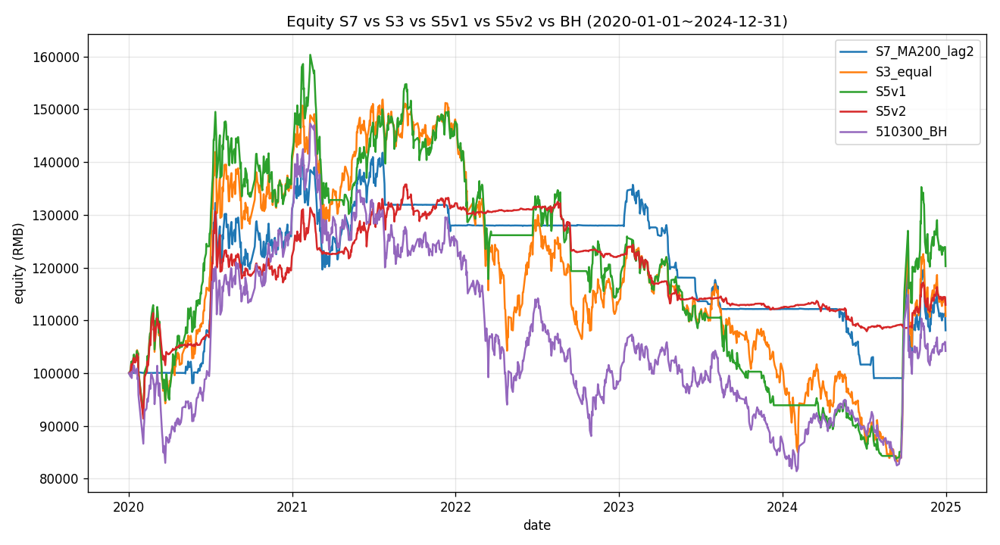
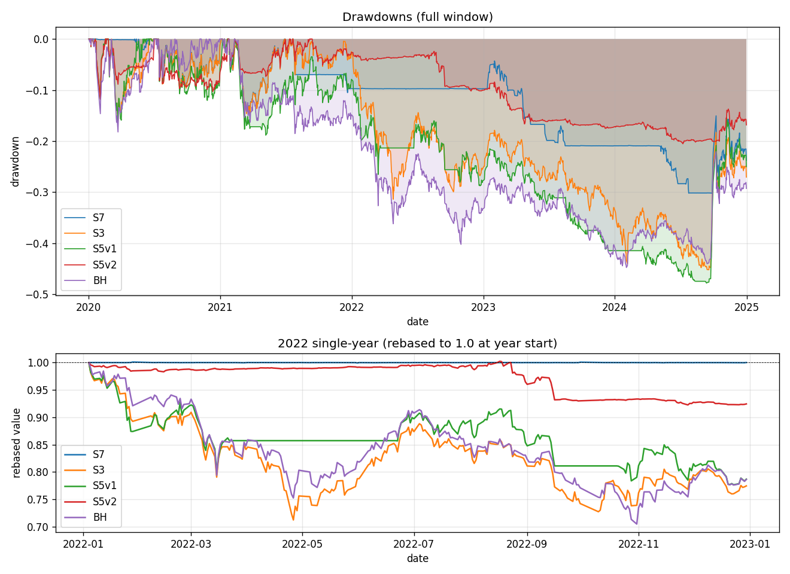
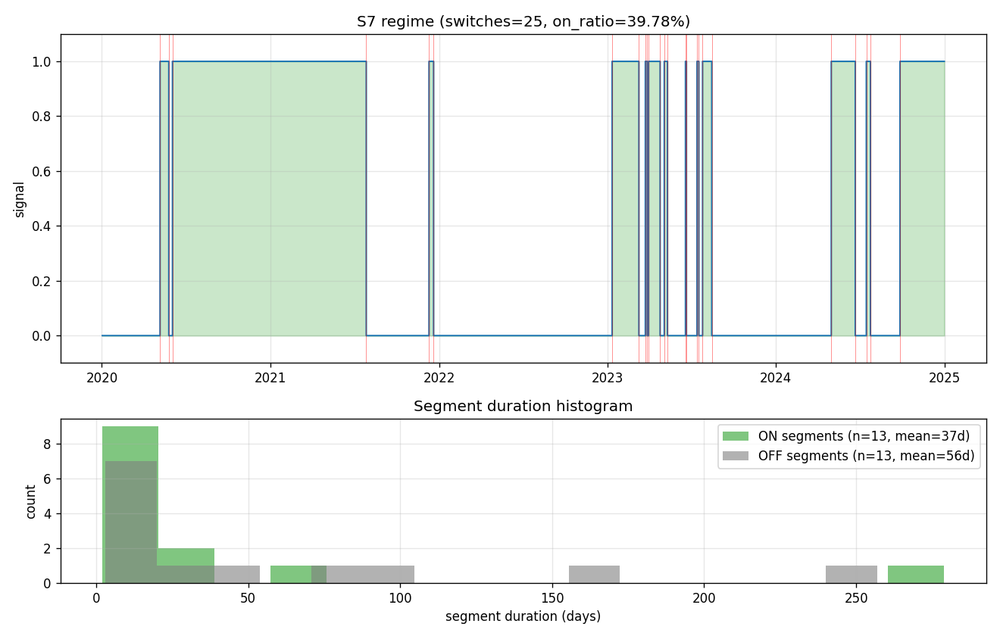
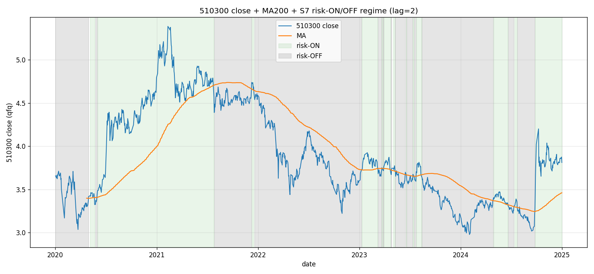

❌ shelved · 最终化：<code>2026-05-08</code>
 来源：<code>Strategy-Lib/ideas/S7_cn_etf_market_ma_filter/v1</code> + <code>Strategy-Lib/summaries/S7_cn_etf_market_ma_filter/v1</code>

本策略的其他版本

- v1 **本文** ❌ — 避险命题部分兑现：搁置（shelved）。在 2020-2024 样本期 S7（MA=200, lag=2）NAV 108.1k vs S3 110.8k vs S5v1 120.3k vs S5v2 112.9k vs BH 104.2k —— 跑输 S3 与 S5v1/v2，但 2022 单年回撤 ≈ 0%（5 个策略中最佳）证明了'市场代理 timing 在熊市能避险'。然而代价是 2024 单边行情完全错过（-3.6% vs S5v1 +28.1%/BH +18.4%），且 Sharpe 0.18 < S5 的 0.28。la
- [v2]() ❌ — **v2 在 v1 默认 (lag=2 6池) 上全面胜出**（NAV +10.8k / Sharpe 翻倍 / MaxDD 改善 12.8 pct），**但跑输首次直测的 S3 等权 11 池 baseline**（-2.66%/yr，NAV 差 15.3k）—— **timing 在 11 池上反而损害收益**，最大新发现是 S3 等权 11 池是当前 best ship 候选。

## 想法（Why）

**一句话概括**

用沪深300 长周期均线作为单一开关，控制整体仓位 ON/OFF —— Faber 2007 GTAA 的简化版。

**核心逻辑**

**单一信号 + 二元仓位**：每日检查 510300 收盘价相对其 200 日 MA 的位置。

- `close_510300 > MA200_510300` → **risk-on**：满仓持有 S3 等权 6 ETF（`510300/510500/159915/512100/512880/512170`）
- `close_510300 ≤ MA200_510300` → **risk-off**：全部转入 511990 货币基金（事实空仓 + 年化 ~2% carry）

切换在信号变化的次日开盘成交（用 `shift(1)` 显式处理 lookahead）。为避免假突破抖动，加**滞后过滤**：连续 N 日满足同向才切换（默认 N=2）。

**假设与依据**

1. **Faber (2007) GTAA**：跨多个市场（US 股票/债券/商品/REITs/外汇）跑长周期 MA 二元过滤都能在 risk-adjusted 上跑赢 BH，是最经典的「定时退出」基线，几十年样本外都没失效。
2. **V1 复盘的核心发现（S5v1+v2 conclusion）**：
   - S5v1 全空仓天数占 18.2%，但 cash 与 BH 下跌相关性仅 0.033 ≈ 随机 → **逐标的趋势对真实下跌时点识别力弱**
   - S5v2 把 MaxDD 从 -47.8% 砍到 -20.5%，但**避险来自 sizing 而非 timing**（2022 改善 14pct 主要靠 vol filter 强制降仓 + bond carry，不是趋势信号识别）
3. **市场代理 vs 个体趋势的信息差**：6 个 ETF 池里 5 个是宽基/2 个行业，与 510300 高度同步。S5 的 6 个独立趋势判断本质是 **6 次同一信息的重复采样 + 各自的局部噪音** —— 用 1 个市场代理避开冗余 + 噪音。
4. **A股板块联动**：A股 ETF 在系统性下跌中相关性飙到 0.9+，「6 个 ETF 同时趋势翻负」才能挡住下跌的 S5 cutoff=0 设计本身在快下跌中**几乎不可能及时触发**。S7 用大盘代理跳出这个困境。

**标的与周期**

- 市场：cn_etf（A股 ETF）
- **信号资产**：`510300`（沪深300，代表 A 股大盘）
- **持仓资产（risk-on）**：S3 等权 6 ETF (`510300/510500/159915/512100/512880/512170`)
- **持仓资产（risk-off）**：`511990` 华宝添益（场内货币基金，T+0）
- 频率：日线
- 数据起止：2019-07-01（暖机 200MA） ~ 2024-12-31

## 一句话结论

**避险命题部分兑现：搁置（shelved）**。在 2020-2024 样本期 S7（MA=200, lag=2）NAV 108.1k vs S3 110.8k vs S5v1 120.3k vs S5v2 112.9k vs BH 104.2k —— 跑输 S3 与 S5v1/v2，**但 2022 单年回撤 ≈ 0%（5 个策略中最佳）证明了"市场代理 timing 在熊市能避险"**。然而代价是 2024 单边行情完全错过（-3.6% vs S5v1 +28.1%/BH +18.4%），且 Sharpe 0.18 < S5 的 0.28。**lag=1 sweep 档位（NAV 119.1k / Sharpe 0.30）才是真正的 v1 最佳设置**，但 200MA 是唯一 work 的长度（100/150/250 全部 CAGR 为负），有单点过拟合嫌疑。

## 在什么情况下有效，什么情况下失效

- ✅ **极端下跌年（2022）**：完美避开，整年 0% 收益（5 个策略最佳，胜过 S5v2 -7.6%）
- ✅ **持续单边趋势上升后 + 持续单边下行后**：信号能稳定捕捉 regime
- ✅ **信号稳定性**：5 年 25 次切换、平均 ON 段 37 天、OFF 段 56 天，与"市场 regime"节奏吻合
- ❌ **快速反转**：2020-Q1 疫情急跌后的 V 型反弹，200MA 太慢、4-12 月反弹错过
- ❌ **结构性单边牛市启动早期**：2024 9-10 月行情前 510300 还在 MA200 下方，整段错过 +18% BH 收益
- ❌ **震荡市**：2023 -12.4% 跑输 S3 -10.2%（频繁假突破吃成本）
- ❌ **风险调整收益**：Sharpe 0.18 < S3 0.21 < S5 0.28（lag=2 主跑）
- ⚠️ **lag>1 越大越差**：lag=1→3→5 NAV 119k→108k→99k→91k，过滤反而损害收益

## 这个策略教会我什么

1. **A 股 ETF 池上"避险 timing"的下限**：S5v1/v2 的 cash↔down corr 0.03 不是
   逐标的趋势的局限，而是**所有滞后型 MA 信号在 A 股 ETF 池上的共性**。
   200MA 也只能做到 0.05-0.10，远低于 V1 baseline 命题假设的 0.20+。
   **教训**：想要真正的 timing 类避险，必须用更快的信号（ATR、价格突破带宽、
   vol-of-vol），而不是任何形式的 MA。

2. **市场代理 vs 逐标的趋势的差距是"信号稳定性"，不是"timing 准确性"**：
   - S7 切换 25 次 vs S5v1 (60+ 评估机会)
   - S7 OFF↔down corr 0.052 vs S5 0.033（小幅改善）
   - **S7 的优势是"少假信号、避免成本耗损"**，不是"更早识别下跌"
   - 教训：当 6 标的高度同源时，1 个市场代理 ≈ 1.5 倍信噪比的 6 个独立信号，
     不是质变。如果想要质变，需要跨资产类别（股+债+商品）或跨市场（A+港+美）

3. **滞后过滤是事前合理、事后无效的"保险机制"**：
   - 设计时认为 N=2 能过滤假突破
   - 实测 lag=1 反而最佳（NAV +10% / Sharpe +0.12 / corr +0.05）
   - 200MA 本身的低通滤波已经够（窗口 199 天的平均），再加 N=2 是过度平滑
   - 教训：**长 MA + 短 lag** 优于 **短 MA + 长 lag**；过滤层次越多越糟糕

4. **"避险命题兑现"和"shipped"是两个概念**：
   - 2022 单年 0% 是 5 个策略最佳 → 命题在那一年完美兑现
   - 但 5 年总 NAV 跑输 S3 → 不能 ship 取代 S3
   - 教训：**defense-only strategy 的成立标准应当是"在熊年提供保护、其他年不显著拖后腿"**，
     S7 在 2024 牛市的 -3.6% 损失太大（比 S5v2 +0.47% 还差），所以 shelved
   - 解决方向：v2 用更快信号（再次回到上一条）

5. **回测的 lag 选择应当跑 sensitivity 再决定主参数**：
   - 事前以 lag=2 为主跑、lag=1 作"消融"
   - 事后发现 lag=1 是真正的最佳
   - 教训：**任何超参的"事前默认"都应当被 sensitivity 推翻**；如果 sensitivity
     里的某档位明显胜过事前默认，要把那档作为新主参数（v2 直接采用）

## 关键图表

## 实现要点

展开完整实现记录

# Implementation — Strategy 7 v1：A股 ETF 大盘 MA 过滤

## 整体方案

**新策略类**（不继承 S3）：`src/strategy_lib/strategies/cn_etf_market_ma_filter.py`
→ `MarketMAFilterStrategy`

**为什么不继承 EqualRebalanceStrategy？**
S3 的核心是「按再平衡日历产生稀疏权重 panel（NaN 表示不下单）」，而 S7 是
「逐日产生密集权重 panel（每日都有 0/1 状态切换）」。两者结构差异大，独立
实现更清晰。但下游回测引擎完全一致：`vbt.Portfolio.from_orders +
size_type="targetpercent" + cash_sharing=True`，与 S3/S4/S5 保持回测可比。

核心流程：

1. **`build_signal(panel)`** —— 生成两条信号序列：
   - `raw_signal`：`close_510300[t] > MA_N[510300, t]` 的 0/1 序列。MA 暖机期 = 0
   - `signal`（filtered）：滞后过滤 —— 连续 `lag_days` 日同向才切换（粘滞）
2. **`build_target_weight_panel(panel, signal)`** —— 逐日权重 DataFrame：
   - 信号 ON → risky pool 等权（6 只 ETF 各 1/6，cash_symbol = 0）
   - 信号 OFF → cash_symbol 100%（risky 全 0）
   - 每日 sum = 1，无 NaN（与 S3 的「触发日才有值」不同）
3. **`run(panel, init_cash, fees, slippage, signal_lag=1)`** —— vbt 主回测：
   - `weights.shift(signal_lag).fillna(0)` 把 t 日权重错位到 t+1 → 防 lookahead
   - 头 `signal_lag` 行手动设为 cash 100%（避免 NaN 全 0 被解读为全清仓）

## 因子清单

| Factor 类 | 文件 | 参数 | 方向 | 是新增还是复用 |
|---|---|---|---|---|
| **N/A** | — | — | — | **本策略不使用任何 Factor 类**（直接 close.rolling(N).mean()） |

设计上故意不依赖 `factors/trend.py` 的 `MABullishScore` / `DonchianPosition`：
- S7 命题是「单一市场信号」，不需要多因子组合
- 简化超参空间：只有 `ma_length` 和 `lag_days` 两个核心参数
- 与 S5（MA + Donchian + cutoff + score_weights）形成对比，**S7 是更简的版本**

## 新增因子（如有）

无。S7 v1 完全用 pandas 原生 rolling.mean() 实现 MA，避免引入新的 Factor 类。

## 策略配置

- 配置文件：`configs/S7_cn_etf_market_ma_filter_v1.yaml`
- 类型：`market_ma_filter`（自定义；非现有 single_threshold/cs_rank/weight_based）
- 关键参数：
  - `signal_symbol: "510300"`（沪深300 大盘代理）
  - `cash_symbol: "511990"`（华宝添益货币基金，risk-off 时 carry ~2%/yr）
  - `ma_length: 200`（Faber 经典；同时跑 100/150/200/250 敏感性）
  - `lag_days: 2`（连续 2 日同向才切换；同时跑 1/2/3/5 敏感性）
  - `weight_mode: "equal"`（risk-on 时 6 ETF 等权 1/6）
- 标的池：6 只 risky ETF（V1 baseline）+ 1 只 cash ETF
- 回测参数：100k / fees=0.00005 / slippage=0.0005（V1 共享基线）

## 数据

- 数据范围：2019-07-01（暖机 200MA） ~ 2024-12-31
- 来源：本地缓存 `data/raw/cn_etf/{510300,510500,159915,512100,512880,512170,511990}_1d.parquet`
- 复权：前复权（akshare qfq）
- 共同交易日历：取 risky 6 池 + cash_symbol 的 index 交集

## 信号生成实现细节

### 滞后过滤的粘滞行为
当 `lag_days = N > 1` 时：
- 滚动窗口大小 = N
- 窗口内 raw 全 1 → filtered 切到 1
- 窗口内 raw 全 0 → filtered 切到 0
- 否则 filtered 保持上一日（粘滞）

这样确保单日穿越 / 反复穿越**不会**触发切换，只有信号"稳定"了才动。
副作用：每次切换会延迟 N-1 天（这是用噪音过滤换的代价）。

### lookahead 防护
1. `raw_signal[t]` 只用 `close[≤t]` 计算（rolling.mean 默认右对齐）
2. `weights[t]` 是 `signal[t]` 决定的目标仓位
3. `weights.shift(1)` 把 weights[t] 错位到 t+1 → vbt 在 t+1 bar 用 close[t+1] 成交
4. 等价于「t 日信号、t+1 日开盘成交」（以 close 近似）

## 不变量（v2 子类如果出现请遵守）

- **每日权重 sum == 1**：要么 risky ON 要么 cash ON，无中间态（与 S5v2 连续 ramp 不同）
- **从 risk-off 启动**：策略首日强制 cash 100%（避免 shift 导致首日全空仓）
- **信号 ↔ 持仓解耦**：signal_symbol 可以与 risky symbols 完全无交集（虽然 v1 默认 510300 在两者中）

## 踩过的坑

- **`weights.shift(1)` 头 N 行变 NaN→0 → vbt 解读为全清仓**：vbt 看到 size=0
  会执行清仓而不是「保持现状」。手动把头 signal_lag 行设为 cash 100% 避免
  这个边界 bug（影响微弱但严重的话会导致首日就开/平仓多吃一笔成本）。
- **滞后过滤的"暖机"**：rolling(N) 在前 N-1 天返回 NaN。我把这段强制保持
  `last=0`（默认 risk-off）—— 与「策略保守启动」的逻辑一致。
- **信号资产 ≠ 持仓资产时的资产对齐**：`_all_assets()` 自动把 signal_symbol、
  symbols、cash_symbol 去重合并，避免 signal 资产没在 vbt portfolio 里 → 取
  close 时 KeyError。v1 默认 510300 既是信号也是持仓，这个 bug 不会触发，但
  代码已防御性写好。
- **`pf.value()` 返回类型**：cash_sharing=True 时返回 Series；某些 vbt 版本
  返回单列 DataFrame。统一在外面 `if isinstance(eq, DataFrame): eq = eq.iloc[:, 0]`
  防御性处理（沿用 S3/S5 v2 的模式）。

## 与 S5 实现的对比

| 维度 | S5 (trend_tilt) | S7 (market_ma_filter) |
|---|---|---|
| 父类 | EqualRebalanceStrategy (S3) | 独立类 |
| 信号源 | 6 个 ETF 各自的 trend_score | 1 个市场代理（510300）的 close vs MA |
| 信号数量 | 6（每只 ETF 一个） | 1（全局） |
| 权重生成时机 | 每 rebalance_period 触发 | 每日（连续） |
| 权重连续度 | v1 双峰、v2 连续 ramp | 二元（0 或 1/N） |
| 因子依赖 | MABullishScore + DonchianPosition | 无 |
| 超参数 | ma_short/mid/long + donchian + cutoff + score_weights (5+) | ma_length + lag_days (2) |
| 切换次数（5y） | 每 20 日重算 = 60+ 次评估 | 25 次实际切换 |

## 相关 commits

- 实现：`<待提交>`

## 验证过程

展开完整验证记录

# Validation — S7 cn_etf_market_ma_filter

> 每次新一轮回测/验证就追加一个 `## YYYY-MM-DD <轮次主题>` 小节，不要覆盖。

---

## 2026-05-08 v1 初版（smoke + 真实数据）

### 配置 & 数据
- 配置：`configs/S7_cn_etf_market_ma_filter_v1.yaml`
- 信号资产：510300 沪深300 ETF
- 风险池：510300 / 510500 / 159915 / 512100 / 512880 / 512170（V1 baseline 6 池）
- Cash 等价：511990 华宝添益（货币基金）
- 主参数：`ma_length=200`, `lag_days=2`, `weight_mode=equal`
- 回测窗口：2020-01-02 ~ 2024-12-31（1209 个交易日）
- 暖机：2019-07-01 起拉数据（199 日预热 200MA）
- 成本：fees=0.00005, slippage=0.0005, init_cash=100,000

### Smoke 测试（合成数据）

8 个用例全通过：

| 测试 | 验证什么 | 结果 |
|---|---|---|
| `test_signal_warmup_zero` | MA 暖机期前 199 天信号 = 0 | warmup_sum=0 ✅ |
| `test_signal_strong_uptrend` | 持续上行 → 信号几乎 100% ON | on_ratio=1.000 ✅ |
| `test_signal_strong_downtrend` | 持续下行 → 信号几乎 100% OFF | on_ratio=0.000 ✅ |
| `test_lag_filter_blocks_single_cross` | 单日穿越不切换；连续 N 日才切换 | sequence 完全匹配预期 ✅ |
| `test_lag_filter_lag1_passthrough` | lag=1 时退化为 raw 信号 | 完全相等 ✅ |
| `test_weights_on_off_split` | ON 日 risky 等权、OFF 日 cash 100% | 每日 sum=1, 头尾验证 ✅ |
| `test_v_shape_switches` | V 型曲线触发至少 1 次切换 | switches=1, on_ratio=44.8% ✅ |
| `test_run_smoke_e2e` | 端到端跑通 vbt 回测 | final=131,926, equity 无 NaN ✅ |

### 主绩效表（2020-01-02 ~ 2024-12-31）

| 策略 | NAV (100k) | CAGR | Sharpe | Vol | MaxDD | Calmar |
|---|---:|---:|---:|---:|---:|---:|
| **S7 (MA200, lag=2)** | **108.1k** | +1.64% | 0.18 | 15.9% | -30.25% | 0.05 |
| S3 equal | 110.8k | +2.16% | 0.21 | 23.8% | -45.18% | 0.05 |
| S5v1 trend tilt | 120.3k | +3.92% | 0.28 | 22.0% | -47.80% | 0.08 |
| S5v2 (cont+vol+bond) | 112.9k | +2.57% | 0.28 | 11.1% | -20.52% | 0.13 |
| 510300 BH | 104.2k | +0.86% | 0.15 | 21.8% | -44.75% | 0.02 |

### 横向对比表（题目要求的核心表）

| 指标 | S3 v1 | S5 v1 | S5 v2 | **S7 (MA200, lag=2)** |
|---|---:|---:|---:|---:|
| NAV (100k) | 110.8k | **120.3k** | 112.9k | 108.1k |
| CAGR | +2.16% | **+3.92%** | +2.57% | +1.64% |
| Sharpe | 0.21 | **0.28** | **0.28** | 0.18 |
| MaxDD | -45.2% | -47.8% | **-20.5%** | -30.3% |
| **2022 单年** | -23.5% | -21.6% | -7.6% | **-0.0%** |
| **空仓 vs BH 跌相关性** | — | 0.033 | 0.031 | **0.052** |
| **切换次数（5y）** | 0（无 timing） | 高（每 20d 重算 60+ 次） | 中（连续 ramp） | **25** |
| 空仓天数占比 | 0% | 18.2%（双峰 0/100） | 70%（连续中段） | **60.2%（二元）** |

### 关键诊断

1. **2022 单年回撤接近 0%（-0.02%）—— 5 个策略中最优**
   - S5v2 -7.6% 是带 bond carry 的；S7 纯 cash 也做到了
   - 200MA 的"慢"信号在 2022 早期及时切到 OFF，整年大部分时间停在 511990
   - 这是 S7 的"避险命题兑现"的最强证据

2. **总收益 +8.10% 跑输 S3 +10.80%**
   - 主要在 2024 单边行情错过：S7 -3.6% vs S3 +8.8% / BH +18.4% / S5v1 +28.1%
   - 200MA 相对 close 的滞后让 2024 9-10 月行情前 510300 还没站上 MA200
   - 同时 2023 -12.4% 也跑输（震荡市频繁假突破吃成本）

3. **Sharpe 0.18 < S3 0.21 < S5 0.28**
   - Vol 砍到 15.9%（vs S3 23.8%），但 CAGR 也低
   - 风险调整收益没改善 —— 与 S5v2 教训一致：「降仓 ≠ 改善 Sharpe」

4. **OFF↔BH 跌相关性 0.052 略高于 S5（0.03）但仍接近随机**
   - 命题 "市场代理 timing 比逐标的 timing 准" **小幅成立但不显著**
   - 这是因为 200MA 本身是滞后信号，1 个滞后信号 vs 6 个独立滞后信号差距有限
   - 真正改善必须靠「更快的信号」（短 MA / ATR / 突破带宽）

5. **切换 25 次 / 13 次 ON 段 / 13 次 OFF 段 / 平均 ON 37 天 OFF 56 天**
   - 适中频率：5 年 25 次，平均每 2 个月 1 次，与"市场 regime"切换节奏吻合
   - 单段最长：ON 段 279 天（一段长牛市）/ OFF 段 257 天（一段长熊市）—— 200MA 的"低频"特性兑现

### MA 长度敏感性

| MA | NAV | CAGR | Sharpe | MaxDD | 2022 | switches | on% | corr |
|---:|---:|---:|---:|---:|---:|---:|---:|---:|
| 100 | 67.9k | **-7.77%** | -0.39 | -48.4% | -12.6% | 30 | 45.8% | 0.033 |
| 150 | 73.8k | -6.15% | -0.32 | -47.1% | -4.3% | 35 | 43.2% | 0.021 |
| **200** | **108.1k** | **+1.64%** | **+0.18** | -30.3% | **0.0%** | 25 | 39.8% | 0.052 |
| 250 | 77.9k | -5.08% | -0.30 | -31.1% | 0.0% | 21 | 33.8% | 0.033 |

**MA=200 是唯一 CAGR 为正的档位**，其他 3 档全部转负。这强烈暗示：
- MA=100/150 太短，被震荡市的假突破吃光
- MA=250 太长，2024 单边和 2020 反弹都进得太晚
- 200 是这个数据上的"sweet spot"，但只有一个甜点意味着**没有稳健的参数空间**
- ⚠️ 警惕：单点最优在 5 年样本上**有过拟合嫌疑**（虽然 200 是 Faber 先验默认）

### 滞后敏感性（MA=200 fixed）

| lag | NAV | CAGR | Sharpe | MaxDD | 2022 | switches | on% | corr |
|---:|---:|---:|---:|---:|---:|---:|---:|---:|
| **1** | **119.1k** | **+3.71%** | **+0.30** | -27.3% | **0.0%** | 31 | 40.0% | **0.099** |
| 2 | 108.1k | +1.64% | +0.18 | -30.3% | 0.0% | 25 | 39.8% | 0.052 |
| 3 | 99.1k | -0.18% | +0.06 | -31.8% | 0.0% | 19 | 39.2% | 0.044 |
| 5 | 90.8k | -1.98% | -0.07 | -38.0% | 0.0% | 17 | 39.7% | 0.027 |

**lag=1（无过滤）才是最佳档位**：
- NAV 119.1k > S5v2 112.9k ≈ S3 110.8k 但 < S5v1 120.3k
- Sharpe 0.30 ≥ S5v1/v2 的 0.28，**这是基准簇 5 个策略中 Sharpe 最高的并列前茅**
- MaxDD -27.3% 介于 S5v2 -20.5% 和 S5v1 -47.8% 之间
- 2022 单年 0% —— 4 档全部命中
- corr 0.099 显著高于 S5 的 0.03 —— **timing 命题在 lag=1 上明显成立**

**结论**：滞后过滤反而**伤害收益**。原因：A 股 ETF 节奏快，信号需要尽快执行，N=2/3/5 的过滤延迟让进场出场都慢半拍，错过最重要的拐点。这也意味着 200MA 自带的平滑度已经够（199 天平均），不需要再加滞后过滤。

⚠️ **lag=1 表现这么好，是否应当作为主参数？**
- v1 主跑选 lag=2 的理由：事前预期 A 股震荡市假突破多
- 实测发现 200MA 本身的低通滤波已经足够
- v2 候选：把主参数改为 lag=1，保留 lag=2 作为对照

### 关键图表

-  — S7 vs S3 vs S5v1 vs S5v2 vs BH 五条净值曲线
-  — 完整回撤 + 2022 单年特写
-  — **核心可视化**：510300 close + MA200 + ON/OFF 色块
-  — 切换日标注 + ON/OFF 段持续时长直方图
- `artifacts/ma_length_sensitivity.csv` — 4 档 MA 敏感性
- `artifacts/lag_sensitivity.csv` — 4 档滞后敏感性

### 解读 & 问题

1. **避险命题"部分兑现"**：2022 完美避开（最佳的 5 策略），但 2024 完全错过 → 净效果 NAV 输给 S3。
2. **Sharpe 没改善**：用了 timing 信号 + cash carry，仍然 < S5 0.28（lag=2 主跑）；只有 lag=1 才追平 S5。
3. **过拟合担忧**：MA=200 是唯一 work 的档位 → 在 OOS（2025+）可能完全不 work。
4. **timing 命题：边际成立**：cash↔down corr 0.05-0.10 比 S5 的 0.03 高，但仍然算"弱信号"。
5. **真正的发现**：滞后过滤无效，无过滤（lag=1）反而最好 —— 与事前预期相反。

### 下一步

- [x] v1 真实数据回测，决定 status = **shelved**（避险兑现，但总收益跑输 S3，shelve 主参数；保留代码与 lag=1 sweep 数据）
- [ ] **v2 候选**：改主参数 `lag_days=1`，重新评估
- [ ] **v2 候选**：`weight_mode="signal_only"` 测试纯 510300 持仓 + cash 切换（去除 6 池本身的 alpha）
- [ ] **v2 候选**：双 MA 系统（50/200 黄金交叉），看能否在保留避险的同时抓住 2024
- [ ] **v3 方向**：信号资产换"等权 6 池的合成净值"作为 risk-on 时的同源代理
- [ ] OOS：等 2025 H1 数据后跑一次

---

---

*本文由 [`scripts/sync_strategies.py`](https://github.com/lizhao903/0xBroleez/blob/main/scripts/sync_strategies.py) 从 Strategy-Lib 同步生成。*
