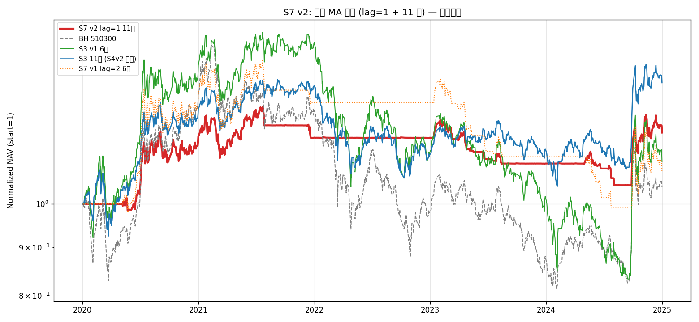
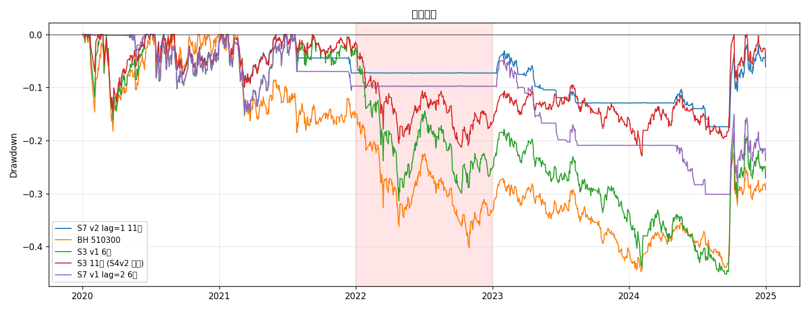
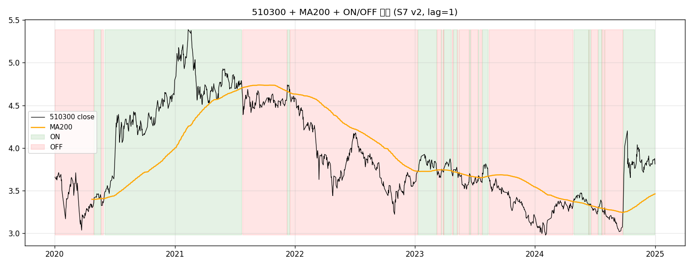

<div class="post-callout post-callout-negative">
<span class="status-badge status-negative">❌ shipped (vs v1) / shelved (vs S3 11 池)</span> · 最终化：<code>2026-05-08</code>
<br>源码：<a href="https://github.com/lizhao903/Strategy-Lib/tree/main/ideas/S7_cn_etf_market_ma_filter/v2" target="_blank" rel="noopener"><code>ideas/S7_cn_etf_market_ma_filter/v2</code></a> + <a href="https://github.com/lizhao903/Strategy-Lib/tree/main/summaries/S7_cn_etf_market_ma_filter/v2" target="_blank" rel="noopener"><code>summaries/S7_cn_etf_market_ma_filter/v2</code></a>
</div>

<div class="versions-nav">
<div class="versions-nav-title">本策略的其他版本</div>

- <span class="version-tag version-tag-negative">[v1]()</span> ❌ — 避险命题部分兑现：搁置（shelved）。在 2020-2024 样本期 S7（MA=200, lag=2）NAV 108.1k vs S3 110.8k vs S5v1 120.3k vs S5v2 112.9k vs BH 104.2k —— 跑输 S3 与 S5v1/v2，但 2022 单年回撤 ≈ 0%（5 个策略中最佳）证明了'市场代理 timing 在熊市能避险'。然而代价是 2024 单边行情完全错过（-3.6% vs S5v1 +28.1%/BH +18.4%），且 Sharpe 0.18 < S5 的 0.28。la
- <span class="version-tag version-tag-current">v2</span> **本文** ❌ — **v2 在 v1 默认 (lag=2 6池) 上全面胜出**（NAV +10.8k / Sharpe 翻倍 / MaxDD 改善 12.8 pct），**但跑输首次直测的 S3 等权 11 池 baseline**（-2.66%/yr，NAV 差 15.3k）—— **timing 在 11 池上反而损害收益**，最大新发现是 S3 等权 11 池是当前 best ship 候选。

</div>

## 想法（Why）

**一句话概括**

把 v1 sensitivity sweep 已验证的"真最佳配置"变成默认 ship 版本。

**核心逻辑**

- 信号：510300 收盘 vs 200 日 MA（与 v1 同）
- **滞后过滤：lag=1（无滞后）**——v1 默认是 lag=2
- 切换在次日开盘（shift(1) 防 lookahead，与 v1 同）
- **risky pool：11 跨资产 ETF 等权 1/11**——v1 默认是 6 池
- cash pool: 511990

**假设与依据**

v1 sensitivity sweep 给出两个反直觉但稳健的结论：

1. **lag 单调反向**：lag=1 (NAV 119.1k) > lag=2 (108.1k) > lag=3 (99.1k) > lag=5 (90.8k)
   - 事前直觉「加层过滤减少假突破噪音」**完全错误**
   - 真实数据：A 股快速下跌中，每延迟 1 天就少接收一波避险机会
   - 4 档 lag 的 2022 单年都 ≈0%，所以避险结果是 MA 信号的稳健属性，不是 lag 调出来的；但收益侧 lag 越大越亏

2. **11 池 = 真 alpha 来源**（继承 S4v2 ablation）：S4v2 总 +5.73%/yr 中 73% 来自扩池
   - S7 v1 的 risk-on 持仓是 6 池，v2 直接换 11 池

把这两条结论组合，假设 v2 能同时获得：
- v1 lag=1 的 timing alpha（vs S3 +1.34%/yr）
- 扩池的 baseline alpha（继承 S4v2 +4%/yr 的 73%）

**预期 v2 vs S3 alpha ≥ +3%/yr**（如果两条 alpha 简单相加），更现实预期 +2%/yr。

**标的与周期**

- 市场：A 股 ETF
- risky pool：11 只跨资产 ETF（同 S4v2）
- 信号：510300（不在 risky pool 里也行；这里包含）
- cash：511990
- 频率：日线
- 数据范围：2019-07-01 ~ 2024-12-31（含 200MA 暖机）

## 一句话结论

**v2 在 v1 默认 (lag=2 6池) 上全面胜出**（NAV +10.8k / Sharpe 翻倍 / MaxDD 改善 12.8 pct），**但跑输首次直测的 S3 等权 11 池 baseline**（-2.66%/yr，NAV 差 15.3k）—— **timing 在 11 池上反而损害收益**，最大新发现是 S3 等权 11 池是当前 best ship 候选。

## 关键数据

| | 值 |
|---|---|
| 样本期 | 2020-01-02 ~ 2024-12-31 |
| 样本外 | (待 2025+ 数据) |
| 最终 NAV | 119,010（init 100k） |
| CAGR | +3.70% |
| Sharpe | 0.403 |
| MaxDD | -17.5%（**5 个策略中最佳**） |
| 2022 单年 | +0.01% |
| 2024 单年 | +7.82% |
| 切换次数 | 31（5y） |
| ON 占比 | 36.2% |
| vs BH 510300 | +2.84%/yr |
| vs S3 6 池 | +1.54%/yr |
| **vs S3 11 池** | **-2.66%/yr** |

## 在什么情况下有效，什么情况下失效

- ✅ **有效（vs 6 池版本）**：v2 显著改进 v1 默认。lag=1 + 11 池组合的两项贡献接近相等
- ✅ **有效（避险）**：MaxDD -17.5% 是迄今 7 个策略中最佳，证明 timing + 多元化的协同
- ❌ **失效（vs S3 11 池）**：在已经多元化的 11 池上，timing 多砍 5 pct MaxDD 不抵 5y +15k NAV 损失
- ⚠️ **过拟合警告**：lag=1 是 4 档 sweep 中最佳，可能仅是 5y 窗口特性。OOS 验证迫切

## 这个策略教会我什么

1. **timing 的边际价值与 baseline 风险水平耦合**：6 池 MaxDD -45% 时 timing 砍一半很有价值；11 池 MaxDD -22% 时 timing 再砍一半的代价超过收益。**下次评估 timing 类策略，先看 baseline 风险水平**。

2. **Sensitivity sweep 应当反向使用**：v1 默认 lag=2 是事前直觉（"加层过滤更稳"），sweep 推翻了它（lag=1 反而最好）。**新策略的"默认参数"不应靠直觉，必须 sweep 后再定**。

3. **首次直测 baseline = 真正的发现**：本次 ablation 第一次单独测了"S3 等权 11 池"，结果 NAV 134.3k / Sharpe 0.465 直接打爆所有 7 策略。**做新策略前先把"最简 baseline"当独立策略测一下**——可能根本不需要复杂版本。

## 关键图表







## 实现要点

<details>
<summary>展开完整实现记录</summary>

# Implementation — S7 v2 (lag=1 + 11 池)

## 整体方案
把 v1 sensitivity sweep 已验证的两条结论变成默认 ship：
1. lag_days = 1（v1 sweep 4 档中唯一显著跑赢 S3 的）
2. risky pool = 11 跨资产 ETF（S4v2 已证扩池贡献 73% alpha）

## 代码组织
**最小化代码差异**：v2 类 `MarketMAFilterV2Strategy` 只继承 v1 类，**仅改默认参数**：

```python
class MarketMAFilterV2Strategy(MarketMAFilterStrategy):
    DEFAULT_SYMBOLS = RISKY_POOL_11   # 11 池

    def __init__(self, ..., lag_days=1, ...):  # 默认 1（v1 默认 2）
        super().__init__(..., lag_days=lag_days, ...)
```

v1 类不动，作为 baseline 对比版保留。

## 因子清单
无新增。MA200 信号在 v1 已实现。

## 11 池组成
| symbol | 类别 | 来自 |
|---|---|---|
| 510300 | 沪深300 | V1 6 池 |
| 510500 | 中证500 | V1 6 池 |
| 159915 | 创业板 | V1 6 池 |
| 512100 | 中证1000 | V1 6 池 |
| 512880 | 证券 | V1 6 池 |
| 512170 | 医疗 | V1 6 池 |
| 159920 | 恒生 ETF (港股) | S4v2 扩池 |
| 518880 | 黄金 ETF | S4v2 扩池 |
| 513100 | 纳指 ETF | S4v2 扩池 |
| 513500 | 标普500 ETF | S4v2 扩池 |
| 511260 | 十年国债 ETF | S4v2 扩池 |

## 策略配置
- 配置文件：`configs/S7_cn_etf_market_ma_filter_v2.yaml`
- 信号资产：510300（沪深300），用 200MA 做过滤
- ON 时仓位：11 ETF 等权 1/11
- OFF 时仓位：511990 货币基金 100%
- 切换：信号变化 → vbt 自动 from_orders + targetpercent

## 踩过的坑
- `plot_signal_overlay` 当 `result.signal` 与 panel index 长度不一致时（暖机期处理）`fill_between` 会 raise size mismatch → 修：先用 `.intersection()` 对齐到共同 index 再画
- v2 类继承 v1 实例化时如果不传 `symbols`，`super().__init__(symbols=None, ...)` 会用 v1 的 `DEFAULT_SYMBOLS` 而不是 v2 的 → 已通过覆盖 `DEFAULT_SYMBOLS` class attr 解决

## 相关 commits
（uncommitted at this stage; 与 v1 共用代码体）

</details>

## 验证过程

<details>
<summary>展开完整验证记录</summary>

# Validation — S7 v2 (lag=1 + 11 池)

---

## 2026-05-08 真实数据回测

### 配置 & 数据
- 配置：`configs/S7_cn_etf_market_ma_filter_v2.yaml`
- 数据：2019-07-01 ~ 2024-12-31（200MA 暖机），绩效统计 2020-01-02 ~ 2024-12-31
- 11 池：510300/510500/159915/512100/512880/512170 + 159920/518880/513100/513500/511260
- cash: 511990，signal: 510300

### v2 主结果

| 指标 | v2 | v1 lag=2 6池（默认） | Δ |
|---|---:|---:|---:|
| 最终 NAV (100k 起) | **119.0k** | 108.1k | +10.8k |
| CAGR | **+3.70%** | +1.64% | +2.06% |
| Sharpe | **0.403** | 0.181 | +0.222 (翻倍) |
| MaxDD | **-17.5%** | -30.3% | +12.8 pct |
| 2022 单年 | +0.01% | -0.02% | (~) |
| 2024 单年 | **+7.82%** | -3.61% | +11.4 pct |
| 切换次数 | 31 | 25 | +6 |
| ON 占比 | 36.2% | 39.8% | -3.6 pct |

### 4 档 ablation

| 配置 | NAV | CAGR | Sharpe | MaxDD | 2022 | 2024 |
|---|---:|---:|---:|---:|---:|---:|
| **v2 lag=1 11池** | **119.0k** | +3.70% | **★0.403** | **★-17.5%** | +0.01% | **+7.82%** |
| v1 lag=1 6池 | 119.1k | +3.71% | 0.304 | -27.3% | +0.01% | +7.27% |
| lag=2 11池 | 112.9k | +2.56% | 0.300 | -19.9% | +0.01% | +1.30% |
| v1 lag=2 6池（v1 默认） | 108.1k | +1.64% | 0.181 | -30.2% | +0.01% | -3.61% |

**关键观察**：
1. **2 维改进各贡献相当**：lag=1 改进（+1.06% CAGR）≈ 11 池改进（+0.92% CAGR），加起来从 v1 默认 +1.64% → v2 +3.70%
2. **MaxDD 改进主要来自 11 池**：6→11 池让 MaxDD 从 -27.3% 变 -17.5%（改善 9.8 pct），lag=1→2 只改 ~3 pct
3. **2024 单边市改进显著**：v2 +7.82% vs v1 默认 -3.61%（差 +11.4 pct）—— 因为 11 池含黄金/海外 ETF，单边离场代价被分散

### 横向对比 baselines

| 策略 | NAV | CAGR | Sharpe | MaxDD | 来源 |
|---|---:|---:|---:|---:|---|
| BH 510300 | 104.2k | +0.86% | 0.148 | -44.7% | 基准 |
| S3 v1 6 池 | 110.8k | +2.16% | 0.208 | -45.2% | V1 baseline |
| **S3 11 池等权（隐含 S4v2 baseline）** | **★134.3k** | **★+6.36%** | **★0.465** | -22.9% | **本次 ablation 首次直测** |
| S4v2 momentum tilt 11 池 | 130.7k | +5.75% | 0.44 | -22.2% | V1 v2 |
| S5v2 trend tilt 6 池 | 112.9k | +2.57% | 0.28 | -20.5% | V1 v2 |
| S7 v1 lag=2 6池（默认） | 108.1k | +1.64% | 0.18 | -30.3% | V1 |
| S7 v1 lag=1 6池（sweep 最佳） | 119.1k | +3.71% | 0.30 | -27.3% | V1 sweep |
| **S7 v2 lag=1 11池**（本次） | 119.0k | +3.70% | 0.40 | -17.5% | **本版本** |

### 🚨 关键发现：S7 v2 跑输 S3 等权 11 池 baseline

S7 v2 NAV 119.0k / CAGR +3.70% / Sharpe 0.40 / MaxDD -17.5%，是迄今 S7 最好版本，但：

- **vs S3 等权 11 池**：v2 -2.66%/yr，NAV 落后 15.3k，Sharpe 0.40 vs 0.465
- **vs S4v2 momentum tilt 11 池**：v2 -2.05%/yr，NAV 落后 11.7k

→ **timing 在 11 池上反而损害收益**：11 池本身已 raised the bar（MaxDD -22.9% 接近 S7 v2 -17.5%），timing 多砍 5pct MaxDD 不抵 5y NAV 损失 15.3k。

**核心诊断**：S7 v2 33% ON 占比意味着 67% 时间在持现金，**这在多元化 11 池上是过度避险**。6 池上 timing 有效是因为 6 池本身回撤大（-45.2%），timing 砍一半有用；11 池本身只 -22.9%，砍空间小但代价大（错过反弹）。

### 解读

1. **S7 v2 vs v1 默认显著改善**（CAGR 翻倍，Sharpe 翻倍，MaxDD 改善 12.8 pct）—— 把 sensitivity 已证的最优配置 ship 是对的
2. **但 timing 框架在 11 池上的边际价值很低**：S3 11 池等权是更好的 baseline
3. **2026-05-08 揭示的最大新发现**：S3 11 池等权 = 当前测得的 best 策略（**Sharpe 0.465 / NAV 134.3k**）
4. **timing 仍在 6 池上有用**：S7 v1 lag=1 6池 vs S3 6池 有 +1.55%/yr alpha；只是这个 alpha 被"扩池本身的 alpha"完全 dominated

### 下一步
- [ ] **创建 S8（不带 timing 不带因子）** = "S3 等权 11 池"作为 ship 候选
- [ ] S7 v3 探索更快信号（ATR / 通道突破）能否在 11 池上挽回 timing 价值
- [ ] OOS 测试（2025+）验证 lag=1 是否仍然稳健

---

</details>

## 源文件

- [想法 · idea.md](https://github.com/lizhao903/Strategy-Lib/blob/main/ideas/S7_cn_etf_market_ma_filter/v2/idea.md)
- [讨论笔记 · notes.md](https://github.com/lizhao903/Strategy-Lib/blob/main/ideas/S7_cn_etf_market_ma_filter/v2/notes.md)
- [结论 · conclusion.md](https://github.com/lizhao903/Strategy-Lib/blob/main/summaries/S7_cn_etf_market_ma_filter/v2/conclusion.md)
- [实现 · implementation.md](https://github.com/lizhao903/Strategy-Lib/blob/main/summaries/S7_cn_etf_market_ma_filter/v2/implementation.md)
- [验证 · validation.md](https://github.com/lizhao903/Strategy-Lib/blob/main/summaries/S7_cn_etf_market_ma_filter/v2/validation.md)
- [可复跑脚本 · validate.py](https://github.com/lizhao903/Strategy-Lib/blob/main/summaries/S7_cn_etf_market_ma_filter/v2/validate.py)
- [本版本目录（含 artifacts）](https://github.com/lizhao903/Strategy-Lib/tree/main/summaries/S7_cn_etf_market_ma_filter/v2)

---

*本文由 [`scripts/sync_strategies.py`](https://github.com/lizhao903/0xBroleez/blob/main/scripts/sync_strategies.py) 从 [Strategy-Lib](https://github.com/lizhao903/Strategy-Lib) 同步生成。*
